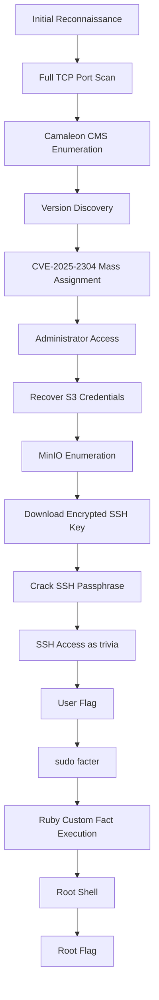
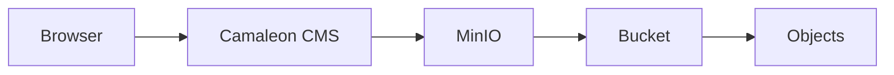
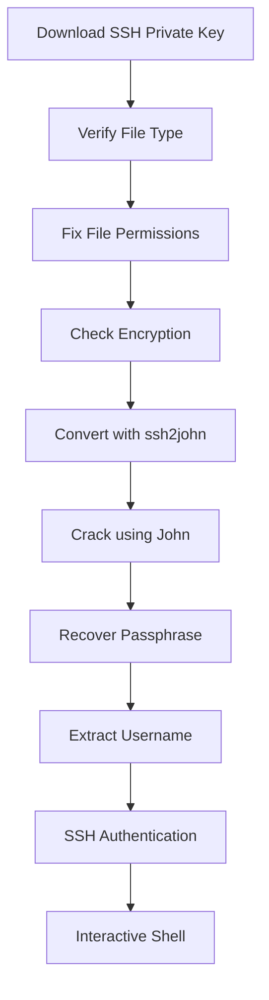
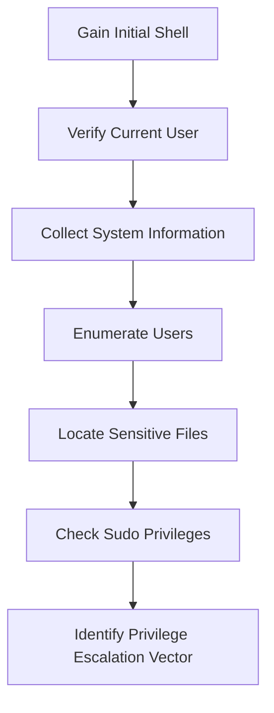
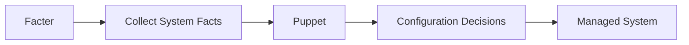
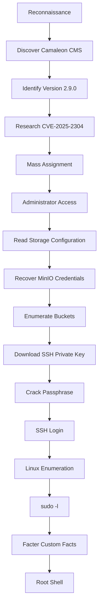

# Hack The Box — Facts Writeup

> **Difficulty:** Medium  
> **Operating System:** Linux  
> **Author:** DevdanLabs  
> **Platform:** Hack The Box

---

# Executive Summary

**Facts** is a medium-difficulty Linux machine that combines modern web application exploitation with Linux privilege escalation. The attack chain begins with identifying a vulnerable version of **Camaleon CMS**, where a **Mass Assignment** vulnerability (CVE-2025-2304) allows privilege escalation from a regular user to an administrator.

After obtaining administrative access, the attacker discovers object storage credentials pointing to a **MinIO** instance that exposes sensitive files, including an encrypted SSH private key. By cracking the key's passphrase, it becomes possible to gain SSH access to the target machine as a low-privileged user.

The final stage abuses an insecure **sudo** configuration allowing execution of **Facter** as root. Since Facter supports loading arbitrary Ruby custom facts, it can be leveraged to execute code as the root user, ultimately resulting in full system compromise.

Unlike machines that rely on a single vulnerability, **Facts** demonstrates how multiple seemingly unrelated weaknesses can be chained together into a complete attack path.

---

# Learning Objectives

By completing this machine, the following skills and concepts were practiced:

- Network reconnaissance using Nmap
- Full TCP port enumeration
- Virtual Host configuration
- Web application enumeration
- CMS fingerprinting
- Source code inspection
- CVE research and vulnerability validation
- Understanding Mass Assignment vulnerabilities
- HTTP request manipulation with Burp Suite
- AWS S3 / MinIO enumeration
- AWS CLI configuration
- Sensitive file discovery
- SSH private key analysis
- Password cracking with John the Ripper
- Linux privilege escalation
- Ruby code execution
- Abusing insecure sudo configurations

---

# Attack Chain Overview



---

# Machine Information

| Category | Information |
|----------|-------------|
| Platform | Hack The Box |
| Machine | Facts |
| Difficulty | Medium |
| Operating System | Linux |
| Primary Attack Vector | Web Application |
| Initial Foothold | Camaleon CMS Mass Assignment |
| Privilege Escalation | Insecure sudo configuration (Facter) |

---

# Skills Demonstrated

## Web Application Security

- CMS Fingerprinting
- Source Code Review
- HTTP Request Analysis
- Burp Suite Repeater
- Parameter Tampering
- Mass Assignment Exploitation

---

## Cloud & Storage Security

- AWS S3 Concepts
- MinIO Enumeration
- Bucket Discovery
- Credential Abuse
- Sensitive Object Retrieval

---

## Linux

- SSH Authentication
- File Permissions
- Key Management
- Linux Enumeration
- sudo Enumeration
- Privilege Escalation

---

## Offensive Security

- Enumeration Methodology
- CVE Research
- Exploit Development
- Credential Access
- Post Exploitation
- Privilege Escalation

---

# Tools Used

| Tool | Purpose |
|------|---------|
| Nmap | Port scanning and service enumeration |
| Burp Suite | HTTP interception and request manipulation |
| Firefox Developer Tools | HTML source inspection |
| AWS CLI | MinIO/S3 enumeration |
| ssh-keygen | SSH key analysis |
| ssh2john.py | Convert SSH key for cracking |
| John the Ripper | Recover SSH key passphrase |
| OpenSSH | Remote shell access |
| Facter | Linux privilege escalation |

---

# MITRE ATT&CK Mapping

| Phase | Technique |
|--------|-----------|
| Reconnaissance | Active Scanning (T1595) |
| Discovery | Service Discovery (T1046) |
| Initial Access | Exploit Public-Facing Application (T1190) |
| Credential Access | Unsecured Credentials (T1552) |
| Credential Access | Brute Force / Password Cracking (T1110) |
| Lateral Movement | Remote Services (T1021) |
| Privilege Escalation | Abuse Elevation Control Mechanism (T1548) |
| Execution | Command and Scripting Interpreter (T1059) |

---

# Lab Environment

- **Attacker Machine:** Kali Linux
- **VPN:** Hack The Box OpenVPN
- **Target Machine:** Facts
- **Browser:** Firefox
- **Network:** HTB Private Lab

---

> **Important**
>
> This writeup is intended for educational purposes only. All testing was performed within the Hack The Box platform on systems explicitly designed for legal security research and penetration testing practice.

# Part 2 — Reconnaissance

Reconnaissance is the foundation of every penetration test. Before attempting to exploit a target, it is essential to understand which services are exposed, how the application is hosted, and whether any hidden attack surface exists.

One of the most common mistakes beginners make is relying solely on a default Nmap scan. Since the default scan only checks the top 1,000 most common TCP ports, services running on uncommon ports may remain completely undiscovered.

For this reason, the reconnaissance phase consisted of two stages:

1. Initial service discovery
2. Full TCP port enumeration

---

# Initial Port Scan

The first step was to identify exposed services.

```bash
nmap -sC -sV <TARGET_IP>
```

## Command Breakdown

| Option | Description |
|---------|-------------|
| `-sC` | Run the default NSE scripts |
| `-sV` | Detect service versions |

---

### Initial Scan Result

> **Figure 1 – Initial Nmap Scan**

*Insert screenshot here*

The initial scan identified two open services:

| Port | Service |
|------|----------|
| 22 | SSH |
| 80 | HTTP (nginx) |

At first glance, the target appeared to expose only a standard Linux web server.

---

# Why This Was Not Enough

Although discovering SSH and HTTP is a good starting point, assuming that these are the only available services can be dangerous.

Many applications expose administrative interfaces, APIs, object storage services, or development tools on high-numbered ports that are not included in Nmap's default scan.

As penetration testers, we should avoid making assumptions based on incomplete information.

---

# Full TCP Port Scan

To ensure no services were overlooked, a full TCP scan was performed.

```bash
nmap -p- --min-rate 5000 <TARGET_IP>
```

## Command Breakdown

| Option | Description |
|---------|-------------|
| `-p-` | Scan all 65,535 TCP ports |
| `--min-rate 5000` | Increase packet sending rate for faster scanning |

---

> **Figure 2 – Full TCP Port Scan**

*Insert screenshot here*

The complete scan revealed an additional service that was missed during the initial enumeration.

| Port | Service |
|------|----------|
| 22 | SSH |
| 80 | nginx |
| 54321 | MinIO Object Storage |

This additional discovery completely changed the attack surface of the machine.

---

> **Pentester Tip**
>
> Always perform a full TCP scan when time permits.
>
> Many Hack The Box machines intentionally hide important services on uncommon ports to test whether candidates perform thorough enumeration.

---

# Understanding MinIO

The service running on port **54321** was identified as **MinIO**.

MinIO is an open-source object storage server that is compatible with the Amazon S3 API.

Instead of storing files directly on the web server, many modern applications store uploaded content inside object storage solutions such as:

- Amazon S3
- MinIO
- DigitalOcean Spaces
- Wasabi
- Ceph Object Storage

This immediately suggested that uploaded files, backups, or sensitive application data might eventually be stored outside the web application itself.

Although the MinIO instance was not immediately accessible, identifying its presence early proved to be critical later in the attack chain.

---

# Virtual Host Enumeration

Navigating directly to the target IP displayed the web application.

However, further inspection revealed that the application expected requests to use a hostname rather than the raw IP address.

A local hosts entry was added.

```text
<TARGET_IP> facts.htb
```

Linux:

```bash
sudo nano /etc/hosts
```

Windows:

```text
C:\Windows\System32\drivers\etc\hosts
```

---

> **Figure 3 – Hosts File Configuration**

*Insert screenshot here*

After saving the hosts file, browsing to

```
http://facts.htb
```

correctly loaded the application.

---

# Why Virtual Hosts Matter

Modern web servers often host multiple websites on the same IP address.

Rather than relying on the destination IP alone, the server uses the HTTP **Host** header to determine which website should be served.

Example:

```
Host: facts.htb
```

Without the correct hostname, the server may:

- Return a default page
- Redirect unexpectedly
- Hide application functionality
- Prevent access entirely

This technique is commonly used in both real-world environments and Capture The Flag platforms.

---

# Reconnaissance Summary

At the end of the reconnaissance phase, the following information had been gathered:

| Information | Value |
|-------------|-------|
| Operating System | Linux |
| Web Server | nginx |
| Web Application | HTTP Service |
| SSH Available | Yes |
| Additional Service | MinIO |
| Hostname | facts.htb |

Although no vulnerabilities had been identified yet, the attack surface had been significantly expanded through proper enumeration.

The next phase focuses on identifying the technology stack powering the web application and determining whether any known vulnerabilities are applicable.

# Part 3 — CMS Fingerprinting & Technology Enumeration

After identifying the web application during reconnaissance, the next objective was to determine **what technology was powering the website**.

Knowing the underlying framework or Content Management System (CMS) is one of the most valuable pieces of information during a penetration test because it allows us to:

- Search for publicly known vulnerabilities (CVEs)
- Understand the application's architecture
- Predict common directories and endpoints
- Identify default administrative interfaces
- Focus further enumeration on technology-specific attack vectors

Rather than blindly searching for exploits, a penetration tester should first identify the technologies in use.

---

# Initial Website Inspection

Browsing to the homepage presented what appeared to be a simple news website.

> **Figure 4 – Initial Website**

*Insert screenshot here*

At this stage, nothing immediately suggested which framework or CMS was being used.

Instead of guessing, the next step was to inspect the application's source code.

---

# Inspecting the HTML Source

Modern web applications often expose useful information through publicly accessible HTML source code.

Firefox Developer Tools or the browser's **View Page Source** feature can reveal:

- JavaScript files
- CSS files
- Comments
- Framework-specific assets
- API endpoints
- Third-party libraries

The page source was inspected.

> **Figure 5 – HTML Source Code**

*Insert screenshot here*

Among the linked resources, the following path stood out:

```text
/assets/themes/camaleon_first/
```

This naming convention strongly suggested that the application was using **Camaleon CMS**.

---

> **Why This Matters**
>
> Many CMS platforms include their name within asset paths, themes, plugins, or static resources.
>
> Even when administrators attempt to hide the application's technology stack, these resources often remain publicly accessible.

---

# Understanding Camaleon CMS

Camaleon CMS is an open-source Content Management System built on top of the **Ruby on Rails** framework.

Unlike WordPress, which is written in PHP, Camaleon uses the Ruby ecosystem while still providing familiar CMS functionality such as:

- User management
- Themes
- Plugins
- Content publishing
- Media uploads
- Administrative dashboards

Understanding the underlying framework is valuable because vulnerabilities may originate from either:

- The CMS itself
- The Ruby on Rails application
- Third-party plugins

---

# Identifying the Administration Portal

Many CMS platforms expose a predictable administration interface.

Common examples include:

| CMS | Default Admin Path |
|------|--------------------|
| WordPress | `/wp-admin` |
| Joomla | `/administrator` |
| Drupal | `/user/login` |
| Camaleon CMS | `/admin` |

Based on the identified CMS, the following endpoint was tested:

```text
http://facts.htb/admin
```

The server redirected the request to:

```text
/admin/login
```

> **Figure 6 – Camaleon CMS Login Page**

*Insert screenshot here*

This confirmed the presence of the administrative interface.

---

# Registering a New User

Since authentication was required, a new account was created using the public registration functionality.

After successfully registering and logging in as a regular user, additional application details became visible.

One particularly useful piece of information appeared in the website footer.

> **Figure 7 – Camaleon CMS Version**

*Insert screenshot here*

```
Camaleon CMS 2.9.0
```

Knowing the exact software version significantly narrowed the scope of vulnerability research.

---

# Version Enumeration

Version enumeration is one of the most valuable reconnaissance techniques during web application assessments.

Without an exact version number:

```
Camaleon CMS
        │
        ▼
Hundreds of possible releases
        │
        ▼
Unknown attack surface
```

With an exact version:

```
Camaleon CMS 2.9.0
        │
        ▼
Known release
        │
        ▼
Known CVEs
        │
        ▼
Public advisories
        │
        ▼
Source code comparison
```

Instead of testing random payloads, enumeration becomes targeted and significantly more efficient.

---

# Researching Public Vulnerabilities

Once the application version had been identified, the next step was to search for publicly disclosed vulnerabilities affecting Camaleon CMS 2.9.0.

Typical resources include:

- GitHub Security Advisories
- NVD (National Vulnerability Database)
- CVE databases
- Vendor advisories
- Security researchers' blogs
- GitHub commits and patches

Searching for:

```
Camaleon CMS 2.9.0 CVE
```

revealed a recently published advisory describing a **Mass Assignment vulnerability** affecting this version of the CMS.

Rather than immediately attempting to exploit it, the advisory and source code were carefully reviewed to understand:

- Why the vulnerability existed
- Which controller was affected
- Which parameters were trusted
- How user-controlled input reached the database

Understanding the vulnerability before exploiting it greatly increases reliability and reduces unnecessary trial-and-error during testing.

---

> **Pentester Tip**
>
> Always read the advisory and, whenever possible, review the vulnerable source code.
>
> Copying an exploit without understanding the underlying vulnerability often leads to failed exploitation and missed opportunities when facing modified or partially patched applications.

---

# Reconnaissance Summary

At this point, the application had been successfully fingerprinted.

The following information had been gathered:

| Discovery | Result |
|-----------|--------|
| Framework | Ruby on Rails |
| CMS | Camaleon CMS |
| Theme | camaleon_first |
| Administrative Portal | `/admin` |
| Registration | Enabled |
| CMS Version | 2.9.0 |
| Public Advisory | CVE-2025-2304 |

The reconnaissance phase had now transitioned into vulnerability analysis.

Rather than relying on automated exploit scripts, the next step would focus on understanding **how the Mass Assignment vulnerability worked internally**, why it existed, and how it could be leveraged to escalate privileges from a normal user to an administrator.

# Part 4 — Understanding and Exploiting CVE-2025-2304 (Mass Assignment)

After identifying **Camaleon CMS 2.9.0**, vulnerability research revealed a recently published security advisory affecting this version.

The advisory described **CVE-2025-2304**, a **Mass Assignment** vulnerability that allowed authenticated users to modify attributes that should never be directly controlled by clients.

Unlike many web vulnerabilities that rely on memory corruption or complex logic flaws, Mass Assignment is fundamentally a **business logic vulnerability**. The application unintentionally trusts user-controlled input and writes it directly into sensitive fields.

Before attempting exploitation, it is important to understand **why the vulnerability exists**.

---

# What is Mass Assignment?

Modern web frameworks simplify development by automatically converting HTTP parameters into model objects.

For example, consider the following HTTP request:

```http
POST /profile

username=alice
email=alice@example.com
password=password123
```

Instead of manually assigning every field:

```ruby
user.username = params[:username]
user.email = params[:email]
```

frameworks often allow developers to write:

```ruby
user.update(params)
```

The framework automatically maps incoming parameters to database columns.

```
HTTP Request
      │
      ▼
Parameters
      │
      ▼
Framework
      │
      ▼
Database Model
```

This feature greatly improves developer productivity.

Unfortunately, it also introduces risk.

---

# Why is it Dangerous?

Imagine the database contains the following columns:

| Column | Should Users Control? |
|---------|----------------------|
| username | ✅ Yes |
| email | ✅ Yes |
| password | ✅ Yes |
| role | ❌ No |
| is_admin | ❌ No |
| balance | ❌ No |
| verified | ❌ No |

The developer only expects users to submit:

```http
username=alice
email=alice@example.com
password=password123
```

However, HTTP requests can easily be modified.

An attacker may instead submit:

```http
username=alice
email=alice@example.com
password=password123
role=admin
```

If the application blindly trusts every parameter, the database becomes:

| Column | Value |
|---------|-------|
| username | alice |
| email | alice@example.com |
| role | admin |

The attacker has just promoted themselves to an administrator without exploiting memory corruption or bypassing authentication.

---

> **Important**
>
> The vulnerability is not caused by HTTP.
>
> The vulnerability is caused by **the server trusting parameters that should never be controlled by users.**

---

# Ruby on Rails Strong Parameters

Ruby on Rails introduced **Strong Parameters** to solve this exact problem.

Instead of accepting every incoming field:

```ruby
params
```

developers should explicitly define which attributes are allowed.

Example:

```ruby
params.require(:user).permit(
    :username,
    :email,
    :password
)
```

Now Rails ignores everything else.

If an attacker submits:

```http
role=admin
```

Rails simply discards it.

```
Incoming Request
        │
        ▼
Strong Parameters
        │
        ├──────── username ✔
        ├──────── email ✔
        ├──────── password ✔
        └──────── role ✘
```

Only approved fields reach the database.

---

# The Dangerous `.permit!`

Rails also provides another helper:

```ruby
permit!
```

Unlike `permit()`, this method tells Rails:

> "Trust every incoming parameter."

Example:

```ruby
params.require(:user).permit!
```

This effectively disables the whitelist mechanism.

Every field submitted by the client becomes trusted.

```
Incoming Request
        │
        ▼
permit!
        │
        ▼
Everything Accepted
        │
        ▼
Database Update
```

This helper should almost never be used with user-controlled input.

---

# Enumerating the Application

Although a public advisory existed, simply copying an exploit would not have been a good approach.

Instead, the application itself was inspected to determine whether the vulnerable functionality was actually reachable.

After registering a standard user account, the available functionality was explored.

Only two options were available:

- Profile
- Logout

No administrative functionality was accessible.

This indicated that privilege escalation would likely require manipulating requests sent from the profile page.

---

# Inspecting the Profile Update Request

The profile update form was intercepted using **Burp Suite**.

> **Figure 8 – Intercepting Profile Update Request**

*Insert screenshot here*

The intercepted request looked similar to:

```http
POST /admin/users/5

user[username]=...
user[email]=...
```

At first glance, nothing appeared vulnerable.

The application only exposed editable profile fields.

---

# Looking Beyond the Visible Interface

A common mistake during web assessments is trusting what the browser displays.

Browsers are merely user interfaces.

The server ultimately decides which parameters are accepted.

The HTML source of the profile page was inspected.

> **Figure 9 – Disabled Role Field**

*Insert screenshot here*

Inside the HTML, an interesting element appeared:

```html
<select
name="user[role]"
disabled="disabled">

<option value="admin">
<option value="client" selected>
```

Although regular users could not interact with the dropdown, the browser had already revealed an important piece of information:

- The application contained a **role** field.
- One valid value was **admin**.
- The field was merely disabled.

---

> **Pentester Tip**
>
> Disabled does **not** mean secure.
>
> HTML restrictions are enforced by the browser—not by the server.

---

# First Exploitation Attempt

The most obvious idea was to modify the intercepted request.

The following parameter was added:

```http
user[role]=admin
```

The server responded successfully.

However, after refreshing the profile, nothing had changed.

The account was still a normal user.

---

# Why the Exploit Failed

This was an important lesson.

A successful HTTP response does **not** necessarily indicate successful exploitation.

Possible explanations included:

- Wrong endpoint
- Wrong parameter
- Server-side filtering
- Patched vulnerability

Instead of repeatedly guessing parameters, further investigation was required.

---

# Reviewing the Vulnerable Source Code

The public advisory referenced the vulnerable controller.

The relevant code looked similar to:

```ruby
def updated_ajax
    @user = current_site.users.find(params[:user_id])

    @user.update(params.require(:password).permit!)

    attrs = params.require(:password).permit(
        :password,
        :password_confirmation
    )

    @user.update(
        password: attrs.require(:password),
        password_confirmation: attrs.require(:password_confirmation)
    )
end
```

This single line immediately explained the vulnerability:

```ruby
@user.update(params.require(:password).permit!)
```

The application was not reading:

```
user[...]
```

It was reading:

```
password[...]
```

This subtle difference completely changed the exploitation strategy.

---

# Root Cause Analysis

The vulnerable code trusted every parameter inside the **password** object.

```
HTTP Request
        │
        ▼
password[]
        │
        ▼
permit!
        │
        ▼
User.update()
        │
        ▼
Database
```

Because `permit!` accepted every field, any model attribute could potentially be modified.

This included:

- role
- id
- username
- email

depending on model restrictions.

---

# Successful Exploitation

The intercepted request was modified again.

Instead of:

```http
user[role]=admin
```

the request included:

```http
password[role]=admin
```

The modified request was forwarded.

After refreshing the page, administrator functionality immediately became available.

> **Figure 10 – Administrator Access**

*Insert screenshot here*

The privilege escalation was successful.

---

# Why This Worked

The vulnerability was not simply the presence of `permit!`.

The real problem was the combination of three issues:

1. The controller trusted client-controlled input.

2. `permit!` disabled Strong Parameters.

3. The trusted parameters were directly passed into:

```ruby
@user.update(...)
```

The server therefore performed the privilege escalation on behalf of the attacker.

No authentication bypass occurred.

No SQL injection occurred.

No memory corruption occurred.

The application simply trusted data that should never have been trusted.

---

# Common Mistakes Encountered

During exploitation, several mistakes were made before identifying the correct attack vector.

| Mistake | Why It Failed |
|----------|---------------|
| Using `user[role]` | Wrong parameter object |
| Assuming HTML restrictions provided security | Browser restrictions can be bypassed |
| Trusting HTTP 302 responses | Redirects do not indicate success |
| Guessing payloads repeatedly | Source code review provided the actual answer |

Each failed attempt helped narrow the investigation until the vulnerable controller was fully understood.

---

# Detection Opportunities

From a Blue Team perspective, this attack could potentially be detected by monitoring:

- Unexpected changes to privileged database fields
- User role modifications
- Requests containing unusual parameters
- Administrative role assignments originating from normal users
- HTTP requests with non-standard nested parameters

Logging sensitive attribute changes is one of the simplest ways to identify Mass Assignment attacks in production.

---

# Security Recommendations

The vulnerability could be prevented by:

- Never using `permit!` with user-controlled input.
- Implementing strict Strong Parameters.
- Performing server-side authorization checks before updating privileged fields.
- Logging privilege changes.
- Conducting secure code reviews before deployment.

Even a single insecure call to `permit!` can completely undermine an application's authorization model.

# Part 5 — Enumerating MinIO Object Storage

Successfully obtaining administrator privileges dramatically expanded the attack surface.

Rather than immediately searching for flags or attempting privilege escalation, the next objective was to identify sensitive information exposed through the administrative interface.

Administrative dashboards often contain valuable assets such as:

- API keys
- Database credentials
- SMTP settings
- Cloud storage configurations
- Backup locations
- Third-party integrations

These configuration pages frequently become stepping stones to further compromise.

---

# Reviewing the Site Configuration

After exploring the administration panel, the **General Site** configuration page contained an interesting section related to file storage.

> **Figure 11 – Storage Configuration**

*Insert screenshot here*

Several configuration values were exposed:

```
Storage Type
Access Key
Secret Key
Bucket Name
Endpoint
```

The endpoint immediately stood out:

```
http://localhost:54321
```

Combined with the reconnaissance phase, this matched the previously discovered service running on port **54321**.

This confirmed that the application stored uploaded content inside a **MinIO** object storage server.

---

# Understanding Object Storage

Unlike traditional file systems, object storage does not organize data into folders and directories.

Instead, every uploaded file becomes an **object** stored inside a **bucket**.

A simplified architecture looks like this:



The web application does not necessarily store uploaded files locally.

Instead, it communicates with the storage service using an API compatible with **Amazon S3**.

---

# What is MinIO?

MinIO is an open-source implementation of the Amazon S3 API.

From an application's perspective, interacting with MinIO is almost identical to interacting with AWS S3.

Operations such as:

- Uploading files
- Downloading files
- Listing buckets
- Deleting objects

are performed using the same API.

This compatibility also means that standard AWS tools can communicate directly with MinIO.

---

> **Real-World Relevance**
>
> Many organizations deploy MinIO instead of Amazon S3 for on-premises environments.
>
> As a result, understanding S3-compatible object storage is an increasingly valuable skill during web application and cloud security assessments.

---

# Configuring the AWS CLI

Since valid storage credentials had been obtained, the next step was configuring the AWS CLI.

```bash
aws configure
```

The application provided the required values:

- Access Key
- Secret Key

Because the target was not an actual AWS environment, requests also needed to specify the custom endpoint.

---

> **Figure 12 – AWS CLI Configuration**

*Insert screenshot here*

Unlike AWS, MinIO does not require internet connectivity.

All requests are sent directly to the locally hosted endpoint exposed by the target machine.

---

# Enumerating Available Buckets

The first objective was identifying available buckets.

```bash
aws s3 ls \
--endpoint-url http://facts.htb:54321
```

> **Figure 13 – Bucket Enumeration**

*Insert screenshot here*

The command returned two buckets:

```
internal
randomfacts
```

The presence of a bucket named **internal** immediately attracted attention.

Buckets with names such as:

- internal
- backup
- archive
- admin
- private

often contain files that should never be publicly accessible.

---

# Why Bucket Enumeration Matters

Object storage frequently becomes an overlooked attack surface.

Developers often assume that bucket permissions alone are sufficient to protect sensitive information.

However, once valid credentials are compromised, object storage may expose:

- Source code
- Backups
- SSH keys
- Configuration files
- Database exports
- Internal documentation

Enumerating every bucket is therefore an essential post-exploitation step.

---

# Exploring the Internal Bucket

The contents of the internal bucket were listed.

```bash
aws s3 ls s3://internal \
--recursive \
--endpoint-url http://facts.htb:54321
```

> **Figure 14 – Internal Bucket Contents**

*Insert screenshot here*

Several interesting files were discovered:

```
.cache/

.lesshst

.profile

.ssh/authorized_keys

.ssh/id_ed25519
```

Although configuration files can reveal useful information, one object immediately stood out.

```
.ssh/id_ed25519
```

Finding a private SSH key inside object storage is a significant security issue.

---

# Downloading the Private Key

The private key was downloaded locally.

```bash
aws s3 cp \
s3://internal/.ssh/id_ed25519 \
id_ed25519 \
--endpoint-url http://facts.htb:54321
```

> **Figure 15 – Downloading the SSH Private Key**

*Insert screenshot here*

The file was successfully retrieved.

---

# Verifying the File Type

Before attempting authentication, the downloaded file was inspected.

```bash
file id_ed25519
```

Output:

```
OpenSSH private key
```

This confirmed that the object was a legitimate SSH private key.

However, possession of the key alone did not guarantee immediate access.

Modern SSH keys are commonly protected using passphrases.

Determining whether this key was encrypted became the next objective.

---

# Why This Worked

The attack was successful because administrator privileges exposed sensitive storage credentials that were never intended to be accessible by untrusted users.

Once valid credentials were obtained:

```
Administrator
        │
        ▼
Storage Configuration
        │
        ▼
Access Key + Secret Key
        │
        ▼
AWS CLI Authentication
        │
        ▼
Bucket Enumeration
        │
        ▼
Sensitive File Discovery
```

No exploitation of MinIO itself was required.

The storage server behaved exactly as designed.

The weakness originated from exposing highly privileged storage credentials inside the application's administrative interface.

---

# Blue Team Perspective

From a defensive standpoint, several security issues contributed to this compromise.

- Administrative users should not have unrestricted access to storage credentials.
- Sensitive buckets should enforce the principle of least privilege.
- SSH private keys should never be stored inside object storage.
- Credentials should be managed using dedicated secret management solutions instead of being displayed directly within administrative dashboards.
- Access to sensitive buckets should be monitored and logged.

A single leaked access key allowed complete visibility into the organization's object storage, ultimately leading to credential theft and further system compromise.

---

# Transition to the Next Phase

The internal bucket exposed an encrypted SSH private key belonging to one of the system users.

The next phase focuses on determining whether the key is protected by a passphrase, recovering that passphrase, and using the recovered credentials to obtain an interactive shell on the target machine.

# Part 6 — Recovering SSH Credentials

The previous phase ended with the discovery of an SSH private key inside the MinIO object storage.

Although obtaining a private key is a significant milestone, it does **not** automatically grant SSH access.

Modern OpenSSH private keys are commonly protected with a **passphrase**, providing an additional layer of security even if the key file is stolen.

The next objective was to determine:

- Is the file actually a valid SSH private key?
- Is it encrypted?
- Can the passphrase be recovered?
- Can the recovered credentials be used to obtain an interactive shell?

---

# Inspecting the Private Key

The downloaded file was first examined using the `file` utility.

```bash
file id_ed25519
```

Output:

```text
id_ed25519: OpenSSH private key
```

> **Figure 16 – Verifying the Downloaded SSH Key**

*Insert screenshot here*

This confirmed that the downloaded object was a legitimate OpenSSH private key rather than an arbitrary file.

---

# Attempting SSH Authentication

The obvious next step was attempting authentication.

```bash
ssh -i id_ed25519 trivia@facts.htb
```

However, SSH immediately returned an error.

```text
Permissions 0664 for 'id_ed25519' are too open.
```

---

# Understanding SSH File Permissions

Unlike many applications, OpenSSH performs strict permission checks on private key files.

If other users on the local machine can read the key, SSH refuses to use it.

This prevents accidental exposure of sensitive credentials.

The permissions were corrected.

```bash
chmod 600 id_ed25519
```

Verification:

```bash
ls -l id_ed25519
```

Output:

```text
-rw------- id_ed25519
```

> **Figure 17 – Correcting File Permissions**

*Insert screenshot here*

---

> **Why This Matters**
>
> SSH assumes that a private key should only be readable by its owner.
>
> If group or world permissions are present, the client considers the key insecure and refuses authentication.

---

# Checking for Passphrase Protection

With the permissions corrected, the public key was extracted.

```bash
ssh-keygen -y -f id_ed25519
```

Instead of displaying the public key immediately, SSH prompted for:

```text
Enter passphrase:
```

This confirmed that the private key was encrypted.

Without the correct passphrase, authentication would not be possible.

---

# Recovering the Passphrase

John the Ripper cannot crack an OpenSSH private key directly.

The key must first be converted into a password hash.

This is accomplished using `ssh2john.py`.

```bash
ssh2john.py id_ed25519 > ssh.hash
```

The generated hash was then attacked using John the Ripper and the widely used **rockyou.txt** wordlist.

```bash
john ssh.hash \
--wordlist=/usr/share/wordlists/rockyou.txt
```

> **Figure 18 – Cracking the SSH Passphrase**

*Insert screenshot here*

After a short period, John successfully recovered the passphrase.

```text
dragonballz
```

---

# Understanding the Attack

This attack does **not** crack the SSH key itself.

Instead, John repeatedly attempts candidate passwords from the supplied wordlist.

For each password:

```
Candidate Password
        │
        ▼
Attempt Key Decryption
        │
        ▼
Success?
```

Once the correct passphrase is found, the encrypted private key becomes usable.

The strength of this attack depends entirely on the complexity of the passphrase.

---

> **Pentester Tip**
>
> Discovering an encrypted SSH key should never be considered the end of the attack.
>
> Weak passphrases are surprisingly common in both Capture The Flag environments and real-world infrastructure.

---

# Identifying the Username

Knowing the passphrase alone was insufficient.

The corresponding Linux username was still required.

Fortunately, OpenSSH keys often contain a comment identifying their owner.

The public key was extracted.

```bash
ssh-keygen -y -f id_ed25519
```

After entering the recovered passphrase, the output ended with:

```text
trivia@facts.htb
```

This strongly suggested that the associated account name was:

```text
trivia
```

---

# Obtaining an Interactive Shell

Using the recovered credentials, SSH authentication was attempted again.

```bash
ssh -i id_ed25519 trivia@facts.htb
```

When prompted, the recovered passphrase was entered.

```text
dragonballz
```

Authentication succeeded.

> **Figure 19 – SSH Access as trivia**

*Insert screenshot here*

An interactive shell was obtained as the **trivia** user.

---

# Attack Flow



---

# Why This Worked

The attack succeeded because multiple security weaknesses were chained together.

1. The SSH private key was stored inside object storage.
2. Valid storage credentials were exposed to an attacker.
3. The key used a weak passphrase present in a common password wordlist.

None of these weaknesses alone would necessarily result in compromise.

However, together they allowed complete recovery of valid SSH credentials.

---

# Blue Team Perspective

Several defensive improvements could have prevented this attack.

- Never store SSH private keys inside application storage.
- Use dedicated secret management solutions.
- Enforce strong passphrases for encrypted private keys.
- Rotate compromised SSH keys immediately.
- Monitor unusual object storage access.
- Restrict access to sensitive buckets using the principle of least privilege.

Credential theft remains one of the most common attack paths in modern enterprise environments.

Protecting secrets is often more important than protecting the application itself.

---

# Transition to the Next Phase

With a valid SSH session established, attention shifted from web application security to Linux post-exploitation.

The next phase focuses on local enumeration, identifying the available users, locating the user flag, and searching for privilege escalation opportunities.

# Part 7 — Linux Enumeration and User Flag

After successfully authenticating via SSH, the attack transitioned from web application exploitation to Linux post-exploitation.

At this stage, the objective was no longer to compromise the web application, but to understand the operating system, identify available users, locate sensitive files, and determine possible privilege escalation paths.

Obtaining a shell should never be considered the end of an assessment.

Instead, it marks the beginning of local enumeration.

---

# Verifying Initial Access

After logging in with the recovered SSH key and passphrase, an interactive shell was established.

```bash
ssh -i id_ed25519 trivia@facts.htb
```

After entering the recovered passphrase:

```text
dragonballz
```

authentication succeeded.

> **Figure 20 – Interactive Shell as trivia**

*Insert screenshot here*

The current identity was verified.

```bash
whoami
```

Output:

```text
trivia
```

The system information was also collected.

```bash
hostname
id
pwd
```

These basic commands help establish the current execution context before further enumeration begins.

---

# Why Local Enumeration Matters

One of the most common mistakes beginners make is immediately searching for privilege escalation exploits after obtaining a shell.

Experienced penetration testers instead collect as much information as possible about the target.

Typical objectives include:

- Identifying local users
- Inspecting permissions
- Discovering sensitive files
- Enumerating installed software
- Reviewing scheduled tasks
- Checking sudo privileges
- Identifying potential privilege escalation vectors

Comprehensive enumeration often reveals vulnerabilities that automated exploit scripts miss.

---

# Enumerating Local Users

The first step was identifying other user accounts on the system.

```bash
ls -la /home
```

> **Figure 21 – Home Directory Enumeration**

*Insert screenshot here*

The output revealed multiple home directories.

```text
trivia
william
```

Although the current shell belonged to **trivia**, another user account named **william** was also present.

The presence of multiple users suggested that additional privilege boundaries existed within the system.

---

# Locating the User Flag

Hack The Box user flags are typically stored inside the target user's home directory.

The contents of the current user's home directory were inspected.

```bash
ls -la
```

The user flag was located.

```text
user.txt
```

The contents were displayed.

```bash
cat user.txt
```

Output:

```text
ebadcc86dbc883d02ef1c7dc52914bd7
```

> **Figure 22 – User Flag**

*Insert screenshot here*

At this point, the first objective of the machine had been completed.

---

# Beginning Privilege Escalation Enumeration

With user-level access established, attention shifted toward privilege escalation.

Rather than immediately searching for kernel exploits, the standard Linux enumeration process began.

One of the highest-priority checks is determining whether the current user has any sudo privileges.

```bash
sudo -l
```

This command displays every executable the current user is permitted to run with elevated privileges.

In many real-world environments, misconfigured sudo rules provide a direct path to root access.

---

> **Pentester Tip**
>
> `sudo -l` should almost always be one of the first commands executed after obtaining a shell.
>
> Misconfigured sudo permissions remain one of the most common Linux privilege escalation vectors.

---

# Why This Enumeration Order Matters

A structured enumeration process helps avoid overlooking critical information.

A simplified workflow looks like this:



Rather than randomly executing enumeration scripts, each step builds a better understanding of the target environment.

---

# Blue Team Perspective

From a defensive standpoint, user-level compromise should never automatically lead to full system compromise.

Administrators should:

- Apply the principle of least privilege.
- Limit unnecessary sudo permissions.
- Monitor SSH logins from unusual sources.
- Audit local user accounts regularly.
- Restrict access to sensitive files using appropriate filesystem permissions.

Even when an attacker gains a user shell, properly configured privilege boundaries can significantly reduce the impact of the compromise.

---

# Transition to the Next Phase

The local enumeration process revealed that the **trivia** account possessed an unusual sudo permission.

Running `sudo -l` identified a single executable that could be run as **root** without requiring a password:

```text
/usr/bin/facter
```

Although this initially appeared harmless, further investigation revealed that **Facter** supports loading custom Ruby code during execution.

The next phase explores how this seemingly benign utility can be abused to execute arbitrary commands as the root user, ultimately leading to complete system compromise.

# Part 8 — Privilege Escalation via Facter Custom Facts

With user-level access established, the final objective was obtaining full administrative privileges on the target system.

Rather than immediately searching for kernel exploits or attempting brute-force privilege escalation techniques, standard Linux privilege enumeration was performed.

One of the most important enumeration commands is:

```bash
sudo -l
```

This command displays every executable that the current user is permitted to execute with elevated privileges.

---

# Enumerating Sudo Permissions

The command returned the following result:

```bash
Matching Defaults entries for trivia on facts:

User trivia may run the following commands:

(root) NOPASSWD:
/usr/bin/facter
```

> **Figure 23 – Sudo Privileges**

*Insert screenshot here*

This immediately became the primary privilege escalation candidate.

At first glance, allowing users to execute **Facter** may appear harmless.

Unlike shells or scripting languages, Facter is primarily known as a system information utility.

However, understanding how Facter operates internally reveals why this configuration is dangerous.

---

# What is Facter?

Facter is an open-source system profiling tool developed by Puppet.

Its primary purpose is collecting information about a machine, commonly referred to as **facts**.

Examples include:

- Hostname
- Operating System
- Kernel Version
- CPU Information
- Memory
- Network Interfaces
- IP Addresses

For example:

```bash
facter
```

may produce output similar to:

```text
hostname => facts
os.name => Ubuntu
memory.system.total => 4 GB
networking.ip => 10.10.x.x
```

System administrators use these facts to automate infrastructure management.

---

# Puppet and Infrastructure Automation

Facter is commonly used alongside **Puppet**, an Infrastructure as Code (IaC) platform.

A simplified workflow looks like this:



Instead of manually configuring hundreds of servers, Puppet automatically adapts its configuration based on the facts collected by Facter.

---

# Extending Facter with Custom Facts

One of Facter's most powerful features is support for **Custom Facts**.

Administrators can write Ruby scripts that generate additional system information.

For example:

```ruby
Facter.add("department") do
    setcode do
        "Finance"
    end
end
```

Running:

```bash
facter department
```

returns:

```text
Finance
```

This extensibility is extremely useful for automation.

Unfortunately, it also introduces a potential security risk.

---

# How Custom Facts Work

When Facter starts, it searches predefined directories for Ruby files.

Every discovered file is loaded and executed.

The process is approximately:

```
Start Facter
       │
       ▼
Search Fact Directories
       │
       ▼
Load Ruby Files
       │
       ▼
Execute Ruby Code
       │
       ▼
Register Facts
```

Since Ruby code is executed during startup, any malicious code inside a custom fact also executes.

---

# Discovering the Custom Directory Option

To understand how Facter loads external modules, the available command-line options were reviewed.

```bash
facter --help
```

Among the available options, one parameter immediately stood out:

```text
--custom-dir
```

This option allows users to specify an additional directory containing custom facts.

In other words:

```
User Directory
        │
        ▼
Ruby File
        │
        ▼
Facter Loads It
        │
        ▼
Ruby Executes
```

If Facter is executed through **sudo**, the Ruby code is executed **as root**.

---

> **Important**
>
> The vulnerability is **not** inside Facter itself.
>
> The problem is allowing an untrusted user to execute Facter as root while still allowing arbitrary Ruby code to be loaded.

---

# Creating a Malicious Custom Fact

A new directory was created.

```bash
mkdir exploit
```

Inside the directory, a Ruby file was written.

```bash
nano exploit/root.rb
```

Contents:

```ruby
Facter.add("root") do
    setcode do
        exec("/bin/bash")
    end
end
```

The script defines a custom fact named **root**.

However, instead of returning system information, it immediately replaces the running process with a root shell.

---

# Why `exec()`?

Ruby provides several methods for executing external commands.

The two most common are:

```ruby
system("/bin/bash")
```

and

```ruby
exec("/bin/bash")
```

Although they appear similar, they behave differently.

### `system()`

```
Ruby
 │
 ├──── Execute Bash
 │
 └──── Continue Ruby
```

Ruby launches a child process and continues running after the command exits.

---

### `exec()`

```
Ruby
      │
      ▼
Replace Current Process
      │
      ▼
/bin/bash
```

The Ruby interpreter disappears completely.

The current process becomes a root shell.

This produces a cleaner and more reliable privilege escalation.

---

# Executing the Exploit

Facter was executed with elevated privileges while pointing to the malicious directory.

```bash
sudo facter \
--custom-dir ./exploit
```

As soon as Facter loaded the custom module, the embedded Ruby code executed.

The prompt immediately changed.

```text
root@facts:~#
```

> **Figure 24 – Root Shell via Facter**

*Insert screenshot here*

Root privileges had been obtained successfully.

---

# Verifying Root Access

The current identity was verified.

```bash
whoami
```

Output:

```text
root
```

Additional confirmation:

```bash
id
```

Output:

```text
uid=0(root)
```

The root flag was then retrieved.

```bash
cat /root/root.txt
```

Output:

```text
8fad1b0d02b3f6f9a9cc8adfe006e57a
```

> **Figure 25 – Root Flag**

*Insert screenshot here*

This completed the machine.

---

# Attack Flow

```mermaid
graph TD

A[User Shell]

A --> B[sudo -l]

B --> C[Facter Allowed]

C --> D[Research Facter Features]

D --> E[Discover --custom-dir]

E --> F[Create Malicious Ruby Fact]

F --> G[sudo facter --custom-dir]

G --> H[Ruby Executes as Root]

H --> I[exec('/bin/bash')]

I --> J[Root Shell]

J --> K[Read root.txt]
```

---

# Why This Worked

The privilege escalation succeeded because of the interaction between three separate components:

1. The `trivia` user was allowed to execute Facter as **root** without a password.
2. Facter supports loading arbitrary Ruby code through the `--custom-dir` option.
3. The loaded Ruby code executed with the privileges of the Facter process.

Since Facter itself was running as root, the injected Ruby code also executed as root.

This transformed a seemingly harmless system information tool into an arbitrary code execution primitive.

Importantly, no vulnerability existed within Ruby itself.

Likewise, Facter behaved exactly as designed.

The security issue stemmed entirely from an unsafe **sudo** configuration.

---

# Blue Team Perspective

Several defensive practices would have prevented this privilege escalation.

- Avoid granting unrestricted sudo access to extensible applications.
- Remove the ability to specify arbitrary plugin or module directories.
- Apply the principle of least privilege to administrative tooling.
- Review every binary permitted through `sudo`.
- Regularly audit `sudoers` entries for applications capable of executing scripts or loading plugins.

Many legitimate administrative tools support scripting, plugins, or dynamic modules.

Granting such tools unrestricted sudo access often creates unintended privilege escalation opportunities.

---

# MITRE ATT&CK Mapping

| Tactic | Technique | Description |
|---------|-----------|-------------|
| Privilege Escalation | T1548.003 | Abuse Elevation Control Mechanism: Sudo and Sudo Caching |
| Execution | T1059.006 | Command and Scripting Interpreter: Python/Ruby (Ruby Execution) |
| Persistence (Potential) | T1574 | Hijack Execution Flow (Plugin/Module Loading) |

---

# Key Takeaways

This privilege escalation demonstrates an important lesson frequently encountered during real-world security assessments:

> **A secure application can still become dangerous when combined with an insecure operating system configuration.**

Neither Ruby nor Facter contained an exploitable software vulnerability.

Instead, the compromise resulted from granting elevated privileges to an application capable of executing user-controlled code.

Understanding how trusted administrative tools behave internally is often more valuable than memorizing individual privilege escalation techniques.

Successful penetration testers focus on identifying **dangerous capabilities**, not just known exploits.

# Part 9 — Conclusion, Lessons Learned, and Security Recommendations

Completing the **Facts** machine required chaining together multiple weaknesses across different layers of the technology stack.

Rather than relying on a single critical vulnerability, the compromise resulted from combining several independent issues into one complete attack path.

This mirrors many real-world security incidents, where attackers rarely exploit just one vulnerability. Instead, they combine information disclosure, application flaws, credential exposure, and privilege escalation to achieve full system compromise.

---

# Complete Attack Chain

The overall compromise followed the workflow below.



Each individual step expanded the attacker's capabilities until complete control of the target system was achieved.

---

# Kill Chain Analysis

The attack can also be viewed using a simplified cyber kill chain.

| Phase | Action |
|---------|--------|
| Reconnaissance | Service enumeration with Nmap |
| Weaponization | Research public vulnerability |
| Initial Access | Exploit Mass Assignment |
| Privilege Escalation | Become CMS administrator |
| Credential Access | Recover MinIO credentials |
| Discovery | Enumerate object storage |
| Credential Access | Recover SSH private key |
| Lateral Movement | SSH authentication |
| Privilege Escalation | Abuse Facter via sudo |
| Actions on Objectives | Read root flag |

Although this was a Hack The Box environment, the attack closely resembles real-world multi-stage intrusions.

---

# Root Cause Analysis

The compromise was not caused by a single catastrophic vulnerability.

Instead, multiple security weaknesses accumulated throughout the environment.

## 1. Insecure Parameter Handling

The application trusted client-controlled input through:

```ruby
permit!
```

This allowed unauthorized modification of sensitive user attributes.

Impact:

- Privilege escalation
- Authorization bypass

---

## 2. Excessive Administrative Exposure

The administrative dashboard exposed highly sensitive infrastructure credentials.

Examples:

- Storage endpoint
- Access Key
- Secret Key

These credentials granted direct access to backend object storage.

---

## 3. Poor Secret Management

Sensitive assets were stored inside object storage.

Examples included:

- SSH private keys
- User configuration files

Secrets should never reside in locations accessible through application credentials.

---

## 4. Weak SSH Passphrase

Although the SSH key was encrypted, the passphrase was weak enough to be recovered using a standard wordlist.

This effectively nullified the additional protection offered by encryption.

---

## 5. Unsafe Sudo Configuration

Granting unrestricted sudo access to an extensible application created the final privilege escalation vector.

The issue was not within Facter itself.

The issue was allowing arbitrary Ruby code to execute with root privileges.

---

# Security Recommendations

The following recommendations would significantly improve the overall security posture.

## Web Application

- Replace every use of `permit!` with explicit Strong Parameters.
- Perform server-side authorization checks before updating privileged fields.
- Validate every client-controlled parameter.
- Conduct regular secure code reviews.

---

## Cloud Storage

- Never expose storage credentials through administrative interfaces.
- Separate application users from administrative storage users.
- Apply least-privilege IAM policies.
- Monitor object storage access logs.

---

## Secret Management

Avoid storing:

- SSH private keys
- API keys
- Backup credentials
- Certificates

inside general-purpose object storage.

Instead, use dedicated secret management solutions such as:

- HashiCorp Vault
- AWS Secrets Manager
- Azure Key Vault

---

## Authentication

- Enforce long, randomly generated SSH passphrases.
- Rotate compromised keys immediately.
- Consider hardware-backed authentication such as FIDO2 security keys.

---

## Linux Hardening

Regularly audit:

```bash
sudo -l
```

Avoid granting elevated privileges to applications capable of:

- Loading plugins
- Executing scripts
- Interpreting code
- Dynamically importing modules

Least privilege should always be preferred.

---

# MITRE ATT&CK Summary

| Tactic | Technique | Description |
|---------|-----------|-------------|
| Reconnaissance | T1595 | Active Scanning |
| Initial Access | T1190 | Exploit Public-Facing Application |
| Privilege Escalation | T1068 / T1548.003 | Abuse Elevation Control Mechanism |
| Credential Access | T1552 | Unsecured Credentials |
| Discovery | T1083 | File and Directory Discovery |
| Execution | T1059.006 | Command and Scripting Interpreter (Ruby) |

---

# Skills Demonstrated

This machine reinforced knowledge across multiple cybersecurity domains.

## Web Application Security

- CMS fingerprinting
- Version enumeration
- Source code analysis
- CVE research
- Business logic vulnerabilities
- Mass Assignment exploitation
- HTTP request manipulation
- Burp Suite workflow

---

## Cloud Security

- S3-compatible object storage
- MinIO administration
- AWS CLI
- Bucket enumeration
- Credential abuse

---

## Linux

- SSH authentication
- File permission management
- Passphrase cracking
- Local enumeration
- Sudo analysis
- Privilege escalation

---

## Ruby

- Strong Parameters
- `permit!`
- Custom Facts
- Ruby execution flow
- `system()` vs `exec()`

---

# Lessons Learned

Several important lessons emerged from this machine.

### Enumeration is everything.

The MinIO service was hidden on a non-standard port and would have been missed without a full TCP scan.

---

### Understanding technology beats memorizing exploits.

Reviewing the vulnerable Ruby controller made exploitation significantly easier than blindly following public exploit scripts.

---

### Credentials are often more valuable than exploits.

Recovering valid credentials enabled further compromise without exploiting additional software vulnerabilities.

---

### Security failures accumulate.

No single issue completely compromised the machine.

Instead, each weakness enabled the next stage of the attack until full system compromise became possible.

---

### Secure tools can become insecure through misconfiguration.

Neither Ruby nor Facter contained an exploitable vulnerability.

The root cause was an unsafe sudo configuration that allowed legitimate functionality to execute with excessive privileges.

---

# Personal Reflection

The **Facts** machine was an excellent demonstration of how modern penetration testing extends beyond traditional web exploitation.

Rather than focusing solely on a single vulnerability, the assessment required understanding multiple technologies, including Ruby on Rails, Camaleon CMS, MinIO object storage, OpenSSH, Linux privilege escalation, and Puppet's Facter framework.

Perhaps the most valuable takeaway from this machine is that successful penetration testing is driven by **understanding systems**, not by memorizing payloads.

Each stage required asking *why* something worked before attempting to exploit it.

That mindset is ultimately what separates a penetration tester from someone who simply follows walkthroughs.

---

# References

- CVE-2025-2304 Advisory
- Camaleon CMS Documentation
- Ruby on Rails Strong Parameters Documentation
- MinIO Documentation
- AWS CLI Documentation
- OpenSSH Documentation
- Puppet Facter Documentation
- MITRE ATT&CK Framework
- GTFOBins

---

# Final Thoughts

The **Facts** machine is an outstanding example of a modern, multi-stage penetration testing challenge.

It combines:

- Web application security
- Secure coding concepts
- Cloud storage enumeration
- Credential recovery
- Linux post-exploitation
- Ruby internals
- Infrastructure automation
- Privilege escalation

into a coherent attack path that closely resembles real enterprise environments.

More importantly, it reinforces a timeless principle of offensive security:

> **Great penetration testers don't simply execute exploits—they understand why those exploits work.**