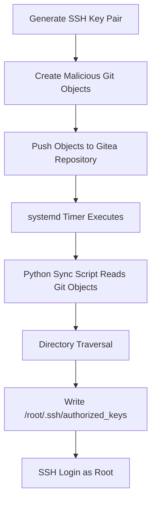
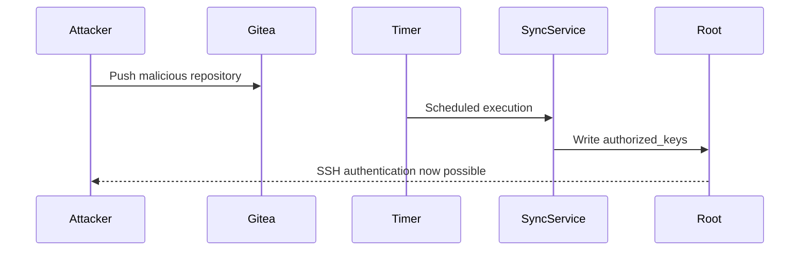
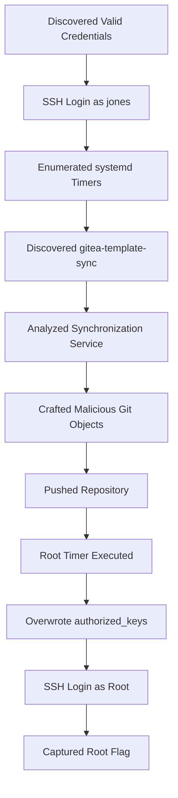

# Hack The Box - Nexus

## Executive Summary

**Nexus** is an **Intermediate** Linux machine that focuses on understanding how seemingly legitimate automation can become a privilege escalation vector when security boundaries are not properly enforced.

Unlike traditional privilege escalation techniques that rely on vulnerable binaries or misconfigured sudo permissions, this machine demonstrates how a **privileged automation service** can unintentionally trust attacker-controlled content. By combining system enumeration, Git internals, and a scheduled synchronization process, an attacker can escalate privileges from a standard user to **root**.

Throughout this walkthrough, we'll examine not only **how** each step works, but also **why** it works, how defenders can detect it, and what security lessons can be learned from the attack chain.

---

## Machine Information

| Attribute | Value |
|-----------|-------|
| Platform | Hack The Box |
| Machine | Nexus |
| Difficulty | Intermediate |
| Operating System | Linux (Ubuntu 24.04) |
| Primary Technologies | SSH, Git, Gitea, systemd, Python |
| Attack Surface | SSH, Gitea Template Repository, Scheduled Synchronization Service |

---

## Skills Covered

By completing this machine, you will gain practical experience with:

- Credential reuse attacks
- SSH authentication
- Linux enumeration
- Enumerating systemd timers
- Understanding Gitea template repositories
- Git internals (Blob, Tree, Commit objects)
- Directory Traversal using crafted Git objects
- Privilege escalation through SSH key injection
- Blue Team detection opportunities
- Secure software design considerations

---

## Learning Objectives

After completing this walkthrough, you should be able to:

- Explain why credential reuse remains one of the most common initial access techniques.
- Enumerate Linux scheduled tasks using **systemd**.
- Understand the relationship between **systemd services** and **systemd timers**.
- Explain how Git stores data internally.
- Identify dangerous trust relationships between privileged services and user-controlled repositories.
- Understand how directory traversal vulnerabilities can appear outside of web applications.
- Recognize how attackers abuse automation workflows for privilege escalation.
- Recommend defensive controls to prevent similar attacks.

---

# Methodology

Like a real penetration test, we'll follow a structured methodology instead of jumping directly into exploitation.

```text
Reconnaissance
      │
      ▼
Enumeration
      │
      ▼
Initial Access
      │
      ▼
Privilege Escalation
      │
      ▼
Post Exploitation
      │
      ▼
Documentation & Mitigation
```

Each phase has a specific objective:

| Phase | Purpose |
|--------|----------|
| Reconnaissance | Collect information about the target. |
| Enumeration | Identify services, users, scheduled tasks, and potential attack vectors. |
| Initial Access | Obtain a foothold using valid credentials. |
| Privilege Escalation | Abuse system misconfigurations to become root. |
| Post Exploitation | Verify full compromise and collect evidence. |
| Documentation | Explain findings and recommend mitigations. |

> [!NOTE]
> A successful penetration test is not about exploiting vulnerabilities as quickly as possible. The most effective attackers spend the majority of their time performing careful enumeration before attempting exploitation.

---

# Attack Chain

The overall attack path followed in this machine can be summarized as follows:


At first glance, none of these individual steps appear particularly dangerous.

However, when chained together, they create a complete privilege escalation path that ultimately grants full administrative access to the target system.

---

# Step 0 — Understanding the Technologies

Before interacting with the target, it's important to understand the technologies that appear throughout this machine.

Understanding **why** these technologies exist makes it much easier to recognize security weaknesses later.

---

## SSH

### What is SSH?

SSH (Secure Shell) is a protocol that allows users to securely access remote systems over an encrypted connection.

It replaces older protocols such as Telnet, which transmitted credentials in plaintext.

### Why does it exist?

System administrators need a secure way to remotely manage Linux servers.

SSH provides:

- Encrypted communication
- User authentication
- Secure file transfers
- Remote command execution

### Why is it important in this machine?

SSH provides the **initial foothold** after valid credentials are discovered.

Without SSH access, we would not be able to enumerate the internal system.

### Red Team Perspective

Attackers frequently test discovered credentials against SSH because:

- SSH often provides direct shell access.
- Many organizations still allow password authentication.
- A single valid login can expose the entire operating system.

### Blue Team Perspective

Administrators should:

- Disable password authentication whenever possible.
- Require SSH keys.
- Enable Multi-Factor Authentication (MFA).
- Monitor unusual login locations and times.

---

## systemd

### What is systemd?

systemd is the initialization and service management framework used by most modern Linux distributions.

When Linux boots, systemd becomes the first userspace process and is responsible for managing:

- Services
- Timers
- Startup processes
- Logging
- Resource management

Think of systemd as the operating system's task manager for background services.

### Why does it matter?

During enumeration we'll discover a **systemd timer** that automatically executes a privileged synchronization script.

This scheduled task ultimately becomes the privilege escalation vector.

> [!TIP]
> Modern Linux privilege escalation frequently involves scheduled automation rather than traditional cron jobs.

---

## Gitea

### What is Gitea?

Gitea is an open-source Git hosting platform similar to GitHub or GitLab.

Organizations commonly use it to host:

- Source code
- Internal projects
- Documentation
- Template repositories

### Why is it important?

This machine contains a **template repository synchronization service**.

That synchronization process trusts repository content more than it should.

Understanding how Gitea stores repositories helps explain why the privilege escalation works later.

---

## Git Objects

Many people think Git simply stores files.

Internally, Git stores **objects**.

The three most important object types are:

| Object | Purpose |
|---------|----------|
| Blob | Stores file contents |
| Tree | Stores directory structures |
| Commit | Stores repository history and references to tree objects |

Rather than storing complete copies of files, Git references these objects using SHA-1 hashes.

This design is extremely efficient—but it also means that applications interacting with Git objects must validate them carefully.

In this machine, we'll abuse how a privileged synchronization service reconstructs repository contents from these Git objects.

> [!IMPORTANT]
> The vulnerability is **not** Git itself. The weakness lies in how a privileged application processes Git data without properly validating file paths.

---

## Python

The synchronization service responsible for processing template repositories is implemented in Python.

Python is commonly used for automation because it is:

- Easy to read
- Cross-platform
- Fast to develop
- Well suited for filesystem operations

Unfortunately, filesystem automation becomes dangerous when user-controlled input is trusted without proper validation.

---

# Why These Technologies Matter

At this point, we haven't exploited anything yet.

Instead, we've built the knowledge necessary to understand the attack chain we'll encounter throughout this machine.

Every major component—

- SSH
- systemd
- Gitea
- Git
- Python

—plays a legitimate role in normal system administration.

The privilege escalation occurs because these components are combined in an insecure way.

Understanding those trust relationships is one of the most valuable skills a penetration tester can develop.

---

## Key Takeaways

- SSH provides the initial foothold into the target system.
- systemd timers are a common Linux automation mechanism worth enumerating.
- Gitea repositories should never be blindly trusted by privileged services.
- Git stores data as objects rather than traditional files.
- Automation running as **root** should never process untrusted input without strict validation.

---

➡️ **Next:** **Part 2 – Initial Access: Exploiting Password Reuse**

# Step 1 — Initial Access: Exploiting Credential Reuse

## Objective

Obtain an initial foothold on the target system by testing previously discovered credentials against the SSH service.

---

## Why This Step Matters

Finding valid credentials is only half of the battle.

One of the first things a penetration tester should do after discovering credentials is determine **where else they are valid**.

This process is known as **credential reuse testing**.

In many real-world environments, users reuse the same password across multiple services. As a result, credentials exposed through one application frequently become valid for completely different services such as:

- SSH
- VPN
- RDP
- Email
- Internal web applications
- Databases

Because this requires no exploitation, credential reuse is often one of the fastest paths to initial access.

> [!NOTE]
> Credential reuse is classified as the abuse of **valid accounts**, not password cracking. The attacker simply authenticates using legitimate credentials that were obtained elsewhere.

---

# Understanding Credential Reuse

Imagine an employee uses the following password everywhere:

```text
Email
SSH
Git Server
Internal Wiki
VPN
```

If just **one** of these services exposes the password, every other service immediately becomes a potential entry point.

This is exactly why organizations strongly recommend:

- Unique passwords
- Password managers
- Multi-Factor Authentication (MFA)

Without these protections, compromising a single application can quickly lead to full system compromise.

---

## SSH Authentication

SSH supports multiple authentication methods.

| Method | Description |
|---------|-------------|
| Password Authentication | User enters their password during login. |
| Public Key Authentication | Authentication is performed using an SSH key pair. |
| Multi-Factor Authentication | Requires an additional authentication factor. |

For this machine, SSH password authentication is enabled.

---

## Command Used

```bash
ssh jones@billing.nexus.htb
```

---

## Command Breakdown

| Component | Explanation |
|-----------|-------------|
| `ssh` | Launches the Secure Shell client. |
| `jones` | Username used for authentication. |
| `billing.nexus.htb` | Target hostname. |

---

## Example Output

```text
jones@billing.nexus.htb's password:

Welcome to Ubuntu 24.04.4 LTS
Linux billing 6.8.0-106-generic x86_64
```

---

## Output Interpretation

Several important things happen after a successful login.

### Password Accepted

The supplied credentials are valid.

This confirms that the previously discovered password can also authenticate against SSH.

---

### Interactive Shell Obtained

Instead of gaining access to a web application or a limited interface, we now have an interactive Linux shell.

This significantly expands our ability to enumerate the target.

We can now inspect:

- Users
- Groups
- Scheduled tasks
- Running services
- Configuration files
- Installed software
- Permissions
- Environment variables

---

### Operating System Identified

The login banner also reveals useful information.

```text
Ubuntu 24.04.4 LTS
```

Knowing the operating system version helps narrow down:

- Potential privilege escalation techniques
- Available packages
- systemd behavior
- Kernel-specific vulnerabilities

Although version information alone rarely leads directly to exploitation, it helps build a clearer picture of the environment.

---

## Why This Worked

Several conditions allowed this attack to succeed.

### Credential Reuse

The password discovered earlier was reused for SSH authentication.

Without password reuse, this login attempt would have failed.

---

### Password Authentication Enabled

The SSH server accepts password-based logins.

If the administrator had disabled password authentication and required SSH keys only, this attack path would not have worked.

---

### No Multi-Factor Authentication

Even with the correct password, MFA would have required an additional authentication factor.

Since MFA is not enforced, possession of the password alone is enough to authenticate successfully.

---

## Common Pitfalls

### Testing Too Aggressively

After finding credentials, avoid trying them repeatedly against multiple usernames.

Excessive authentication attempts may:

- Trigger security alerts
- Lock user accounts
- Reveal your presence

Always perform targeted authentication attempts instead of brute forcing.

---

### Ignoring Other Services

SSH is only one possible target.

Whenever valid credentials are discovered, consider testing them against:

- Gitea
- FTP
- SMB
- VPN
- Internal web applications
- Database services

Credential reuse frequently extends beyond a single protocol.

---

### Assuming Root Access

A successful SSH login does **not** mean the engagement is over.

Most real-world compromises begin with a standard user account.

The next objective becomes identifying privilege escalation opportunities.

---

## Red Team Perspective

Credential reuse remains one of the most effective techniques for gaining initial access because it requires:

- No exploit development
- No vulnerability scanning
- No malware
- Minimal noise

Instead, attackers simply authenticate using legitimate credentials.

This makes the activity blend in with normal user behavior.

---

## Blue Team Perspective

Defenders should assume that **every leaked password will eventually be tested against other services**.

To reduce this risk:

- Enforce unique passwords.
- Require Multi-Factor Authentication.
- Disable SSH password authentication where possible.
- Require SSH key authentication.
- Monitor authentication attempts across multiple services.

---

## Detection Opportunities

Security teams can identify credential reuse by monitoring:

- Successful SSH logins from unusual IP addresses.
- Authentication immediately following password exposure.
- First-time logins from unfamiliar devices.
- Geographic anomalies.
- Impossible travel events.
- Logins outside normal working hours.

Correlating these events often reveals compromised accounts before attackers achieve privilege escalation.

---

## MITRE ATT&CK Mapping

| Technique | ID | Description |
|-----------|----|-------------|
| Valid Accounts | T1078 | Authenticate using legitimate user credentials instead of exploiting software vulnerabilities. |
| Remote Services (SSH) | T1021.004 | Gain remote access through the SSH protocol using valid credentials. |

---

## Pentester Notes

### Enumeration Relevance

Obtaining a shell dramatically expands the attack surface by allowing local enumeration of files, services, scheduled tasks, and permissions.

### Privilege Escalation Relevance

Most Linux privilege escalation paths begin only **after** an attacker has obtained a low-privileged shell.

### Exam Relevance

Credential reuse is an extremely common technique in:

- Hack The Box
- Proving Grounds
- PNPT
- CPTS
- OSCP

Always test discovered credentials before searching for more complex vulnerabilities.

---

## Blue Team Notes

### Hardening

- Disable SSH password authentication.
- Enforce SSH key authentication.
- Require Multi-Factor Authentication.
- Rotate exposed credentials immediately.
- Prevent password reuse through organizational password policies.

### Monitoring

Monitor:

- `/var/log/auth.log`
- SSH daemon logs
- Failed authentication attempts
- Successful logins from new locations
- Authentication events outside normal user behavior

Alerting on these indicators can significantly reduce attacker dwell time.

---

## Key Takeaways

- Credential reuse is one of the simplest yet most effective initial access techniques.
- SSH password authentication greatly increases the impact of exposed credentials.
- A successful low-privileged shell is the beginning of the engagement—not the end.
- Local enumeration becomes the next priority after obtaining interactive access.

---

➡️ **Next:** **Part 3 – Enumeration: Discovering the `gitea-template-sync` systemd Timer**

# Step 2 — Enumeration: Discovering the `gitea-template-sync` systemd Timer

## Objective

Enumerate scheduled tasks running on the system to identify privileged processes that may expose an attack surface for privilege escalation.

---

## Why This Step Matters

Once initial access has been obtained, the next priority is **enumeration**, not exploitation.

Many beginners immediately search for kernel exploits or SUID binaries. While those are valid privilege escalation techniques, modern Linux systems are increasingly hardened against them.

Instead, attackers often look for:

- Scheduled tasks
- Background services
- Automation scripts
- Backup processes
- Deployment pipelines
- Synchronization jobs

These components frequently execute with elevated privileges while processing user-controlled data, making them attractive privilege escalation targets.

In this machine, a scheduled synchronization service ultimately becomes the path to **root**.

> [!TIP]
> Enumeration is often responsible for more than 80% of a successful penetration test. Spending time understanding the target usually leads to easier and more reliable exploitation.

---

# Understanding systemd Timers

Older Linux systems relied heavily on **cron** for scheduling recurring tasks.

Modern Linux distributions instead use **systemd timers**, which provide greater flexibility and tighter integration with the operating system.

A timer is responsible for determining **when** something should execute.

The actual work is performed by a corresponding **systemd service**.

For example:

```text
gitea-template-sync.timer
            │
            ▼
gitea-template-sync.service
            │
            ▼
Runs a synchronization script
```

Think of the timer as an alarm clock.

When the alarm goes off, it tells the associated service to start.

---

## Why Attackers Enumerate Timers

Timers often perform privileged maintenance tasks such as:

- Backups
- Software updates
- Log cleanup
- Database synchronization
- Repository synchronization
- File processing

If these tasks trust user-controlled input, they may become privilege escalation vectors.

Examples include:

- Copying files without validating paths
- Executing attacker-controlled scripts
- Importing configuration files
- Synchronizing repositories
- Processing uploaded content

Because timers usually run automatically and often execute as **root**, any weakness in their logic can have severe consequences.

---

# Listing systemd Timers

To inspect scheduled tasks, list every timer registered with systemd.

```bash
systemctl list-timers --all
```

---

## Command Breakdown

| Component | Description |
|-----------|-------------|
| `systemctl` | Interact with the systemd service manager. |
| `list-timers` | Display all configured timers. |
| `--all` | Include both active and inactive timers. |

---

## Example Output

```text
NEXT                         LEFT     LAST                         PASSED

Wed 2026-08-05 07:10:52 UTC  54s      Wed 2026-08-05 07:09:52 UTC  5s ago

gitea-template-sync.timer

gitea-template-sync.service
```

---

## Output Interpretation

One timer immediately stands out:

```text
gitea-template-sync.timer
```

This timer periodically executes:

```text
gitea-template-sync.service
```

The naming convention strongly suggests that the service synchronizes **Gitea template repositories**.

At this stage, we don't yet know:

- What the service does.
- Which user executes it.
- Which files it accesses.
- Whether it processes user-controlled input.

These are the questions we'll answer during the next phase.

---

# Why This Service Looks Interesting

Several indicators make this timer worth investigating.

## Repository Synchronization

Synchronization services regularly read external content before writing it elsewhere.

Whenever a privileged process copies attacker-controlled files, there's potential for:

- Directory traversal
- Arbitrary file writes
- Symbolic link abuse
- File overwrite vulnerabilities

---

## Automation

Because this task runs automatically, we don't need to manually trigger it.

If we can influence its input, the service will eventually execute our changes.

---

## Possible Privileged Context

Many maintenance services execute as **root**.

If this service also runs with elevated privileges, any file operations it performs inherit those permissions.

That dramatically increases its value as a privilege escalation target.

---

> [!NOTE]
> At this point we are **not exploiting anything**. We're simply identifying an automation process that deserves further investigation.

---

# Recommended Follow-Up Enumeration

Finding the timer is only the first step.

A penetration tester should immediately inspect the associated service.

Useful commands include:

```bash
systemctl cat gitea-template-sync.service
```

Displays the complete service definition.

---

```bash
journalctl -u gitea-template-sync.service
```

Displays historical logs for the service.

---

```bash
journalctl -u gitea-template-sync.service --since "1 hour ago"
```

Shows only recent execution logs.

---

These commands help answer important questions:

- Which executable is launched?
- Does it execute as root?
- Which script performs the synchronization?
- Where are synchronization logs stored?
- How frequently does it run?
- Does it generate useful debugging information?

Understanding these details is essential before attempting exploitation.

---

# Red Team Perspective

Scheduled automation is one of the most overlooked privilege escalation vectors.

Attackers are especially interested in services that:

- Run automatically.
- Execute as root.
- Process external data.
- Read from Git repositories.
- Copy files.
- Extract archives.
- Parse configuration files.

If any of these operations fail to validate their input, they may become exploitable.

---

# Blue Team Perspective

Automation should never blindly trust user-controlled data.

To reduce risk:

- Run scheduled jobs with the least privileges possible.
- Separate automation accounts from administrative accounts.
- Restrict filesystem permissions.
- Validate every file path before writing.
- Reject symbolic links and directory traversal sequences.
- Log all privileged file operations.

Even legitimate maintenance tasks should be treated as part of the organization's attack surface.

---

# Detection Opportunities

Security teams should monitor for:

- New or modified systemd timers.
- Unexpected execution of privileged services.
- Automated processes writing outside their intended directories.
- Repository synchronization failures.
- Frequent timer execution immediately following repository updates.

Correlating Git activity with privileged file operations can reveal abuse before privilege escalation is completed.

---

# MITRE ATT&CK Mapping

| Technique | ID | Description |
|-----------|----|-------------|
| Scheduled Task / Job | T1053 | Abuse of scheduled execution mechanisms. |
| System Services | T1569 | Leveraging privileged services to perform attacker-controlled actions. |

---

# Pentester Notes

### Enumeration Relevance

systemd timers should always be inspected during Linux privilege escalation because they frequently execute scripts with elevated privileges.

### Privilege Escalation Relevance

Finding a root-owned synchronization service provides a strong candidate for further analysis.

Understanding **how** it processes files is more valuable than immediately searching for exploits.

### Exam Relevance

Enumeration of scheduled tasks is a common objective in:

- Hack The Box
- Proving Grounds
- CPTS
- PNPT
- OSCP

Many modern privilege escalation challenges revolve around automation rather than vulnerable binaries.

---

# Blue Team Notes

### Hardening

- Avoid running maintenance services as root unless absolutely necessary.
- Use dedicated service accounts.
- Restrict filesystem permissions.
- Validate all repository content before processing.

### Monitoring

Monitor:

- `systemctl` activity.
- `journalctl` logs.
- Repository synchronization events.
- Unexpected file writes performed by scheduled services.
- File Integrity Monitoring (FIM) alerts on sensitive directories.

---

# Key Takeaways

- Enumeration is the foundation of successful privilege escalation.
- systemd timers are the modern equivalent of cron jobs and should always be inspected.
- Automation that processes external content is an attractive attack surface.
- The discovery of `gitea-template-sync.timer` provides the first major clue toward the eventual root compromise.
- Before exploiting any service, always understand **what it does**, **how it works**, and **which privileges it has**.

---

➡️ **Next:** **Part 4 – Analyzing the `gitea-template-sync` Service and Understanding the Root Cause**

# Step 3 — Service Analysis: Investigating `gitea-template-sync`

## Objective

Understand how the `gitea-template-sync` service operates, determine its privilege level, and identify whether it contains any security weaknesses that can be abused for privilege escalation.

---

## Why This Step Matters

Finding an interesting service during enumeration is only the beginning.

Before attempting any exploitation, we need to answer several important questions:

- What does this service actually do?
- Who executes it?
- What files does it access?
- Does it process user-controlled data?
- Can an attacker influence its behavior?

Many privilege escalation vulnerabilities are not caused by dangerous binaries or kernel bugs—they result from **trusted automation making unsafe assumptions**.

In this machine, the vulnerability isn't immediately obvious. It only becomes clear after understanding how the synchronization process works.

> [!NOTE]
> Enumeration answers **what exists**. Service analysis answers **whether it can be abused**.

---

# Understanding the Synchronization Workflow

Based on the service name and subsequent investigation, the synchronization process follows a workflow similar to this:

```text
User Pushes Changes
        │
        ▼
Gitea Repository
        │
        ▼
systemd Timer Executes
        │
        ▼
Python Synchronization Script
        │
        ▼
Reads Git Repository
        │
        ▼
Reconstructs Repository Files
        │
        ▼
Writes Files to Disk
```

At first glance, nothing about this workflow appears dangerous.

However, notice one important detail:

> The synchronization process **reads content that originated from a user-controlled Git repository.**

Any privileged service that processes untrusted input should immediately attract attention.

---

# Understanding Gitea Template Repositories

## What is a Template Repository?

Gitea allows repositories to be marked as **templates**.

Instead of cloning an existing project manually, users can create new repositories based on these templates.

For organizations, template repositories are useful for:

- Project skeletons
- Internal tooling
- Starter applications
- Configuration repositories

Because templates are intended to be copied automatically, administrators often create scripts that synchronize or deploy them elsewhere.

That convenience introduces risk.

---

## Why Does This Matter?

The synchronization script **trusts repository contents**.

Every file inside the repository eventually becomes a file on disk.

If the synchronization process doesn't properly validate filenames or paths, an attacker may be able to control **where** files are written.

This is exactly the condition we're looking for.

---

# Inspecting the Service

Once the timer has been identified, the next logical step is to inspect its associated service.

```bash
systemctl cat gitea-template-sync.service
```

---

## Command Breakdown

| Component | Description |
|-----------|-------------|
| `systemctl` | Interacts with the systemd service manager. |
| `cat` | Displays the contents of a unit file. |
| `gitea-template-sync.service` | The service executed by the previously discovered timer. |

---

## Why Inspect the Service?

A service file reveals valuable information such as:

- Which executable runs
- Which script is executed
- Which user executes the service
- Environment variables
- Working directory
- Execution frequency (through the timer)

If the service runs as **root**, every filesystem operation it performs also has root privileges.

---

# Reviewing Service Logs

The next step is to inspect recent executions.

```bash
journalctl -u gitea-template-sync.service --since "1 hour ago"
```

---

## Command Breakdown

| Component | Description |
|-----------|-------------|
| `journalctl` | Reads logs collected by systemd. |
| `-u` | Filter logs by service unit. |
| `--since` | Display only recent entries. |

---

## Why Logs Matter

Logs frequently reveal:

- Files being processed
- Errors
- Working directories
- Repository names
- Unexpected warnings
- Stack traces
- Internal application behavior

Developers often include far more debugging information than intended.

For an attacker, these logs provide insight into how the application behaves internally.

---

# Identifying the Trust Boundary

One of the most important concepts in secure software design is the **trust boundary**.

A trust boundary is the point where trusted code begins interacting with untrusted input.

In this machine, that boundary looks like this:

```text
Attacker
    │
    ▼
Git Repository
    │
    ▼
Synchronization Script
    │
    ▼
Root Filesystem
```

Everything before the synchronization script is attacker-controlled.

Everything after the synchronization script belongs to the operating system.

If the script fails to validate repository data before writing files, an attacker may cross this trust boundary and modify privileged locations.

> [!IMPORTANT]
> Most modern privilege escalation vulnerabilities are actually **trust boundary failures** rather than software bugs.

---

# Git Internals Refresher

To understand the upcoming exploit, we need a basic understanding of how Git stores information internally.

Git doesn't store files directly.

Instead, every repository consists of **objects**.

---

## Blob Objects

A **blob** stores file contents.

For example:

```text
README.md
```

The text inside the file becomes a blob object.

---

## Tree Objects

A **tree** stores directory information.

Rather than containing file contents, it references:

- Filenames
- Permissions
- Blob objects
- Other tree objects

Think of a tree object as Git's version of a folder.

---

## Commit Objects

A commit ties everything together.

Each commit references:

- One root tree
- Author metadata
- Commit message
- Parent commits

When Git checks out a commit, it reconstructs the filesystem by walking through these tree objects.

---

# Where Things Go Wrong

Normally, Git itself safely reconstructs repository contents.

However, this machine introduces an additional component:

```text
Git Repository
        │
        ▼
Custom Python Sync Script
        │
        ▼
Filesystem
```

Instead of Git performing the checkout directly, a **custom Python script** interprets Git objects and recreates the files.

That distinction is critical.

Git has spent years hardening its handling of paths and filenames.

A custom synchronization script may not.

---

# The Root Cause

The synchronization process trusts repository metadata without sufficiently validating it.

Specifically, it reconstructs files using names stored inside Git tree objects.

If those names contain traversal sequences such as:

```text
../../../../../
```

and the application simply appends them to its destination path, the resulting file may be written **outside the intended directory**.

This is no longer ordinary file synchronization.

It becomes an **arbitrary file write** vulnerability.

> [!WARNING]
> The vulnerability is **not** in Git itself.
>
> The vulnerability exists because the synchronization service fails to validate attacker-controlled paths before writing files.

---

# Red Team Perspective

When analyzing automation services, attackers ask several questions:

- Does the service process external content?
- Does it execute with elevated privileges?
- Does it create or overwrite files?
- Can repository metadata be manipulated?
- Are filenames trusted?

If the answer to these questions is **yes**, the service deserves deeper investigation.

---

# Blue Team Perspective

Developers often assume repository data is safe because it originates from Git.

That assumption is dangerous.

Applications should always:

- Normalize paths.
- Reject traversal sequences.
- Reject absolute paths.
- Validate destination directories.
- Resolve symbolic links safely.
- Restrict filesystem access.

The safest solution is to run synchronization services under an unprivileged account with limited filesystem permissions.

---

# Detection Opportunities

Security teams should monitor for:

- Repository synchronization failures.
- Unexpected filesystem writes.
- Privileged services processing attacker-controlled repositories.
- Directory traversal attempts.
- Access outside expected working directories.
- Suspicious Git operations performed by automated services.

File Integrity Monitoring (FIM) can also detect writes to sensitive locations such as:

```text
/root/
/etc/
/home/*/.ssh/
```

---

# MITRE ATT&CK Mapping

| Technique | ID | Description |
|-----------|----|-------------|
| Exploitation for Privilege Escalation | T1068 | Abuse of an insecure privileged service. |
| Scheduled Task / Job | T1053 | Privileged scheduled execution. |
| File and Directory Discovery | T1083 | Understanding filesystem layout before exploitation. |

---

# Pentester Notes

### Enumeration Relevance

Finding the timer was only the first clue.

Understanding **how** the synchronization process works ultimately reveals the real privilege escalation opportunity.

### Privilege Escalation Relevance

Applications that copy attacker-controlled files while running as root should always be treated as high-risk.

These services frequently become arbitrary file write vulnerabilities.

### Exam Relevance

Modern HTB and CPTS machines increasingly focus on **application logic flaws** instead of traditional Linux privilege escalation techniques.

Understanding the application's behavior is often more valuable than memorizing exploits.

---

# Blue Team Notes

### Hardening

- Never trust filenames originating from repositories.
- Normalize every destination path before writing.
- Reject `..` components.
- Reject absolute paths.
- Restrict filesystem permissions.
- Run synchronization services as dedicated service accounts.

### Monitoring

Monitor:

- Repository synchronization events.
- Privileged Python processes.
- File creation outside expected directories.
- Changes to SSH configuration files.
- Writes performed by automation services.

---

# Key Takeaways

- Understanding **how** a service works is often more important than immediately searching for vulnerabilities.
- Git itself is not vulnerable; the insecure synchronization logic is.
- The critical weakness is a broken trust boundary between user-controlled repository content and a privileged filesystem operation.
- This analysis reveals the exact primitive we'll abuse in the next step: an **arbitrary file write via crafted Git objects**.

---

➡️ **Next:** **Part 5 – Exploitation: Crafting Malicious Git Objects to Achieve Arbitrary File Write**

# Step 4 — Privilege Escalation: Crafting Malicious Git Objects

## Objective

Exploit the insecure template synchronization process by crafting malicious Git objects that cause the privileged synchronization service to write an attacker-controlled SSH public key into `/root/.ssh/authorized_keys`.

Successfully completing this step allows us to authenticate directly as the **root** user using our own SSH key.

---

## Why This Step Matters

At this stage, we've confirmed three critical facts:

1. A privileged synchronization service runs automatically.
2. The service processes data from a user-controlled Gitea repository.
3. Repository contents are not sufficiently validated before being written to disk.

These conditions create an opportunity for an **arbitrary file write**, one of the most powerful primitives in privilege escalation.

Instead of executing code directly, we'll abuse the synchronization process to make **root** write a file on our behalf.

---

# Understanding Arbitrary File Write

An arbitrary file write occurs when an attacker can control:

- **What** data is written.
- **Where** the data is written.

This doesn't necessarily provide code execution immediately, but it can often be leveraged into complete system compromise.

Common targets include:

```text
authorized_keys
/etc/passwd
/etc/crontab
/etc/sudoers
systemd service files
application configuration files
```

In this machine, the target is:

```text
/root/.ssh/authorized_keys
```

If our public SSH key is written into this file, the SSH daemon will trust it for root authentication.

---

# Why Target `authorized_keys`?

Linux supports SSH public key authentication.

When a user attempts to log in using an SSH key, the SSH daemon checks:

```text
~/.ssh/authorized_keys
```

If the supplied private key matches one of the public keys stored in this file, authentication succeeds.

For the root account, this file is located at:

```text
/root/.ssh/authorized_keys
```

Since the synchronization service runs as **root**, any file it creates inside `/root` also belongs to **root**.

---

## Attack Overview

The exploitation process can be summarized as follows:



Notice that we never execute commands as root.

Instead, we trick a trusted process into performing the write operation for us.

---

# Understanding Git Objects

To understand why this works, let's briefly review how Git stores data internally.

Git doesn't save directories directly.

Instead, every repository consists of interconnected objects.

## Blob

Stores file contents.

Example:

```text
authorized_keys
README.md
config.yml
```

---

## Tree

Stores directory structure.

Each tree contains references to:

- Filenames
- Permissions
- Blob objects
- Other tree objects

---

## Commit

Represents a snapshot of the repository.

Each commit references a root tree object.

---

During checkout, Git reconstructs the repository by traversing these objects.

The synchronization script attempts to perform a similar reconstruction process.

Unfortunately, it trusts the filenames stored inside those tree objects.

---

# Generating an SSH Key Pair

Before crafting the repository, we need our own SSH key pair.

```bash
ssh-keygen -t ed25519 -f /tmp/.k -N ""
```

---

## Command Breakdown

| Option | Description |
|---------|-------------|
| `-t ed25519` | Generate an Ed25519 key pair. |
| `-f /tmp/.k` | Output file location. |
| `-N ""` | Create the key without a passphrase. |

This generates:

```text
/tmp/.k
```

Private key.

and

```text
/tmp/.k.pub
```

Public key.

The **public key** will eventually be written into:

```text
/root/.ssh/authorized_keys
```

---

# Crafting Malicious Git Objects

Rather than using normal Git commands like:

```bash
git add
git commit
```

the exploit manually creates Git objects.

According to the engagement, a custom Python script (`build.py`) is used to:

- Create blob objects.
- Create tree objects.
- Create commit objects.
- Build a malicious directory structure.
- Update the Git reference to point to the crafted commit.

Instead of showing the entire script in this walkthrough, we'll focus on the important logic.

---

## Step 1 — Create a Blob Object

The script first creates a blob containing our public SSH key.

Conceptually, it performs an operation similar to:

```python
blob = write_obj(public_key.encode(), "blob")
```

This blob now represents the contents of:

```text
authorized_keys
```

---

## Step 2 — Build Tree Objects

Next, tree objects are created.

Under normal circumstances, a tree might look like this:

```text
README.md
src/
docs/
```

Instead, the exploit builds a tree containing traversal entries.

Conceptually:

```text
..
..
..
..
root
└── .ssh
    └── authorized_keys
```

The synchronization service later interprets these entries as filesystem paths.

---

## Step 3 — Create the Commit

Finally, the crafted tree becomes the root tree of a commit.

The script updates:

```text
refs/heads/main
```

to point to this malicious commit.

Once pushed, the repository appears perfectly valid from Git's perspective.

---

> [!NOTE]
> Git itself is not vulnerable.
>
> The malicious repository only becomes dangerous because the synchronization service reconstructs repository contents insecurely.

---

# Why This Worked

The exploit succeeds because several conditions align.

### The Service Trusts Repository Metadata

Instead of validating filenames, the synchronization script accepts them as legitimate.

---

### Directory Traversal Is Not Blocked

Entries containing:

```text
..
```

are accepted instead of being rejected.

As a result, files can be written outside the intended synchronization directory.

---

### The Service Runs as Root

Every file created by the synchronization process inherits root privileges.

This allows writing directly into:

```text
/root/.ssh/
```

without requiring any local privilege escalation.

---

### SSH Trusts `authorized_keys`

Once our public key is written successfully, the SSH daemon automatically accepts our corresponding private key.

No password cracking is necessary.

---

# Common Pitfalls

### Incorrect Traversal Depth

If the traversal chain doesn't contain enough `..` components, the payload writes to the wrong directory.

---

### Invalid Git Objects

Malformed tree or commit objects prevent the repository from being processed correctly.

---

### Missing Newline

Every SSH public key stored in `authorized_keys` should end with a newline.

Failure to do so can cause authentication issues.

---

### Repository Permissions

If you cannot push to the template repository, the synchronization service never receives your crafted objects.

---

# Red Team Perspective

This technique demonstrates why attackers study **application logic**, not just vulnerabilities.

Rather than exploiting memory corruption or command injection, the attacker abuses a trusted workflow.

These attacks are often:

- Stealthier
- More reliable
- Harder to detect
- Less dependent on software versions

---

# Blue Team Perspective

Applications should never assume repository metadata is trustworthy.

To prevent arbitrary file writes:

- Normalize all paths.
- Reject `..` components.
- Reject absolute paths.
- Restrict writes to a dedicated directory.
- Run synchronization services as non-root users.
- Validate repository contents before processing.

---

# Detection Opportunities

Security teams should monitor for:

- Unexpected updates to `authorized_keys`.
- Privileged services writing outside expected directories.
- Repository synchronization immediately followed by SSH logins.
- Forced pushes to template repositories.
- Anomalous filesystem activity performed by automation scripts.

File Integrity Monitoring (FIM) is particularly effective for detecting unauthorized modifications to:

```text
/root/.ssh/
```

---

# MITRE ATT&CK Mapping

| Technique | ID | Description |
|-----------|----|-------------|
| Exploitation for Privilege Escalation | T1068 | Abuse of a privileged synchronization service. |
| Modify Authentication Process | T1556 | Injection of an SSH public key into `authorized_keys`. |
| Scheduled Task / Job | T1053 | Exploiting a scheduled synchronization process. |

---

# Pentester Notes

### Enumeration Relevance

Without identifying the synchronization service during enumeration, this attack path would not exist.

### Privilege Escalation Relevance

The arbitrary file write primitive is the core of this privilege escalation.

Once an attacker can control privileged file writes, complete system compromise is often only a matter of selecting the right target file.

### Exam Relevance

This machine demonstrates a modern privilege escalation technique based on **application logic flaws** rather than traditional Linux misconfigurations.

---

# Blue Team Notes

### Hardening

- Never process repository paths without validation.
- Reject traversal sequences.
- Run synchronization services with least privilege.
- Apply AppArmor or SELinux policies.
- Restrict write permissions outside the synchronization directory.

### Monitoring

Monitor:

- Git repository synchronization events.
- Changes to `/root/.ssh/authorized_keys`.
- Privileged Python processes.
- Unexpected filesystem writes outside the repository root.

---

# Key Takeaways

- The privilege escalation does **not** exploit Git itself.
- The vulnerability exists because a privileged synchronization service trusts attacker-controlled Git metadata.
- By abusing directory traversal inside crafted Git objects, we gain an arbitrary file write.
- Writing our public SSH key into `/root/.ssh/authorized_keys` prepares the final step: authenticating directly as the root user.

---

➡️ **Next:** **Part 6 – Triggering the Synchronization Service and Gaining Root Access**

# Step 5 — Triggering the Synchronization Service and Gaining Root Access

## Objective

Upload the crafted Git objects to the remote template repository, wait for the scheduled synchronization service to execute, and verify that our public SSH key has been written into `/root/.ssh/authorized_keys`.

Once the synchronization completes successfully, authenticate as **root** using the corresponding private key.

---

## Why This Step Matters

Crafting the malicious Git objects alone is not enough.

The exploit only succeeds after the **privileged synchronization service** processes our repository.

Think of the attack like this:

```text
Attacker
    │
    ▼
Craft Malicious Repository
    │
    ▼
Push Repository to Gitea
    │
    ▼
Wait for systemd Timer
    │
    ▼
Root Synchronization Service
    │
    ▼
Writes authorized_keys
    │
    ▼
Root SSH Login
```

Notice that we never directly interact with the root account.

Instead, we let the scheduled task unknowingly perform the privileged action on our behalf.

---

# Pushing the Malicious Repository

After generating the malicious Git objects locally, the repository must be pushed back to the remote Gitea instance.

```bash
git push -u origin main --force
```

---

## Command Breakdown

| Component | Description |
|-----------|-------------|
| `git push` | Upload local commits to the remote repository. |
| `-u` | Set the upstream tracking branch. |
| `origin` | Remote repository name. |
| `main` | Branch being pushed. |
| `--force` | Overwrite the remote branch with the crafted commit. |

---

## Why Use `--force`?

Normally, Git prevents overwriting remote history.

However, our malicious commit was manually constructed rather than created through the standard Git workflow.

Because of this, the remote branch may reject it unless we explicitly force the update.

> [!WARNING]
> Force pushing is generally discouraged in collaborative environments because it rewrites repository history.
>
> In this case, it is necessary because the crafted commit does not share the expected commit history.

---

## Example Output

```text
Enumerating objects: 11, done.
Counting objects: 100% (11/11), done.
Writing objects: 100% (11/11), done.

remote: Processing references...

To http://git.nexus.htb/jones/rce.git

 * [new branch]      main -> main
```

---

## Output Interpretation

Several important observations can be made:

- The crafted Git objects were accepted.
- The remote repository successfully updated the `main` branch.
- The synchronization service now has access to our malicious repository.

At this point, **no privilege escalation has occurred yet**.

The final stage depends on the scheduled synchronization timer executing.

---

# Waiting for the Scheduled Synchronization

Earlier during enumeration, we discovered the following timer:

```text
gitea-template-sync.timer
```

Because the synchronization happens automatically, we simply wait for the timer to trigger.

The workflow now looks like this:



This is a great example of an attacker abusing legitimate automation instead of interacting directly with privileged components.

---

# Monitoring the Synchronization Process

To confirm whether the synchronization service processes our repository, monitor its log file.

```bash
tail -f /var/log/template-sync.log
```

---

## Command Breakdown

| Component | Description |
|-----------|-------------|
| `tail` | Display the end of a file. |
| `-f` | Continue following the file as new entries are added. |

---

## Why Monitor the Logs?

Logs provide immediate feedback about:

- Repository synchronization
- Processing errors
- File creation
- Unexpected behavior

Instead of blindly waiting, monitoring the logs allows us to verify exactly what the service is doing.

---

## Example Output

```text
[2026-08-05 07:32:53]

Template sync starting

Found 1 template repo(s)

Syncing template: jones/rce

synced: README.md

synced: ../../../../../root/.ssh/authorized_keys

Template sync complete
```

---

## Output Interpretation

This single line confirms the vulnerability:

```text
synced:

../../../../../root/.ssh/authorized_keys
```

Instead of rejecting the traversal sequence, the synchronization service processed it exactly as provided.

This means our public SSH key has now been written into:

```text
/root/.ssh/authorized_keys
```

The arbitrary file write was successful.

> [!IMPORTANT]
> This log entry provides direct evidence that the synchronization service trusted attacker-controlled paths without proper validation.

---

# Authenticating as Root

With the public key successfully installed, we can authenticate using the corresponding private key generated earlier.

```bash
ssh -i /tmp/.k root@nexus.htb
```

---

## Command Breakdown

| Component | Description |
|-----------|-------------|
| `ssh` | Secure Shell client. |
| `-i` | Specify the private key file. |
| `/tmp/.k` | Private key corresponding to the injected public key. |
| `root@nexus.htb` | Authenticate directly as the root user. |

---

## Example Output

```text
root@nexus:~#
```

We now have a fully interactive root shell.

---

# Capturing the Root Flag

Finally, verify full system compromise by reading the root flag.

```bash
cat /root/root.txt
```

Example output:

```text
08daa999291ff1dbf06d9ebb709c9ab7
```

Successfully obtaining the root flag confirms that the privilege escalation chain is complete.

---

# Why This Worked

Several independent weaknesses combined to make this attack possible.

### Trusted Repository Content

The synchronization service assumed repository metadata was trustworthy.

---

### Missing Path Validation

Traversal sequences such as:

```text
../../../../../
```

were accepted instead of rejected.

---

### Privileged Execution

The synchronization service executed as **root**, allowing writes into privileged directories.

---

### SSH Key Authentication

Once our public key appeared inside:

```text
/root/.ssh/authorized_keys
```

SSH automatically trusted the matching private key.

No password was required.

---

# Common Pitfalls

### Monitoring the Wrong Logs

Watching the wrong service logs may lead you to believe nothing happened.

Always identify which logs correspond to the synchronization service.

---

### Pushing to the Wrong Branch

If the synchronization service only monitors the `main` branch, pushing elsewhere prevents the exploit from triggering.

---

### Incorrect SSH Key Pair

The private key must correspond exactly to the injected public key.

Otherwise, SSH authentication will fail.

---

### Timer Hasn't Executed Yet

If the synchronization service hasn't run yet, the exploit will appear to fail.

Sometimes patience is all that's required.

---

# Red Team Perspective

This attack demonstrates how powerful **indirect exploitation** can be.

Rather than attacking the root account directly, we manipulated an automated workflow into performing privileged actions on our behalf.

These attacks are often:

- Reliable
- Quiet
- Difficult to detect
- Independent of kernel vulnerabilities

---

# Blue Team Perspective

Privileged automation should never blindly process external content.

Recommended mitigations include:

- Execute synchronization services as dedicated service accounts.
- Validate every filesystem path.
- Reject traversal sequences.
- Restrict writes using AppArmor or SELinux.
- Monitor changes to sensitive authentication files.

---

# Detection Opportunities

Security teams should investigate:

- Forced pushes to template repositories.
- Unexpected synchronization events.
- Modifications to `/root/.ssh/authorized_keys`.
- Privileged services writing outside expected directories.
- Root SSH logins immediately following repository synchronization.

Correlating Git activity with authentication events provides strong indicators of compromise.

---

# MITRE ATT&CK Mapping

| Technique | ID | Description |
|-----------|----|-------------|
| Scheduled Task / Job | T1053 | Abuse of automated task execution. |
| Modify Authentication Process | T1556 | Injection of an SSH public key into `authorized_keys`. |
| Valid Accounts | T1078 | Authentication using a trusted SSH key. |
| Remote Services: SSH | T1021.004 | Remote root access via SSH. |

---

# Pentester Notes

### Enumeration Relevance

The timer discovered during enumeration became the key to triggering the exploit automatically.

### Privilege Escalation Relevance

Rather than executing arbitrary commands as root, the exploit leveraged an arbitrary file write to establish trusted authentication.

### Exam Relevance

This machine is an excellent reminder that modern privilege escalation often comes from abusing automation rather than exploiting binaries or kernels.

---

# Blue Team Notes

### Hardening

- Never run synchronization services as root unless absolutely necessary.
- Validate all filesystem paths before writing.
- Reject repository entries containing traversal sequences.
- Implement File Integrity Monitoring (FIM) for sensitive directories.

### Monitoring

Monitor:

- Repository synchronization events.
- Root SSH logins.
- Changes to `authorized_keys`.
- Privileged Python processes.
- File writes outside approved directories.

---

# Key Takeaways

- Successful privilege escalation often relies on chaining multiple small weaknesses together.
- The arbitrary file write became a trusted authentication mechanism through SSH key injection.
- Automation running with elevated privileges should always be considered part of the attack surface.
- Trust boundaries must be carefully enforced whenever privileged services process user-controlled data.

---

➡️ **Next:** **Part 7 – Post Exploitation, Security Recommendations, MITRE ATT&CK Mapping, and Final Takeaways**

# Post Exploitation

## Objective

Verify that the objective of the engagement has been successfully achieved, collect supporting evidence, assess the impact of the compromise, and document recommendations to help prevent similar attacks in real-world environments.

---

## Why This Step Matters

Many beginners think penetration testing ends after obtaining a root shell.

In reality, that is only one milestone.

Professional penetration testers must also:

- Verify the impact of the compromise.
- Document how the attack succeeded.
- Collect evidence.
- Explain the business risk.
- Recommend mitigations.
- Help defenders understand how to detect similar attacks.

Without proper documentation, even a successful exploitation has limited value to the client.

> [!NOTE]
> A penetration test is ultimately a consulting engagement. The report is often more valuable than the exploit itself.

---

# Evidence Collected

Throughout this engagement, several key pieces of evidence confirmed the success of the attack.

| Evidence | Description |
|----------|-------------|
| Initial Access | Successfully authenticated to SSH as `jones`. |
| Enumeration | Discovered the `gitea-template-sync.timer` scheduled task. |
| Service Analysis | Identified a privileged synchronization process that trusted repository content. |
| Exploitation | Crafted malicious Git objects containing directory traversal entries. |
| Arbitrary File Write | Synchronization service wrote to `/root/.ssh/authorized_keys`. |
| Root Access | Successfully authenticated as `root` using the injected SSH key. |
| Root Flag | Retrieved the contents of `/root/root.txt`. |

Together, these artifacts demonstrate a complete compromise of the target system.

---

# Attack Summary

The full attack chain can be visualized below.



Although no individual step appears particularly severe on its own, chaining them together results in full administrative access.

This illustrates an important lesson in offensive security:

> Small weaknesses often become critical when combined.

---

# Root Cause Analysis

The compromise occurred because several independent weaknesses existed simultaneously.

## 1. Credential Reuse

The initial credentials remained valid for SSH authentication.

---

## 2. Password-Based SSH Authentication

SSH accepted password authentication rather than requiring SSH keys or Multi-Factor Authentication.

---

## 3. Privileged Automation

The synchronization service executed with root privileges.

---

## 4. Trusting User-Controlled Repository Data

Repository metadata was processed without sufficient validation.

---

## 5. Missing Path Validation

Directory traversal sequences such as:

```text
../../../../../
```

were accepted and interpreted as valid filesystem paths.

---

## 6. Arbitrary File Write

Because the synchronization service ran as root, it could create files anywhere on the filesystem.

This ultimately allowed modification of:

```text
/root/.ssh/authorized_keys
```

---

# Business Impact

If this vulnerability existed inside a production environment, an attacker could potentially:

- Obtain permanent administrator access.
- Install persistent SSH keys.
- Access sensitive source code.
- Steal application secrets.
- Modify production systems.
- Deploy malware.
- Pivot into internal infrastructure.
- Disable security tooling.

Even though this machine is a laboratory environment, the attack chain closely resembles real-world incidents involving insecure automation.

---

# Blue Team Recommendations

The following mitigations would prevent this attack chain.

| Risk | Recommendation |
|------|----------------|
| Credential reuse | Enforce unique passwords and Multi-Factor Authentication. |
| SSH password authentication | Require SSH key authentication and disable password logins where possible. |
| Root-owned synchronization service | Execute synchronization tasks as a dedicated low-privileged service account. |
| Path traversal | Normalize and validate every filesystem path before writing files. |
| Repository trust | Treat all repository content as untrusted input. |
| Arbitrary file writes | Restrict writable directories and apply least privilege. |

---

# Detection Opportunities

Security teams should monitor for unusual activity involving:

## Authentication

- New SSH logins.
- Root SSH sessions.
- Password reuse.
- Authentication from unfamiliar locations.

---

## Repository Activity

- Forced pushes.
- Unexpected template repository updates.
- Repository synchronization failures.
- Creation of unusual Git objects.

---

## Filesystem Activity

Unexpected modifications to:

```text
/root/.ssh/
/etc/
/var/lib/systemd/
/home/*/.ssh/
```

should always trigger investigation.

---

## Process Activity

Look for:

- Python processes running as root.
- Scheduled synchronization jobs.
- File writes performed outside expected directories.

---

## File Integrity Monitoring

Implement monitoring for:

```text
authorized_keys
sudoers
crontab
systemd service files
SSH configuration
```

Unexpected modifications to these files frequently indicate privilege escalation attempts.

---

# MITRE ATT&CK Mapping

| Tactic | Technique | ID |
|---------|-----------|----|
| Initial Access | Valid Accounts | T1078 |
| Lateral Movement | Remote Services: SSH | T1021.004 |
| Persistence | Modify Authentication Process | T1556 |
| Privilege Escalation | Exploitation for Privilege Escalation | T1068 |
| Execution | Scheduled Task / Job | T1053 |

---

# Tools Used

| Tool | Purpose |
|------|---------|
| SSH | Remote shell access |
| Git | Clone and push crafted repository |
| Gitea | Repository hosting platform |
| systemctl | Enumerate services and timers |
| journalctl | Review service logs |
| Python | Generate malicious Git objects |
| tail | Monitor synchronization logs |

---

# Skills Gained

Completing this machine strengthens several practical skills.

## Linux

- SSH authentication
- Service enumeration
- systemd timer analysis
- Log analysis

---

## Git

- Repository internals
- Blob objects
- Tree objects
- Commit objects

---

## Web & Development

- Understanding repository synchronization
- Trust boundaries
- Secure automation

---

## Offensive Security

- Credential reuse
- Enumeration methodology
- Application logic abuse
- Arbitrary file write
- SSH key injection
- Privilege escalation

---

## Defensive Security

- File Integrity Monitoring (FIM)
- Secure automation design
- Least privilege
- Path validation
- Detection engineering

---

# Lessons Learned

This machine demonstrates several important principles that extend far beyond Hack The Box.

### Enumeration Is Everything

The attack was only possible because the scheduled synchronization service was discovered during enumeration.

---

### Automation Is Part of the Attack Surface

Many organizations focus on web applications and operating systems while overlooking automation scripts.

These scripts frequently execute with elevated privileges and deserve the same level of security review.

---

### Trust Boundaries Matter

Git itself was not vulnerable.

The vulnerability arose because a privileged application trusted attacker-controlled repository metadata.

---

### Least Privilege Prevents Catastrophic Impact

Had the synchronization service executed as a dedicated low-privileged account instead of root, the arbitrary file write would have had far less impact.

---

### Chaining Weaknesses Is Powerful

The compromise required multiple conditions:

- Credential reuse
- Password authentication
- Privileged automation
- Missing path validation

None of these alone resulted in root compromise.

Together, they formed a complete attack chain.

---

# Future Learning

If you enjoyed this machine, consider studying the following topics next:

- Advanced Git internals
- Secure software supply chain design
- Linux privilege escalation
- systemd security features
- Secure file handling in Python
- SSH hardening
- File Integrity Monitoring (FIM)
- Application sandboxing with AppArmor and SELinux

---

# References

- Git Documentation
- Gitea Documentation
- systemd Documentation
- MITRE ATT&CK Framework
- OWASP Secure Coding Practices

---

# Conclusion

Nexus is an excellent example of how **application logic flaws** can be just as dangerous as traditional software vulnerabilities.

Rather than exploiting a vulnerable binary or abusing a misconfigured `sudo` rule, this machine challenges us to think like both a software engineer and a penetration tester.

By carefully enumerating the environment, understanding how the synchronization workflow operates, and recognizing where a trust boundary breaks down, we successfully transformed a standard user account into full administrative access.

More importantly, this machine reinforces a valuable lesson that applies well beyond Capture the Flag environments:

> **Security is not only about protecting code—it is about protecting the assumptions that code makes.**

When privileged automation blindly trusts untrusted input, even legitimate workflows can become powerful attack vectors.

---

# Final Takeaways

- Enumeration is the foundation of every successful penetration test.
- Credential reuse remains one of the most effective initial access techniques.
- Scheduled automation should always be included in Linux privilege escalation assessments.
- Trust boundaries must be clearly defined and enforced.
- Privileged services should never process untrusted input without strict validation.
- Applying the principle of least privilege dramatically reduces the impact of application logic flaws.
- Understanding *why* an exploit works is more valuable than memorizing exploitation steps.

---

**Machine Status:** ✅ Root Compromised

**Difficulty:** Intermediate

**Platform:** Hack The Box

**Focus Areas:** Linux, Git, Gitea, systemd, Application Logic, Privilege Escalation