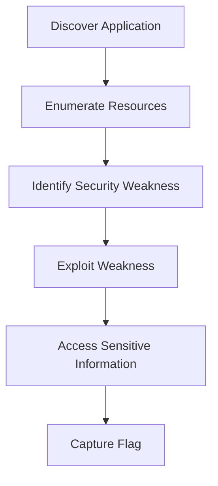
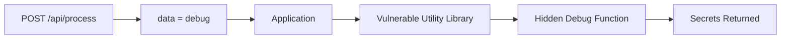
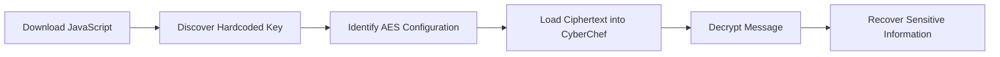
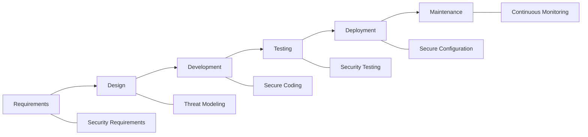
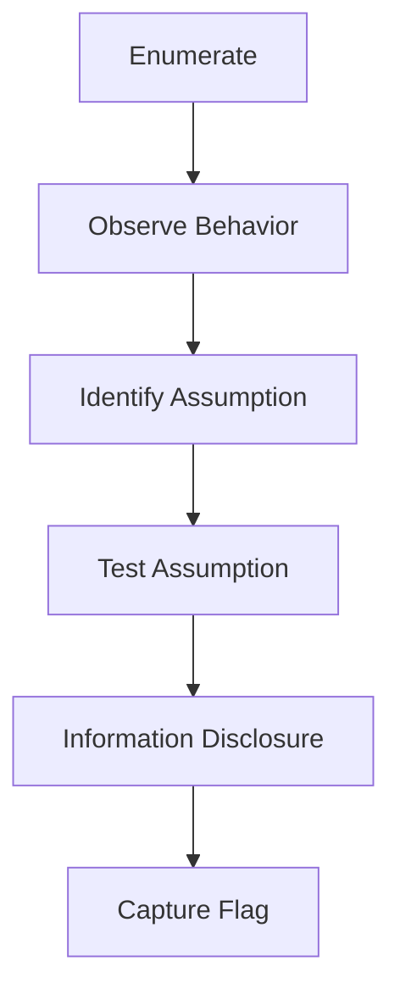

# OWASP Top 10:2025 – Identity & Design Failures

> **Platform:** TryHackMe  
> **Room:** OWASP Top 10:2025 – Identity & Design Failures  
> **Difficulty:** Beginner  
> **Category:** Web Security, Secure Development, API Security, Cryptography  
> **Status:** ✅ Completed

---

# Executive Summary

This room introduces several security weaknesses from the **OWASP Top 10:2025**, focusing on vulnerabilities caused by poor design decisions rather than complex software bugs.

Instead of exploiting SQL Injection or Remote Code Execution, the exercises demonstrate how insecure assumptions, weak configurations, outdated dependencies, and poor cryptographic implementations can expose sensitive information.

Throughout this room, the following OWASP categories are explored:

- AS02 – Security Misconfiguration
- AS03 – Software Supply Chain Failures
- AS04 – Cryptographic Failures
- AS06 – Insecure Design

Each challenge highlights a different stage of the Secure Development Lifecycle (SDLC), demonstrating that security must be considered from the earliest design phases instead of being added after an application is built.

---

# Learning Objectives

By completing this room, I learned how to:

- Identify common security misconfigurations in production environments.
- Understand the risks introduced by vulnerable third-party software.
- Recognize cryptographic implementation mistakes.
- Identify insecure architectural assumptions.
- Enumerate REST API endpoints.
- Analyze JavaScript files for sensitive information.
- Think like both an attacker and a secure application designer.
- Relate implementation flaws to the corresponding OWASP Top 10 categories.

---

# Prerequisites

To understand this room, readers should be familiar with:

- HTTP Requests and Responses
- REST APIs
- JSON
- Basic Linux Commands
- curl
- Browser Developer Tools
- JavaScript Basics
- Encryption Fundamentals
- Basic Web Enumeration

---

# Room Overview

Unlike many penetration testing rooms, this room is less about exploiting advanced vulnerabilities and more about understanding **why applications become insecure**.

Most challenges can be solved using simple HTTP requests or by inspecting application resources.

The real objective is to recognize insecure design patterns and understand the reasoning behind each vulnerability.

---

# OWASP Categories Covered

| Category | Focus |
|----------|------|
| AS02 | Security Misconfiguration |
| AS03 | Software Supply Chain Failures |
| AS04 | Cryptographic Failures |
| AS06 | Insecure Design |

These vulnerabilities share a common theme:

> Security failures often originate from poor design decisions rather than programming mistakes.

---

# Attack Chain Overview



Although every challenge follows a different path, the overall methodology remains consistent:

1. Enumerate the application.
2. Understand how it works.
3. Identify incorrect assumptions.
4. Verify the weakness.
5. Extract sensitive information.

---

# Concepts Covered

This room introduces several important security concepts that extend beyond penetration testing.

## Security Misconfiguration

Applications often expose unnecessary information because production systems are configured incorrectly.

Examples include:

- Debug mode enabled
- Verbose error messages
- Default credentials
- Exposed administrative interfaces

---

## Software Supply Chain

Modern applications depend heavily on external software.

If one dependency becomes vulnerable, every application using it may also become vulnerable.

Examples include:

- Outdated libraries
- Dependency confusion
- Malicious packages
- Forgotten debug functionality

---

## Cryptographic Failures

Encryption alone does not guarantee security.

Incorrect implementation can completely defeat even strong cryptographic algorithms.

Examples include:

- Hardcoded encryption keys
- Weak cipher modes
- Poor key management
- Secrets embedded in client-side code

---

## Insecure Design

One of the most dangerous vulnerabilities occurs before developers write a single line of code.

Poor assumptions such as:

> "Only our mobile application will access this API."

can introduce critical security weaknesses despite perfectly functioning code.

---

# Why This Room Matters

Many real-world breaches are not caused by sophisticated exploits.

Instead, attackers frequently abuse:

- Misconfigured servers
- Exposed APIs
- Weak architectural assumptions
- Forgotten development features
- Hardcoded secrets

Understanding these mistakes helps security professionals identify vulnerabilities before they become incidents.

---

# What's Next

The following sections document each challenge individually, including:

- Objective
- Enumeration Process
- Commands Used
- Explanation
- Why the attack worked
- Security impact
- Red Team perspective
- Blue Team perspective
- Detection opportunities

The next section begins with **AS02 – Security Misconfiguration**, where a production application unintentionally exposes internal debugging information through verbose error messages.

# AS02 — Security Misconfiguration

> **Objective:** Identify a security misconfiguration that unintentionally exposes sensitive internal information.

---

# Background

A **Security Misconfiguration** occurs when an application, server, or cloud service is deployed using insecure settings.

Unlike software vulnerabilities caused by programming mistakes, security misconfigurations usually result from:

- Debug features left enabled
- Default credentials
- Excessive permissions
- Unnecessary services
- Verbose error messages
- Exposed administrative interfaces

These issues frequently occur because development and production environments are configured differently.

---

## Why Security Misconfigurations Matter

Modern applications often contain debugging features that help developers during testing.

For example:

- Full stack traces
- Database errors
- File paths
- Framework versions
- Environment variables

While extremely useful during development, these details become valuable intelligence for attackers if exposed in production.

Even if they do not immediately allow exploitation, they significantly reduce the effort required to understand the application's internal structure.

---

# Challenge Objective

The challenge provides a simple API endpoint.

Our goal is to determine whether the application reveals information that should never be exposed to normal users.

---

# Enumeration

The application exposes the following endpoint:

```text
/api/user/<id>
```

Initially, requesting a numeric ID returned normal user information.

Example:

```http
GET /api/user/1
```

Changing the numeric identifier simply returned another valid response.

At first glance, nothing appeared vulnerable.

---

# Testing Unexpected Input

Applications should gracefully reject invalid input.

Instead of providing a numeric identifier, we supplied a string.

Example:

```http
GET /api/user/admin
```

---

## Response

Instead of returning a generic error page, the application revealed extensive internal debugging information.

Example response:

```json
{
    "error": "Invalid user ID format",
    "traceback": "...",
    "flag": "THM{...}"
}
```

> **Figure 1.** Verbose error message revealing internal application information.

*(Insert screenshot here)*

---

# Why This Worked

The endpoint expected an integer value.

Internally, the application attempted to convert:

```python
int(user_id)
```

When the value `"admin"` was supplied, Python raised a `ValueError`.

Instead of catching the exception and returning a generic error such as:

```http
400 Bad Request
```

the application exposed the complete debugging output.

This revealed:

- Internal exception details
- Application file paths
- Python traceback
- Sensitive implementation details
- The challenge flag

---

# Root Cause

The vulnerability was **not** caused by Python.

It was caused by how the application was configured.

The server was running with verbose debugging enabled, allowing internal exceptions to be returned directly to clients.

This represents a classic **Security Misconfiguration**.

---

# Attack Flow

```mermaid
flowchart LR

A[Send Request]
B["/api/user/admin"]
C[Application Attempts int(admin)]
D[ValueError Raised]
E[Verbose Debug Output]
F[Information Disclosure]

A --> B
B --> C
C --> D
D --> E
E --> F
```

---

# Pentester Perspective

Verbose error messages are extremely valuable during reconnaissance.

Even if they do not immediately lead to Remote Code Execution, they often reveal information such as:

- Programming language
- Framework
- Directory structure
- Database technology
- Installed packages
- Source code locations
- API behavior

This information reduces uncertainty and helps attackers identify additional attack paths.

---

# Blue Team Perspective

Production systems should never expose debugging information.

Instead:

- Disable debug mode.
- Return generic error messages.
- Log detailed exceptions internally.
- Protect logs from unauthorized access.
- Implement centralized monitoring.

A secure production response should resemble:

```http
HTTP/1.1 400 Bad Request

{
    "error": "Invalid request."
}
```

Detailed stack traces should remain visible only to developers through logging systems.

---

# Detection Opportunities

Security teams can detect this type of issue through:

- Automated vulnerability scanning
- Manual API testing
- Error response monitoring
- Web Application Firewalls (WAF)
- Secure configuration reviews
- Continuous security testing during deployment

---

# MITRE ATT&CK Mapping

| Technique | Description |
|-----------|-------------|
| T1592 | Gather Victim Host Information |
| T1082 | System Information Discovery |

Although this challenge only exposed debugging information, similar leaks frequently provide attackers with enough intelligence to plan subsequent attacks.

---

> **Pentester Tip**
>
> Whenever an application expects a specific input type (such as an integer), intentionally provide unexpected values like strings, special characters, or malformed data. Well-designed applications should fail gracefully. If detailed errors are returned instead, you've likely discovered an information disclosure issue.

---

# Key Takeaways

- Security Misconfiguration is a deployment problem rather than a programming bug.
- Debugging information should never be exposed in production.
- Verbose errors significantly improve an attacker's reconnaissance.
- Secure applications fail safely by returning generic error messages while logging technical details internally.
- Small information leaks often become the first step toward larger compromises.

# AS03 — Software Supply Chain Failures

> **Objective:** Identify a vulnerability introduced through a third-party software component.

---

# Background

Modern applications rarely consist entirely of code written by their developers.

Instead, they rely heavily on third-party software such as:

- Python packages
- JavaScript libraries
- Docker images
- Operating system packages
- CI/CD plugins
- Open-source frameworks

Collectively, these external components form the application's **software supply chain**.

While this dramatically accelerates development, it also introduces new security risks. If any dependency contains a vulnerability—or even an old debugging feature—every application that uses it may inherit the same weakness.

---

## What is a Software Supply Chain Failure?

A Software Supply Chain Failure occurs when vulnerabilities are introduced through external components rather than the application's own business logic.

Examples include:

- Vulnerable open-source libraries
- Malicious packages
- Dependency confusion attacks
- Typosquatting packages
- Compromised package repositories
- Forgotten debug functionality
- Outdated dependencies containing known CVEs

Unlike traditional application bugs, these weaknesses often originate from code that developers did not write themselves.

---

# Challenge Objective

The application exposes an API endpoint responsible for processing user input.

Our objective is to determine whether the backend relies on a vulnerable component that unintentionally exposes sensitive information.

---

# Enumeration

The application provided the following endpoint:

```text
POST /api/process
```

A normal request looked similar to:

```http
POST /api/process
Content-Type: application/json

{
    "data":"hello"
}
```

The endpoint behaved normally.

However, the room hinted that the application depended on an outdated utility library.

This suggested that hidden debugging functionality might still exist.

---

# Testing the Debug Functionality

Instead of sending ordinary data, the request contained the keyword:

```json
{
    "data":"debug"
}
```

Using `curl`:

```bash
curl -X POST http://<TARGET_IP>:5003/api/process \
-H "Content-Type: application/json" \
-d '{"data":"debug"}'
```

---

## Response

The server immediately returned highly sensitive internal information.

Example:

```json
{
    "admin_token": "...",
    "internal_secret": "...",
    "version": "...",
    "flag": "THM{SUPPLY_CH41N_VULN3R4B1L1TY}"
}
```

> **Figure 2.** Hidden debugging functionality exposing sensitive application data.

*(Insert screenshot here.)*

---

# Why This Worked

The vulnerable application depended on an outdated helper library.

That library still contained debugging functionality intended only for developers.

Instead of removing or disabling the debug feature before deployment, the application continued exposing it in production.

When the application received the input:

```text
debug
```

the dependency entered its debugging routine and revealed confidential internal information.

The application's own code was functioning as expected.

The weakness originated from software that the application trusted.

---

# Root Cause

The vulnerability was caused by an insecure software dependency rather than faulty application logic.

Conceptually, the architecture looked like this:

```text
Application
      │
      ▼
Third-Party Utility Library
      │
      ▼
Hidden Debug Function
      │
      ▼
Sensitive Information Disclosure
```

The developers unknowingly inherited insecure behavior from an external component.

---

# Attack Flow



---

# Why This is a Supply Chain Failure

At first glance, this may appear to be another debugging mistake.

However, the critical difference is **where the vulnerability originated**.

The application itself did not intentionally expose:

- admin tokens
- internal secrets
- debugging information

Instead, these behaviors came from a third-party dependency that had not been properly reviewed or updated.

Because the application trusted that dependency, it inherited its vulnerabilities.

This is precisely what OWASP classifies as a **Software Supply Chain Failure**.

---

# Real-World Examples

Software Supply Chain attacks have become one of the fastest-growing attack vectors.

Some well-known examples include:

- SolarWinds Orion compromise
- Log4Shell (Log4j)
- XZ Utils backdoor
- Dependency Confusion attacks
- Malicious NPM packages
- Malicious PyPI packages

In each case, attackers targeted software dependencies instead of attacking the application directly.

---

# Pentester Perspective

When assessing an application, always identify the technologies it relies on.

Useful reconnaissance includes:

- Framework versions
- Library versions
- JavaScript packages
- Python packages
- Docker images
- Build pipelines
- Public CVEs

If a vulnerable dependency is discovered, search for known exploits before attempting manual exploitation.

Sometimes the easiest compromise comes from software the developers simply forgot to update.

---

# Blue Team Perspective

Organizations should continuously monitor the security of every dependency used in production.

Recommended practices include:

- Keep dependencies updated.
- Remove unused packages.
- Review third-party code before deployment.
- Generate Software Bills of Materials (SBOMs).
- Continuously scan dependencies for known CVEs.
- Disable or remove debugging functionality from production builds.
- Pin dependency versions instead of relying on floating releases.

Security reviews should include not only application code but also every external component the application depends upon.

---

# Detection Opportunities

Security teams can identify supply chain issues using:

- Software Composition Analysis (SCA)
- SBOM validation
- Dependency vulnerability scanners
- CI/CD security testing
- Package integrity verification
- Runtime application monitoring

Examples of commonly used tools include:

- Dependabot
- Snyk
- Trivy
- OWASP Dependency-Check
- GitHub Advanced Security

---

# MITRE ATT&CK Mapping

| Technique | Description |
|-----------|-------------|
| T1195 | Supply Chain Compromise |
| T1588 | Obtain Capabilities |

This challenge demonstrates how attackers can abuse trusted software components instead of exploiting the application's own code.

---

> **Pentester Tip**
>
> When a challenge mentions a library, framework, or utility component, always ask yourself: **"Is the vulnerability actually in the application, or in something the application depends on?"** Searching for known CVEs and hidden debug functionality can often save hours of manual testing.

---

# Key Takeaways

- Modern applications inherit the security posture of their dependencies.
- Third-party software should be treated as part of the attack surface.
- Hidden debugging features inside dependencies can expose highly sensitive information.
- Regular dependency updates and security reviews are essential.
- A secure application requires both secure code **and** a secure software supply chain.

# AS04 — Cryptographic Failures

> **Objective:** Recover sensitive information by identifying an insecure cryptographic implementation.

---

# Background

Cryptography is one of the most effective tools for protecting sensitive information.

When implemented correctly, encryption ensures that even if an attacker intercepts data, it remains unreadable without the correct cryptographic key.

However, simply using encryption does **not** guarantee security.

Poor implementation choices—such as hardcoded keys, weak cipher modes, or improper key management—can completely undermine otherwise strong cryptographic algorithms.

This category is covered by **OWASP AS04: Cryptographic Failures**.

---

## What are Cryptographic Failures?

A Cryptographic Failure occurs when developers misuse cryptographic mechanisms, exposing sensitive data that should remain confidential.

Common examples include:

- Hardcoded encryption keys
- Weak hashing algorithms (MD5, SHA-1)
- Weak cipher modes (ECB)
- Poor key management
- Secrets stored in client-side code
- Sensitive data transmitted without encryption

In most real-world incidents, attackers do **not** break the encryption algorithm itself—they exploit weaknesses in how it has been implemented.

---

# Challenge Objective

The application stores encrypted information.

Our goal is not to break AES encryption, but to determine whether the application has made mistakes that allow us to decrypt the protected data.

---

# Enumeration

While exploring the application, a JavaScript file responsible for decryption was discovered.

Example:

```text
/decrypt.js
```

Inspecting the source code revealed several important configuration values.

```javascript
const SECRET_KEY = "my-secret-key-16";
const ENCRYPTION_MODE = "ECB";
const KEY_SIZE = 128;
```

> **Figure 3.** JavaScript source exposing the application's encryption configuration.

*(Insert screenshot here.)*

Immediately, two major security issues become apparent:

1. The encryption key is hardcoded inside client-side JavaScript.
2. The application uses **AES-ECB**, a cipher mode that should generally be avoided for sensitive data.

---

# Why This is Dangerous

Client-side JavaScript is downloaded by every user's browser.

That means every visitor automatically receives the encryption key.

Conceptually, the application behaves like this:

```text
Server

↓

Send encrypted data

+

Send decryption key

↓

Browser
```

Once an attacker downloads the JavaScript file, the "secret" key is no longer secret.

At that point, encryption provides little practical protection.

---

# Decrypting the Ciphertext

Using the discovered key, the encrypted message was decrypted with **CyberChef**.

Recipe:

1. **From Base64**
2. **AES Decrypt**

Configuration:

- Mode: ECB
- Key: `my-secret-key-16`
- Key Encoding: UTF-8

The decrypted message revealed:

```text
CONFIDENTIAL:
The admin password is 'admin123'.

Flag:
THM{CRYPTO_FAILURE_H4RDC0D3D_K3Y}
```

> **Figure 4.** Successfully decrypting the protected message using the exposed encryption key.

*(Insert screenshot here.)*

---

# Why This Worked

The attack did **not** break AES encryption.

Instead, it exploited poor implementation.

The application itself disclosed everything necessary for decryption:

- encryption algorithm
- cipher mode
- encryption key

Once those values became available, decrypting the ciphertext became straightforward.

The failure occurred because the application trusted that client-side code could safely store secrets.

---

# Root Cause

The vulnerability resulted from two independent cryptographic mistakes.

## 1. Hardcoded Secret Key

```javascript
const SECRET_KEY = "my-secret-key-16";
```

Anyone capable of viewing the JavaScript source immediately learns the encryption key.

A cryptographic key should **never** be embedded inside client-side code.

---

## 2. AES in ECB Mode

The application also configured AES using:

```javascript
ECB
```

Electronic Codebook (ECB) encrypts each plaintext block independently.

As a result:

- identical plaintext blocks produce identical ciphertext blocks
- patterns remain visible
- structural information may leak

Although ECB still performs encryption, it is generally considered unsuitable for protecting sensitive data because it does not provide semantic security.

Modern applications typically use authenticated encryption modes such as:

- AES-GCM
- AES-CCM
- ChaCha20-Poly1305

---

# Attack Flow



---

# Pentester Perspective

When reviewing web applications, JavaScript files are an excellent source of information.

Always inspect client-side code for:

- API keys
- JWT secrets
- Encryption keys
- Internal endpoints
- Access tokens
- Hidden functionality
- Comments left by developers

Even if encryption is used, ask:

> **"Who knows the key?"**

If the browser knows the key, an attacker can usually obtain it as well.

---

# Blue Team Perspective

Strong cryptography depends on more than selecting a secure algorithm.

Developers should:

- Never hardcode cryptographic keys.
- Store secrets in secure server-side key management systems.
- Use authenticated encryption modes such as AES-GCM.
- Rotate encryption keys regularly.
- Separate encrypted data from key storage.
- Ensure client-side applications never receive secrets they do not absolutely require.

Remember:

> Encryption is only as secure as the protection of its keys.

---

# Detection Opportunities

Security teams can identify cryptographic weaknesses through:

- Secure code reviews
- JavaScript source inspection
- Secret scanning tools
- Static Application Security Testing (SAST)
- Dynamic Application Security Testing (DAST)
- Manual penetration testing

Automated secret scanning tools can also detect hardcoded keys before deployment.

---

# MITRE ATT&CK Mapping

| Technique | Description |
|-----------|-------------|
| T1552 | Unsecured Credentials |
| T1040 | Network Sniffing (when combined with weak cryptographic implementations) |

Although this challenge focuses on local decryption, poor cryptographic implementations frequently enable attackers to recover sensitive credentials and confidential information.

---

> **Pentester Tip**
>
> Never assume encrypted data is actually secure. Before attempting to break the encryption algorithm, look for implementation mistakes such as exposed keys, weak cipher modes, predictable initialization vectors (IVs), or secrets embedded in client-side code. Exploiting implementation flaws is almost always easier than attacking the cryptography itself.

---

# Key Takeaways

- Strong encryption can still fail if implemented incorrectly.
- Hardcoded encryption keys completely undermine confidentiality.
- Secrets should never be stored in client-side JavaScript.
- AES-ECB is unsuitable for protecting sensitive information because it leaks data patterns.
- Most real-world cryptographic failures result from poor implementation rather than weaknesses in the encryption algorithm itself.

# AS06 — Insecure Design

> **Objective:** Identify an insecure architectural assumption that exposes sensitive information through an unprotected API.

---

# Background

Unlike implementation bugs, **Insecure Design** refers to security weaknesses introduced during the planning and architecture phase of software development.

An application can be written with clean, bug-free code and still be insecure if its overall design is based on incorrect assumptions.

Examples include:

- Trusting client-side validation
- Assuming users will behave honestly
- Assuming internal APIs are unreachable
- Assuming only trusted applications can access backend services
- Failing to define authorization requirements

These are not programming mistakes—they are design mistakes.

---

## What is Insecure Design?

Insecure Design occurs when security requirements are missing or when developers make unrealistic assumptions about how their application will be used.

For example:

> "Only our mobile application can communicate with this API."

Although this sounds reasonable, it is fundamentally incorrect.

Every HTTP request sent by a mobile application can also be sent by:

- A web browser
- `curl`
- Postman
- Burp Suite
- Python scripts
- Any custom HTTP client

Unless the server performs proper authentication and authorization, it cannot distinguish between a legitimate mobile application and an attacker.

---

# Challenge Objective

The application advertises itself as a **mobile-only messaging platform**.

Our objective is to determine whether the backend actually enforces that restriction or merely assumes users will only access it through the official mobile application.

---

# Initial Observation

Browsing to the application displays a landing page encouraging users to download the mobile app.

The page states:

> **"SecureChat is designed exclusively for mobile devices."**

At first glance, this suggests that sensitive functionality is only available through the mobile application.

> **Figure 5.** SecureChat landing page promoting the mobile application.

*(Insert screenshot here.)*

---

# Enumeration

Rather than trusting the landing page, API enumeration was performed.

During enumeration, the following endpoint was discovered:

```text
/api/users
```

Request:

```http
GET /api/users
```

Response:

```json
{
  "admin": {
    "email": "admin@example.com",
    "name": "Admin",
    "role": "admin"
  },
  "user1": {
    "email": "alice@example.com",
    "name": "Alice",
    "role": "user"
  },
  "user2": {
    "email": "bob@example.com",
    "name": "Bob",
    "role": "user"
  }
}
```

> **Figure 6.** Publicly accessible API exposing user information without authentication.

*(Insert screenshot here.)*

Immediately, this indicates that the backend does **not** require authentication before disclosing user information.

---

# Expanding Enumeration

After identifying the public user endpoint, additional API paths were tested.

One particularly interesting endpoint was:

```text
/api/messages/admin
```

Request:

```http
GET /api/messages/admin
```

Response:

```json
{
  "messages": [
    {
      "content": "Admin panel access key: THM{1NS3CUR3_D35IGN_4SSUMPT10N}",
      "from": "system"
    }
  ],
  "user": "admin"
}
```

> **Figure 7.** Administrative messages exposed through an unauthenticated API endpoint.

*(Insert screenshot here.)*

The endpoint returned sensitive administrative information without requiring:

- Login
- Session cookie
- API token
- Authorization header

---

# Why This Worked

The application assumed that only the official mobile application would communicate with its backend.

As a result, the developers exposed API endpoints without implementing proper authentication or authorization.

However, the backend receives standard HTTP requests.

It has no inherent way to determine whether a request originated from:

- the official mobile app,
- a browser,
- `curl`,
- Burp Suite,
- or a custom script.

Without server-side access control, every client is treated equally.

---

# Root Cause

The vulnerability was caused by a flawed trust model.

Instead of enforcing security through authentication and authorization, the application relied on an assumption:

```text
Only our mobile application can access these endpoints.
```

This assumption became the application's security mechanism.

Because assumptions are not security controls, attackers were able to access protected resources simply by issuing ordinary HTTP requests.

---

# Attack Flow

```mermaid
flowchart LR

A[Visit Landing Page]
B[Notice Mobile-Only Claim]
C[Enumerate API Endpoints]
D[/api/users]
E[Discover Additional Endpoints]
F[/api/messages/admin]
G[Sensitive Information Disclosure]

A --> B
B --> C
C --> D
D --> E
E --> F
F --> G
```

---

# Why This is Insecure Design

The backend's implementation behaved exactly as designed.

The problem was that the design itself was fundamentally flawed.

The developers assumed:

```text
Mobile App
        │
        ▼
Backend API
```

In reality, the architecture should have been considered as:

```text
Any HTTP Client
        │
        ▼
Authentication
        │
        ▼
Authorization
        │
        ▼
Backend API
```

The missing authentication layer transformed the API into a publicly accessible interface.

---

# Pentester Perspective

When encountering phrases such as:

- "Internal API"
- "Mobile Only"
- "Private Endpoint"
- "Frontend Only"

always verify whether those restrictions are actually enforced.

A common testing methodology is:

1. Enumerate API endpoints.
2. Access them directly using `curl` or Burp Suite.
3. Observe whether authentication is required.
4. Look for sensitive resources exposed without authorization.

Many real-world API vulnerabilities arise because developers trust the client rather than the server.

---

# Blue Team Perspective

Client applications should never be trusted to enforce security.

Every backend endpoint should independently verify:

- Who is making the request (Authentication)
- What they are allowed to access (Authorization)

A secure implementation would require valid credentials before returning any user or administrative data.

Additionally:

- Apply least privilege.
- Perform authorization checks on every request.
- Treat all HTTP clients as potentially untrusted.
- Never rely on hidden endpoints or proprietary applications as security mechanisms.

---

# Detection Opportunities

Organizations can detect insecure design issues through:

- API security assessments
- Threat modeling during system design
- Manual penetration testing
- Authorization testing
- Secure architecture reviews
- OWASP API Security Top 10 assessments

Because these weaknesses originate from design decisions, they are often difficult to detect using automated scanners alone.

---

# MITRE ATT&CK Mapping

| Technique | Description |
|-----------|-------------|
| T1190 | Exploit Public-Facing Application |
| T1087 | Account Discovery |

Although this challenge demonstrates information disclosure, similar design flaws often lead to privilege escalation and unauthorized access to sensitive resources.

---

> **Pentester Tip**
>
> Never assume that claims such as "mobile-only," "internal," or "frontend-only" provide actual security. If an endpoint communicates over HTTP, test whether it can be accessed directly. Security should always be enforced by the server—not by assumptions about the client.

---

# Key Takeaways

- Insecure Design originates from flawed architectural decisions rather than coding errors.
- Backend APIs must never trust the client application.
- Authentication and authorization should be enforced on every sensitive endpoint.
- Hidden or undocumented APIs are **not** security controls.
- Security assumptions should always be validated through technical enforcement rather than developer expectations.

# Defensive Perspective

Although each challenge demonstrated a different vulnerability, the defensive strategies share a common principle:

> **Security should be designed into the system—not added after deployment.**

Organizations should implement security controls throughout the entire Software Development Life Cycle (SDLC), from architecture and implementation to deployment and maintenance.

---

# Defensive Controls by OWASP Category

| OWASP Category | Defensive Controls |
|----------------|-------------------|
| AS02 – Security Misconfiguration | Disable debug mode, remove default credentials, harden production environments, perform secure configuration reviews |
| AS03 – Software Supply Chain Failures | Maintain Software Bill of Materials (SBOM), continuously update dependencies, scan third-party libraries for known vulnerabilities |
| AS04 – Cryptographic Failures | Store secrets securely, implement proper key management, use modern cryptographic algorithms and authenticated encryption modes |
| AS06 – Insecure Design | Perform threat modeling, define trust boundaries, enforce authentication and authorization on every sensitive endpoint |

---

# Secure Development Lifecycle (SDLC)

The vulnerabilities demonstrated in this room can be prevented by integrating security into every phase of development.



Rather than treating security as a final checklist, modern organizations integrate security practices throughout the software lifecycle.

---

# MITRE ATT&CK Overview

Although these exercises focused primarily on information disclosure rather than full system compromise, they align with several MITRE ATT&CK techniques commonly observed during real-world intrusions.

| Technique | Description | Related Challenge |
|-----------|-------------|-------------------|
| T1592 | Gather Victim Host Information | AS02 |
| T1195 | Supply Chain Compromise | AS03 |
| T1552 | Unsecured Credentials | AS04 |
| T1190 | Exploit Public-Facing Application | AS06 |
| T1087 | Account Discovery | AS06 |

These techniques frequently appear during the reconnaissance and initial access phases of an attack.

---

# Skills Gained

Completing this room strengthened several practical cybersecurity skills.

## Web Enumeration

- Enumerating API endpoints
- Inspecting application behavior
- Testing unexpected input
- Identifying exposed resources

---

## API Security

- Understanding REST API exposure
- Testing unauthenticated endpoints
- Recognizing missing authorization
- Identifying insecure trust assumptions

---

## Cryptography

- Identifying hardcoded secrets
- Reviewing client-side JavaScript
- Understanding encryption implementation weaknesses
- Decrypting data using exposed keys

---

## Secure Development

- Understanding threat modeling
- Identifying poor architectural decisions
- Recognizing insecure software dependencies
- Evaluating production configurations

---

# Knowledge Reinforced

This room reinforces an important cybersecurity principle:

> **Most successful attacks exploit implementation mistakes or design assumptions—not advanced mathematics or sophisticated exploits.**

Throughout the exercises, none of the vulnerabilities required:

- Buffer Overflow exploitation
- Remote Code Execution
- Memory corruption
- Complex payloads

Instead, success depended on:

- Careful observation
- Systematic enumeration
- Understanding application behavior
- Recognizing common security patterns

This demonstrates why methodology is often more valuable than memorizing exploit techniques.

---

# Common Patterns Observed

Across all four challenges, the attack methodology remained remarkably consistent.



Although each vulnerability belonged to a different OWASP category, the investigative process remained the same.

---

# Key Takeaways

This room highlights several important lessons that extend beyond the individual challenges.

## 1. Security Begins with Design

Applications become difficult to secure when security is considered only after development is complete.

Proper architecture reduces entire classes of vulnerabilities before any code is written.

---

## 2. Never Trust Assumptions

Developers frequently assume:

- Users will behave correctly.
- Clients cannot be modified.
- Internal APIs cannot be reached.
- Debug functionality will never be discovered.

Attackers routinely challenge these assumptions.

---

## 3. Enumeration is Powerful

Every challenge in this room began with observation rather than exploitation.

Careful enumeration revealed:

- Debug information
- Hidden functionality
- Hardcoded secrets
- Unprotected API endpoints

The exploitation itself was often straightforward once sufficient information had been gathered.

---

## 4. Security is a Shared Responsibility

Application security depends on multiple disciplines working together.

Developers, security engineers, DevOps teams, and system administrators all contribute to the application's overall security posture.

A weakness in any layer can compromise the entire system.

---

# Personal Reflection

This room demonstrated that many critical vulnerabilities originate long before an attacker sends an exploit.

Instead of exploiting complex programming bugs, the exercises focused on recognizing insecure decisions made during development, deployment, and system design.

One particularly valuable lesson was understanding the difference between **implementation flaws** and **design flaws**.

For example, the "mobile-only" challenge initially appeared to require bypassing client restrictions. However, the real issue was recognizing that the backend trusted an assumption instead of enforcing authentication. This reinforced an important penetration testing mindset:

> **Security controls should always be verified—not assumed.**

Overall, this room strengthened my ability to analyze applications from both an attacker's and a defender's perspective, emphasizing that successful penetration testing often begins with understanding how developers think, what assumptions they make, and where those assumptions break down.

---

# References

- OWASP Top 10:2025
- OWASP Secure Coding Practices
- OWASP Software Assurance Maturity Model (SAMM)
- OWASP API Security Top 10
- MITRE ATT&CK Framework
- TryHackMe — OWASP Top 10:2025: Identity & Design Failures

---

# Future Learning Path

This room provides a strong foundation for more advanced topics, including:

- OWASP API Security Top 10
- Authentication and Authorization Testing
- Secure Software Development Lifecycle (SSDLC)
- Threat Modeling
- Secure Cryptographic Engineering
- Software Supply Chain Security
- Web Application Penetration Testing
- Advanced Hack The Box Web Challenges

---

# Final Thoughts

The greatest lesson from this room is that **security is fundamentally about reducing trust**.

Whether dealing with configurations, software dependencies, cryptography, or application architecture, each challenge demonstrated the dangers of trusting something that should instead be verified.

As a penetration tester, this reinforces an important methodology:

1. Enumerate the application.
2. Understand how it works.
3. Identify what the developers trust.
4. Verify whether that trust is justified.
5. Exploit only after understanding the underlying design.

Developing this mindset is far more valuable than memorizing commands or payloads, as it can be applied to virtually every web application assessment.

# Troubleshooting & Lessons Learned

Although this room is classified as beginner-friendly, several situations required troubleshooting and analytical thinking rather than simply following instructions.

---

## Problem 1 — Enumeration Produced No Useful Results

### Issue

While enumerating API endpoints, the initial `ffuf` scan using `common.txt` returned very few interesting results.

Example:

```bash
ffuf -u http://TARGET/FUZZ \
-w /usr/share/seclists/Discovery/Web-Content/common.txt
```

Important endpoints such as:

```
/api/users
```

were not discovered.

---

### Root Cause

`common.txt` is intentionally small and only contains frequently used filenames and directories.

Many API endpoints are simply not included.

---

### Resolution

Switching to a larger wordlist significantly improved coverage.

Examples:

```bash
raft-small-words.txt
```

or

```bash
directory-list-2.3-medium.txt
```

The larger wordlists successfully identified additional API resources that were not present in the smaller list.

---

### Lesson Learned

Choosing the correct wordlist is just as important as choosing the correct enumeration tool.

Different targets require different dictionaries.

---

## Problem 2 — Assuming the Landing Page Was the Application

### Issue

The landing page only displayed a message encouraging users to download the mobile application.

Initially, it appeared that there was nothing interesting to attack.

---

### Root Cause

The visible website was merely a frontend landing page.

The actual challenge existed within the backend API.

---

### Resolution

Instead of focusing solely on the HTML page, API endpoint enumeration was performed.

This quickly revealed:

```
/api/users
```

followed by:

```
/api/messages/admin
```

where the flag was ultimately discovered.

---

### Lesson Learned

Never assume the visible interface represents the complete application.

Modern web applications frequently separate:

- Frontend
- Backend API
- Administrative services

Enumerating the backend is often far more valuable than inspecting the homepage.

---

## Problem 3 — Thinking Like an Attacker Instead of Following the Hint Literally

### Issue

The room hint stated:

> *"Have they assumed that only mobile devices can access it?"*

My initial instinct was to spoof the **User-Agent** header to imitate an Android device.

For example:

```bash
curl -A "Mozilla/5.0 (Linux; Android 14)" http://TARGET
```

However, this produced no meaningful results.

---

### Root Cause

The vulnerability was **not** related to User-Agent validation.

Instead, the challenge focused on the application's trust model.

The developers assumed that only the official mobile application would communicate with the backend API.

---

### Resolution

Rather than attempting to impersonate a mobile device, I shifted my focus toward API enumeration.

This revealed that sensitive backend endpoints were publicly accessible without authentication.

---

### Lesson Learned

Hints often describe **the underlying security concept**, not the exact exploitation technique.

Understanding the vulnerability category is more valuable than blindly following the wording of the hint.

---

# Common Mistakes Beginners Might Make

During this room, several mistakes are easy to make.

### Mistake 1

Assuming encryption automatically means data is secure.

Reality:

Encryption is only as strong as its implementation.

---

### Mistake 2

Believing hidden API endpoints are private.

Reality:

If an endpoint is reachable over HTTP, anyone can potentially access it.

---

### Mistake 3

Ignoring JavaScript files.

Reality:

Client-side JavaScript frequently contains:

- API endpoints
- Access tokens
- Configuration values
- Feature flags
- Hardcoded secrets

---

### Mistake 4

Thinking software dependencies are always trustworthy.

Reality:

Applications inherit vulnerabilities from their dependencies.

---

### Mistake 5

Treating security as a feature instead of a design requirement.

Reality:

Security must be incorporated into the architecture from the beginning.

---

# Overall Learning Outcomes

Completing this room strengthened my understanding of both offensive and defensive application security.

### Offensive Skills

- API enumeration
- HTTP request analysis
- Information disclosure identification
- JavaScript analysis
- Cryptographic assessment
- Security pattern recognition

---

### Defensive Skills

- Secure configuration management
- Dependency management
- Secure cryptographic implementation
- Threat modeling
- Authentication and authorization design

---

# How This Room Fits Into My Cybersecurity Journey

This room marks an important transition from simply learning **how to exploit vulnerabilities** to understanding **why those vulnerabilities exist**.

Unlike traditional Capture The Flag (CTF) challenges, the focus here was not on discovering complicated payloads or chaining exploits.

Instead, the emphasis was on identifying flawed assumptions made during software development.

Understanding these assumptions is essential because real-world penetration testing often involves recognizing weak designs before attempting exploitation.

---

# Final Reflection

One of the most valuable lessons from this room is that successful penetration testing is rarely about trying random payloads until something works.

Instead, it involves developing a structured methodology:

1. Observe the application.
2. Enumerate available resources.
3. Understand the application's architecture.
4. Identify assumptions made by the developers.
5. Verify whether those assumptions are actually enforced.

Throughout this room, every challenge followed this methodology.

Whether dealing with verbose error messages, vulnerable software dependencies, hardcoded cryptographic keys, or publicly accessible APIs, the exploitation itself was relatively simple.

The difficult—and valuable—part was recognizing **why** the application was vulnerable in the first place.

As I continue learning web application security and tackling more advanced Hack The Box machines, this mindset will be far more valuable than memorizing individual exploits. Technologies, frameworks, and attack techniques evolve over time, but the ability to analyze systems, question assumptions, and think critically about security design remains universally applicable.

---

# Repository Structure

```text
OWASP-Top10-2025-Identity-Design-Failures/
│
├── README.md
├── images/
│   ├── 01-room-overview.png
│   ├── 02-as02-verbose-error.png
│   ├── 03-as03-debug-response.png
│   ├── 04-as04-decrypt-js.png
│   ├── 05-as04-cyberchef.png
│   ├── 06-as06-landing-page.png
│   ├── 07-as06-api-users.png
│   └── 08-as06-admin-messages.png
│
└── notes/
    └── personal-notes.md
```

---

# Next Recommended Rooms

To build upon the concepts introduced in this room, I recommend the following learning path:

1. **OWASP Top 10:2025 – Application Design Flaws** *(Next room in this module)*
2. **OWASP API Security Top 10**
3. **Authentication Bypass**
4. **JWT Fundamentals**
5. **IDOR (Insecure Direct Object References)**
6. **Hack The Box – Easy Web Machines**
7. **PortSwigger Web Security Academy**

These topics naturally extend the concepts of trust boundaries, API security, authentication, and secure application design introduced in this room.

---

# Tags

`#OWASP` `#OWASPTop10` `#WebSecurity` `#API` `#SecurityMisconfiguration` `#SupplyChain` `#Cryptography` `#InsecureDesign` `#ThreatModeling` `#TryHackMe` `#CyberJourney`