# OWASP Top 10 2025: Insecure Data Handling

## Executive Summary

The **OWASP Top 10: Insecure Data Handling** room introduces three critical vulnerability categories from the **OWASP Top 10 (2025)** that focus on how web applications process, protect, and trust data. Rather than targeting authentication or access control, these vulnerabilities arise from insecure handling of user input, sensitive information, and application artifacts.

Throughout this room, I explored the following categories:

- **A04 – Cryptographic Failures**
- **A05 – Injection**
- **A08 – Software or Data Integrity Failures**

The practical exercises demonstrated three different attack scenarios:

- Breaking a weak XOR-based encryption scheme through key recovery.
- Exploiting a **Server-Side Template Injection (SSTI)** vulnerability to read sensitive files.
- Crafting a malicious **Python Pickle** object to exploit insecure deserialization.

Although each vulnerability appears different, they all originate from the same security principle:

> **Never trust data without proper validation, protection, or verification.**

Whether the data is encrypted, rendered as a template, or deserialized into an object, applications must establish clear trust boundaries before processing it.

---

# Learning Objectives

After completing this room, I was able to:

- Explain what Cryptographic Failures are and why improper cryptography creates security risks.
- Understand why custom encryption ("rolling your own crypto") should never be used.
- Differentiate between encoding, hashing, and encryption.
- Explain the root cause of Injection vulnerabilities.
- Understand how Server-Side Template Injection (SSTI) works internally.
- Perform an SSTI attack to read sensitive files from the server.
- Explain serialization and deserialization in Python.
- Understand why Python Pickle is dangerous when used with untrusted input.
- Build a malicious Pickle payload using the `__reduce__()` method.
- Explain why Software or Data Integrity Failures are considered a supply-chain and trust-boundary issue.
- Understand secure development practices for preventing these vulnerabilities.

---

# Room Overview

Modern web applications constantly process data from various sources.

Examples include:

- User input
- Uploaded files
- Configuration files
- API responses
- Session cookies
- Serialized objects
- Software dependencies
- Update packages

Every time an application accepts data, it makes an implicit decision:

> **"Do I trust this data?"**

If that trust is misplaced, attackers may manipulate the application's behavior.

This room demonstrates three different ways that misplaced trust can lead to compromise.

| OWASP Category | Focus | Practical Attack |
|---------------|------|------------------|
| **A04** | Protecting sensitive information | Weak XOR encryption |
| **A05** | Processing user input safely | Server-Side Template Injection |
| **A08** | Trusting software and serialized data | Python Pickle Deserialization |

Although these attacks target different components, they all exploit insecure handling of data.

---

# OWASP Top 10 Categories Covered

## A04 – Cryptographic Failures

Cryptography exists to protect sensitive information.

However, cryptography only works when implemented correctly.

Common mistakes include:

- Weak encryption
- Weak keys
- Reused keys
- Hardcoded secrets
- Outdated algorithms
- Custom encryption algorithms

The lab demonstrates a weak XOR cipher protected by a short shared key that can easily be brute-forced.

---

## A05 – Injection

Injection vulnerabilities occur when applications interpret user-controlled data as executable instructions.

Instead of treating input as data, the application accidentally treats it as:

- SQL queries
- Operating system commands
- Template expressions
- AI prompts
- LDAP queries

This room focuses on **Server-Side Template Injection (SSTI)** using a Python template engine.

---

## A08 – Software or Data Integrity Failures

Applications often trust software and data originating from external sources.

If that trust is not verified, attackers may manipulate:

- Software packages
- Build pipelines
- Configuration files
- Templates
- Serialized objects

The practical demonstrates **Insecure Deserialization** using Python Pickle, where a malicious serialized object executes attacker-controlled code during deserialization.

---

# Prerequisites

To fully understand this room, readers should already be familiar with:

- Basic web application architecture
- HTTP requests and responses
- Python fundamentals
- Linux file systems
- Basic command-line usage
- Introduction to OWASP Top 10
- Basic cryptography concepts
- Object-oriented programming fundamentals (helpful for Pickle)

---

# Concepts Covered

This room introduces and reinforces the following concepts:

## Web Security

- Trust boundaries
- Input validation
- Secure software development
- Data integrity
- Secure coding principles

## Cryptography

- XOR encryption
- Symmetric encryption
- Base64 encoding
- Key management
- Password hashing
- Weak cryptographic implementations

## Injection

- Server-Side Template Injection (SSTI)
- Dynamic template rendering
- Python object traversal
- Template engines

## Software Integrity

- Serialization
- Deserialization
- Python Pickle
- `__reduce__()`
- Arbitrary code execution
- Integrity verification

---

# Technologies Used

| Technology | Purpose |
|------------|---------|
| Python | SSTI & Pickle deserialization |
| Jinja2 | Server-side template engine |
| Python Pickle | Object serialization format |
| XOR Cipher | Demonstration of weak encryption |
| Base64 | Binary-to-text encoding |
| Linux | Target operating system |

---

# Lab Architecture

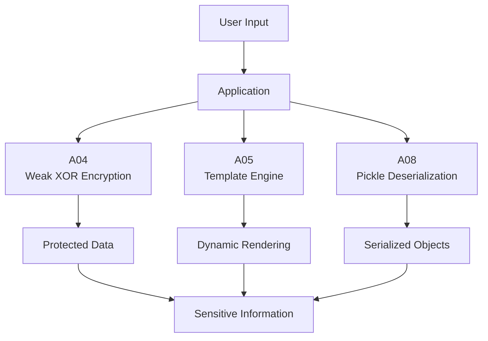

---

# Data Flow Throughout This Room

The three practical exercises demonstrate different stages of data handling inside a web application.

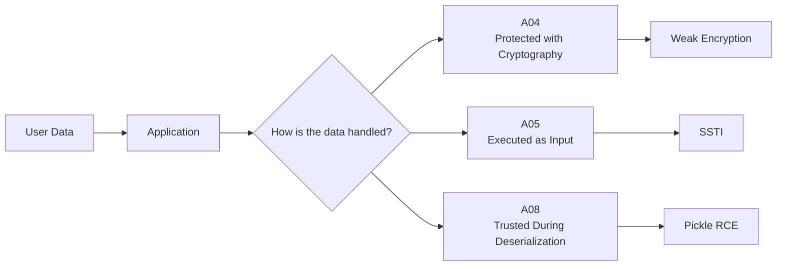

Each vulnerability targets a different phase of the application's data lifecycle:

- **A04** attacks how data is **protected**.
- **A05** attacks how data is **processed**.
- **A08** attacks how data is **trusted**.

Understanding this distinction is essential because modern attacks rarely exploit just one component—they often chain multiple weaknesses together.

---

# Why This Room Matters

Many developers associate web security primarily with authentication and authorization. However, modern applications spend most of their time handling data.

Every request, uploaded file, configuration file, API response, or serialized object introduces an opportunity for attackers if it is:

- Not protected properly
- Parsed incorrectly
- Trusted too easily

The three OWASP categories covered in this room demonstrate that secure applications are not only built by controlling **who** can access data, but also by ensuring that **how data is processed** remains secure throughout its entire lifecycle.

In other words:

> **Applications should never trust data simply because it exists—they must verify, validate, and securely process it before use.**

# A04: Cryptographic Failures

## What is a Cryptographic Failure?

Cryptographic Failures occur when an application fails to adequately protect sensitive information due to the misuse or incorrect implementation of cryptography.

One of the biggest misconceptions about cryptography is that attackers "break the encryption algorithm." In reality, modern cryptographic algorithms such as AES and RSA are extremely difficult to break. Instead, attackers typically exploit **implementation mistakes** made by developers.

Common examples include:

- Storing passwords in plaintext
- Using outdated hashing algorithms (MD5, SHA-1)
- Hardcoding encryption keys
- Using weak or predictable keys
- Reusing encryption keys across multiple users
- Creating custom encryption algorithms ("rolling your own crypto")

The practical exercise in this room demonstrates exactly this last mistake by implementing a weak XOR-based encryption scheme with a short shared key.

---

# Why Does Cryptography Exist?

Before discussing attacks, it's important to understand **why cryptography exists in the first place**.

Modern cryptography helps achieve four major security goals.

| Security Goal | Description |
|--------------|-------------|
| Confidentiality | Prevent unauthorized users from reading sensitive data. |
| Integrity | Ensure data has not been modified. |
| Authentication | Verify the identity of users or systems. |
| Non-repudiation | Prevent parties from denying actions they performed. |

Without cryptography, sensitive information such as passwords, API keys, payment information, and personal data would travel across networks in plain text.

---

# The Weak XOR Cipher

The lab uses an intentionally weak implementation based on the **XOR (Exclusive OR)** operation.

Unlike AES, XOR by itself is **not** a secure encryption algorithm.

The application encrypts every note using:

- A repeating key
- A key length of only four characters
- The same key for every note

These design choices make the encryption extremely weak.

---

# Understanding XOR

XOR is a bitwise logical operation.

One of its most important properties is:

```text
A XOR B XOR B = A
```

This means the exact same key is used for both encryption and decryption.

Encryption process:

```text
Plaintext
      │
      ▼
XOR with Key
      │
      ▼
Ciphertext
```

Decryption process:

```text
Ciphertext
      │
      ▼
XOR with Same Key
      │
      ▼
Plaintext
```

Because XOR is reversible, anyone who discovers the key can immediately decrypt every message protected by it.

---

# Why the Implementation is Weak

The vulnerability is **not XOR itself**, but **how XOR is used**.

The application contains several major cryptographic mistakes.

## 1. Extremely Short Key

The key consists of only four characters.

The application even reveals the first three:

```text
KEY_
```

Only the final character needs to be discovered.

Instead of searching billions or trillions of possibilities, the attacker only has to brute-force a very small search space.

---

## 2. Repeating Key

Suppose the plaintext is:

```text
HELLOWORLD
```

The application repeatedly applies the same key:

```text
KEY1KEY1KEY
```

Result:

```text
HELLOWORLD
KEY1KEY1KE
```

Repeating patterns make statistical attacks and brute-force attacks much easier.

---

## 3. Shared Key

All three encrypted notes use exactly the same encryption key.

```text
Note 1
   │
   ▼
 KEY1

Note 2
   │
   ▼
 KEY1

Note 3
   │
   ▼
 KEY1
```

Once the attacker discovers the key from **one** note, every other encrypted note becomes readable.

This completely defeats confidentiality.

---

# Base64 is NOT Encryption

One common misconception is assuming Base64 provides security.

The ciphertext shown in the lab appears similar to:

```text
BiA8RSIrPhE4...
```

However, this is **not** the encrypted data.

The actual process is:

```text
Plaintext
      │
      ▼
XOR Encryption
      │
      ▼
Binary Data
      │
      ▼
Base64 Encoding
```

Base64 simply converts binary data into printable characters.

Anyone can decode Base64 without knowing any secret key.

It provides **zero confidentiality**.

---

# Practical Walkthrough

The application contains three encrypted notes.

Each note is encrypted using the same weak XOR implementation.

The application also provides an important hint:

```text
KEY_
```

Since only the final character is unknown, the remaining possibilities become very small.

By trying the possible values for the fourth character, the correct key is quickly discovered.

Once the correct key is entered:

- All encrypted notes are decrypted.
- The confidential note becomes readable.
- The flag is revealed.

**Flag**

```text
THM{WEAK_CRYPTO_FLAG}
```

---

# Why the Attack Worked

The attack succeeds because several cryptographic design principles were violated simultaneously.

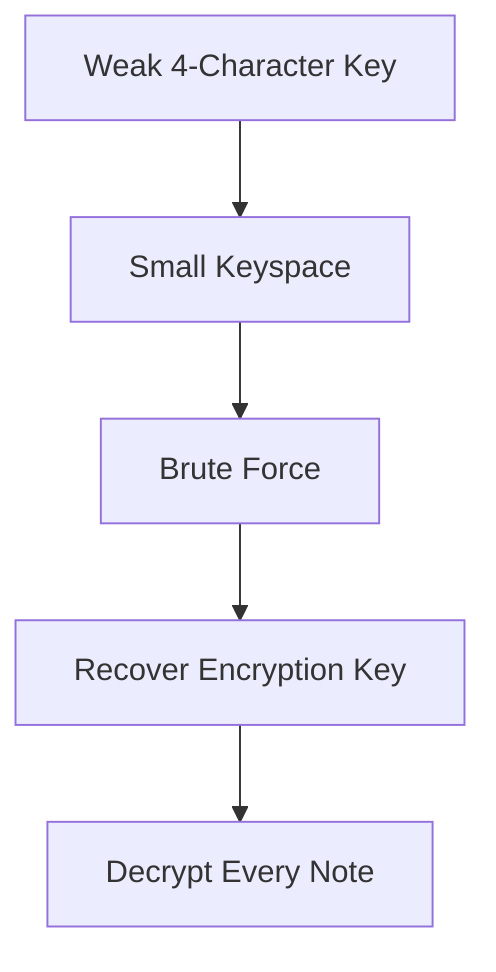

The attacker does **not** break XOR.

Instead, the attacker simply discovers the encryption key because the implementation makes it trivial.

---

# Why "Rolling Your Own Crypto" is Dangerous

Developers sometimes believe they can create a "unique" encryption algorithm.

Unfortunately, security through obscurity rarely works.

Well-established algorithms such as:

- AES
- ChaCha20
- RSA
- ECC

have been reviewed by thousands of cryptographers over many years.

Custom algorithms usually receive **no** peer review and often contain fundamental weaknesses.

This is why security professionals consistently recommend:

> **Never roll your own cryptography.**

---

# How to Prevent Cryptographic Failures

Several best practices significantly reduce the risk of cryptographic failures.

## Use Proven Algorithms

Instead of custom encryption:

- AES-256-GCM
- ChaCha20-Poly1305

---

## Hash Passwords Properly

Never use:

- MD5
- SHA-1

Instead use:

- Argon2
- bcrypt
- scrypt

---

## Use Strong Keys

Keys should be:

- Long
- Random
- Unique
- Rotated periodically

---

## Protect Secrets

Never store:

- API keys
- Encryption keys
- Passwords

inside:

- Source code
- Git repositories
- Configuration files

Instead, use secret management solutions such as:

- HashiCorp Vault
- AWS Secrets Manager
- Azure Key Vault

---

# Red Team Perspective

During a penetration test, cryptographic weaknesses often become valuable attack paths.

Typical findings include:

- Weak password hashing
- Hardcoded secrets
- Weak encryption algorithms
- Predictable encryption keys
- Reused encryption keys
- Sensitive information stored in plaintext

Although attackers rarely "break AES," they frequently exploit poor implementations surrounding cryptography.

---

# Blue Team Perspective

Defenders should ensure:

- Strong encryption algorithms are used.
- Keys are securely generated and stored.
- Passwords are hashed using modern password hashing algorithms.
- TLS is properly configured.
- Secrets are managed through dedicated secret management systems.
- Encryption keys are rotated periodically.

---

# Detection Opportunities

Security teams should monitor for indicators such as:

- Plaintext credential storage
- Hardcoded secrets in repositories
- Deprecated cryptographic algorithms
- Weak TLS configurations
- Identical encryption keys reused across users or systems
- Unexpected access to secret management infrastructure

---

# Key Takeaways

- Cryptographic Failures are usually caused by **poor implementation**, not broken algorithms.
- XOR itself is not secure encryption when used with a short, repeating key.
- Reusing the same key across multiple pieces of data significantly weakens confidentiality.
- Base64 is an encoding format, **not** an encryption mechanism.
- Modern applications should rely on proven cryptographic libraries rather than custom algorithms.
- Strong key management is just as important as strong encryption algorithms.
- For penetration testers, cryptographic weaknesses often lead to credential theft, sensitive data disclosure, and further compromise without ever attacking the encryption algorithm itself.

# A05: Injection

## What is Injection?

Injection is one of the oldest and most dangerous web application vulnerabilities. It occurs when an application accepts user-controlled input and mistakenly treats that input as executable instructions rather than ordinary data.

Instead of safely processing the input, the application passes it directly to another interpreter, such as:

- SQL databases
- Operating system shells
- Template engines
- LDAP services
- XML parsers
- AI models

If the application fails to separate **code** from **data**, an attacker can manipulate the application's behavior.

The fundamental principle behind every Injection vulnerability can be summarized as:

> **User-controlled data should never become executable code.**

---

# Why Does Injection Happen?

Injection almost always happens because developers combine application logic with user input.

Instead of keeping them separate, they construct commands dynamically.

Conceptually:

```text
Application Code
        +
User Input
        │
        ▼
Single Executable Statement
```

This allows attackers to inject additional instructions that were never intended by the developer.

The problem is not the database, shell, or template engine—it is the application's failure to distinguish between trusted code and untrusted input.

---

# Common Types of Injection

Injection is much broader than SQL Injection.

Some of the most common examples include:

| Injection Type | Target |
|----------------|--------|
| SQL Injection | Database |
| Command Injection | Operating System |
| LDAP Injection | LDAP Server |
| XPath Injection | XML Documents |
| XML Injection | XML Parser |
| NoSQL Injection | NoSQL Database |
| Server-Side Template Injection (SSTI) | Template Engine |
| AI Prompt Injection | Large Language Models |

Although each targets a different component, they all exploit the same underlying weakness:

> **Untrusted input is interpreted as executable instructions.**

---

# Server-Side Template Injection (SSTI)

The practical exercise in this room demonstrates **Server-Side Template Injection (SSTI)**.

Modern web applications often generate dynamic pages using template engines.

Instead of writing static HTML, developers use templates such as:

```jinja
Hello {{ username }}
```

When the page is rendered:

```text
Hello Alice
```

The template engine replaces the variable with actual data.

This allows developers to create dynamic web pages efficiently.

---

# How Template Engines Work

A simplified rendering process looks like this:

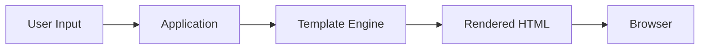

Normally, the application inserts user data into predefined template variables.

However, if user input itself is treated as template code, the template engine begins executing attacker-controlled expressions.

That is exactly what SSTI exploits.

---

# Confirming the Vulnerability

A common way to test for SSTI is by submitting a simple mathematical expression.

Input:

```jinja
{{7*7}}
```

If the application responds with:

```text
49
```

the template engine has evaluated the expression rather than displaying it as plain text.

This confirms that the application is vulnerable to template injection.

---

# Practical Walkthrough

The vulnerable web application renders user input directly using the template engine.

Instead of treating the input as plain text, the application evaluates it as a Jinja2 template.

The goal of the exercise is to retrieve the contents of:

```text
flag.txt
```

which is located in the same directory as the web application.

The payload used during the lab is:

```jinja
{{ request.application.__globals__.__builtins__.open('flag.txt').read() }}
```

Once submitted, the application returns the contents of the file.

**Flag**

```text
THM{SSTI_FLAG_OBTAINED}
```

---

# Understanding the Payload

At first glance, the payload appears complicated.

In reality, it simply traverses Python objects until it reaches Python's built-in functions.

The execution flow is:

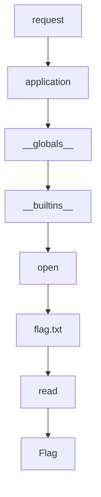

Each component plays a specific role.

---

## `request`

Jinja2 templates expose several useful objects by default.

One of them is:

```python
request
```

This object represents the current HTTP request.

---

## `request.application`

The request object provides access to the running Flask application.

Instead of remaining inside the template context, the payload now reaches the application's Python objects.

---

## `__globals__`

Functions in Python maintain a dictionary called:

```python
__globals__
```

This dictionary contains the global namespace where the function was defined.

Among many objects inside this namespace is another important object:

```python
__builtins__
```

---

## `__builtins__`

Python's built-in namespace contains functions such as:

- open()
- len()
- print()
- range()

Since `open()` is available here, the payload can access files directly.

---

## `open('flag.txt')`

The payload opens the flag file from the current working directory.

Finally,

```python
.read()
```

reads the entire file and returns its contents to the browser.

---

# Why the Attack Worked

The application likely performs something similar to:

```python
render_template_string(user_input)
```

or renders attacker-controlled data directly as a Jinja2 template.

Instead of treating the user's input as plain text:

```text
Hello Devdan
```

Jinja2 evaluates it as executable template code.

This completely breaks the separation between data and code.

---

# Why the Payload is So Long

A common question is:

> Why not simply call `open("flag.txt")`?

The answer lies in Jinja2's execution environment.

The template does **not** expose every Python function directly.

Functions such as:

```python
open()
```

are not immediately available.

Instead, the attacker traverses existing Python objects until reaching the built-in namespace where these functions reside.

The payload is therefore an example of **object traversal**, not simply file access.

---

# Security Impact

Successful SSTI vulnerabilities can lead to much more than reading files.

Depending on the template engine and application configuration, attackers may:

- Read sensitive files
- Access application secrets
- Leak API keys
- Execute arbitrary Python code
- Achieve Remote Code Execution (RCE)
- Completely compromise the server

This makes SSTI one of the highest-impact injection vulnerabilities.

---

# How to Prevent SSTI

Several secure coding practices help prevent template injection.

## Never Render User Input as a Template

User-controlled data should only be inserted into predefined template variables.

Applications should never treat user input itself as template code.

---

## Separate Code from Data

Developers should define templates within the application.

User input should only populate variables inside those templates.

---

## Validate User Input

Although validation alone does not eliminate SSTI, restricting unexpected input reduces the available attack surface.

---

## Use Sandboxed Template Environments

Some template engines support restricted execution environments that limit access to dangerous objects and functions.

However, sandboxing should never replace secure application design.

---

# Red Team Perspective

During a penetration test, SSTI is often discovered by submitting simple expressions and observing how the application responds.

If confirmed, testers typically attempt to:

- Enumerate available template objects
- Traverse Python objects
- Read configuration files
- Access environment variables
- Retrieve credentials
- Demonstrate file disclosure
- Assess whether Remote Code Execution is possible

Because SSTI frequently leads to complete server compromise, it is considered a high-severity finding.

---

# Blue Team Perspective

Developers and defenders should:

- Never render attacker-controlled templates.
- Separate presentation logic from user data.
- Restrict access to dangerous objects within template engines.
- Keep template engines updated.
- Review code for unsafe template rendering patterns.
- Monitor application logs for suspicious template expressions such as:

```text
{{ ... }}
```

or

```text

```

---

# Detection Opportunities

Defenders can detect attempted SSTI attacks by monitoring:

- Repeated template syntax in user input
- Unexpected template evaluation errors
- Requests containing object traversal patterns
- Access to sensitive files
- Abnormal server-side rendering behavior

Web Application Firewalls (WAFs) may also identify common SSTI payloads, although attackers frequently modify payloads to evade signature-based detection.

---

# Key Takeaways

- Injection vulnerabilities occur when applications interpret user input as executable instructions.
- SSTI targets server-side template engines rather than databases or operating system shells.
- The payload used in this lab performs object traversal to reach Python's built-in functions.
- The application becomes vulnerable because it renders attacker-controlled input as a Jinja2 template.
- Once template execution is achieved, attackers may gain access to sensitive files or even Remote Code Execution.
- Preventing SSTI requires maintaining a strict separation between application code and user-controlled data.
- From a penetration tester's perspective, SSTI often represents a path to full application compromise due to the extensive capabilities exposed by server-side template engines.

# A08: Software or Data Integrity Failures

## What are Software or Data Integrity Failures?

Software or Data Integrity Failures occur when an application blindly trusts software, updates, serialized objects, or other critical data without verifying their authenticity, integrity, or origin.

Every application establishes **trust boundaries**.

Whenever data crosses one of these boundaries, the application must answer an important question:

> **Can this data be trusted?**

If the application assumes the answer is "yes" without verification, attackers may manipulate the application's behavior.

Unlike Injection, where the application executes attacker-controlled input directly, Software or Data Integrity Failures occur because the application **trusts data that should never have been trusted in the first place.**

---

# Understanding Trust Boundaries

A trust boundary is any point where data enters a system from another source.

Examples include:

- User uploads
- Configuration files
- Software updates
- CI/CD pipelines
- Third-party libraries
- API responses
- Serialized objects

Every one of these should be considered **untrusted** until verified.

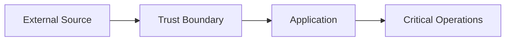

Applications that skip verification allow attackers to inject malicious artifacts into trusted workflows.

---

# Common Examples

Software or Data Integrity Failures extend far beyond insecure deserialization.

Examples include:

- Installing malicious software packages
- Compromised software updates
- Unsigned binaries
- Malicious CI/CD artifacts
- Insecure deserialization
- Loading untrusted templates
- Executing modified configuration files

Although these attacks appear different, they all violate the same principle:

> **Never trust external software or data without verifying its integrity.**

---

# Serialization

Before understanding the vulnerability, we must understand serialization.

Serialization converts an object in memory into a format that can be stored or transmitted.

Example:

```python
user = {
    "username": "alice",
    "role": "user"
}
```

After serialization, the object becomes bytes.

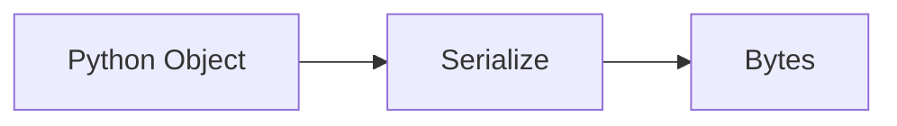

Serialized data can then be:

- Stored in files
- Sent across networks
- Saved in databases

---

# Deserialization

Deserialization performs the reverse operation.

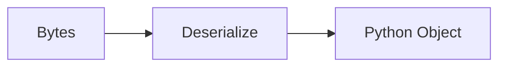

In Python, this often looks like:

```python
pickle.loads(data)
```

The serialized bytes are converted back into a usable Python object.

Normally this process is completely legitimate.

The danger comes from **who controls the serialized data.**

---

# Understanding Python Pickle

Python Pickle is a built-in serialization module capable of storing complex Python objects.

Unlike formats such as JSON, Pickle does **not** simply store data.

Instead, it stores instructions describing how the object should be reconstructed.

For trusted applications, this is extremely useful.

For untrusted input, it becomes extremely dangerous.

---

# Why Pickle is Dangerous

Many developers assume deserialization simply recreates objects.

However, Pickle reconstruction may execute Python functions during the process.

One special method controls this behavior:

```python
__reduce__()
```

This method tells Python how an object should be rebuilt.

Conceptually:

```text
Object

↓

__reduce__()

↓

(Function, Arguments)

↓

Python executes the function
```

If an attacker controls the serialized object, they also control the function that Python executes.

---

# The `__reduce__()` Method

Normally, developers never interact directly with `__reduce__()`.

Internally, Pickle calls this method while rebuilding objects.

A malicious implementation may return something like:

```python
(Function, Arguments)
```

During deserialization, Python performs:

```python
Function(*Arguments)
```

automatically.

This behavior is what enables arbitrary code execution.

---

# Practical Walkthrough

The vulnerable web application accepts serialized Pickle data from the user.

Internally, the application performs deserialization using:

```python
pickle.loads(user_input)
```

without verifying the source or integrity of the serialized object.

Instead of submitting a legitimate serialized object, a malicious Pickle payload is generated using Python.

The payload overrides the `__reduce__()` method so that deserialization executes attacker-controlled code.

Once submitted to the application, the payload executes automatically during deserialization and reads:

```text
flag.txt
```

The application then returns:

**Flag**

```text
THM{INSECURE_DESERIALIZATION}
```

---

# Attack Flow

The complete attack chain looks like this:

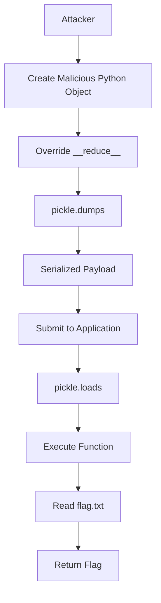

The attacker never directly executes code on the server.

Instead, the server executes the payload itself during object reconstruction.

---

# Why the Attack Worked

The vulnerability exists because the application assumes every Pickle object is trustworthy.

The process is essentially:

```text
Client

↓

Serialized Object

↓

pickle.loads()

↓

Execute Reconstruction Instructions
```

No verification occurs before deserialization.

As a result, attacker-controlled instructions execute with the same privileges as the application.

---

# Pickle vs JSON

A common misconception is assuming every serialization format behaves the same.

This is not true.

### JSON

```json
{
    "name":"Alice",
    "role":"user"
}
```

After parsing:

```python
json.loads(...)
```

the result is simply a dictionary.

No functions are executed.

---

### Pickle

After:

```python
pickle.loads(...)
```

Python may:

- Instantiate objects
- Call constructors
- Invoke `__reduce__()`
- Execute arbitrary functions

This is why Pickle should **never** be used with untrusted input.

---

# Why This Belongs to OWASP A08

Many people initially associate this lab with Remote Code Execution.

However, the root cause is actually a **trust problem**.

The application trusts data crossing a trust boundary without verifying it.

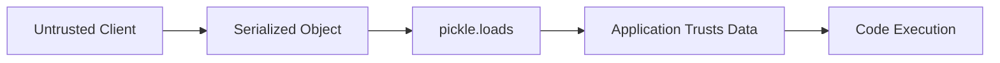

The vulnerability exists because malicious data is treated as legitimate.

---

# Preventing Insecure Deserialization

Several defensive practices greatly reduce the risk.

## Never Deserialize Untrusted Pickle Data

This is the single most important rule.

Applications should never call:

```python
pickle.loads()
```

on user-controlled input.

---

## Prefer Safer Formats

When only data needs to be exchanged, use formats such as:

- JSON
- XML (with secure parsers)
- Protocol Buffers

These formats do not execute arbitrary code during parsing.

---

## Verify Integrity

Serialized objects should be:

- Digitally signed
- Protected with HMAC
- Retrieved only from trusted sources

Applications should reject any modified payloads.

---

## Secure CI/CD Pipelines

Software integrity also extends beyond serialization.

Organizations should:

- Verify software packages.
- Validate update signatures.
- Restrict artifact repositories.
- Monitor build pipelines.
- Protect deployment environments.

---

# Red Team Perspective

When assessing Python applications, insecure deserialization is always a high-priority target.

Indicators include:

- `pickle.loads()`
- `pickle.load()`
- `yaml.load()` with unsafe loaders
- User-controlled serialized objects
- Session cookies containing serialized data
- API endpoints accepting binary payloads

If user input reaches a deserializer, attackers may achieve:

- Sensitive file disclosure
- Credential theft
- Remote Code Execution
- Complete server compromise

---

# Blue Team Perspective

Defenders should:

- Eliminate unsafe deserialization whenever possible.
- Replace Pickle with safer serialization formats.
- Verify integrity before processing serialized data.
- Apply strict trust boundaries.
- Review dependencies regularly.
- Secure software supply chains.
- Monitor unusual deserialization activity.

---

# Detection Opportunities

Security teams should monitor for:

- Applications accepting Pickle objects from clients
- Unexpected binary payloads
- Abnormal deserialization errors
- Execution of unexpected Python functions
- Modified software artifacts
- Unsigned updates
- CI/CD pipeline tampering

Because insecure deserialization frequently leads to Remote Code Execution, detections should be treated as high-priority security events.

---

# Key Takeaways

- Software or Data Integrity Failures occur when applications trust software or data without verifying its integrity.
- Python Pickle is powerful because it stores instructions for rebuilding objects—not just raw data.
- The `__reduce__()` method allows Pickle to execute functions during deserialization.
- If attackers control serialized objects, they may execute arbitrary code with the application's privileges.
- The root cause is not Pickle itself—it is trusting untrusted serialized data.
- Applications should avoid deserializing user-controlled Pickle objects and instead use safer formats whenever possible.
- Strong trust boundaries, integrity verification, and secure software supply chain practices are essential defenses against this OWASP category.

# Commands & Payload Reference

This section documents every important command and payload used throughout the practical exercises. Instead of simply listing commands, each entry explains **what it does, why it was used, how it works internally, and how to interpret the results.**

---

# A04 – Cryptographic Failures

## Weak XOR Cipher

Unlike the other practical exercises, this lab does not require command-line tools.

The application provides three encrypted notes and hints that all of them use the same weak XOR cipher protected by a four-character key.

The objective is to discover the final character of the shared key.

---

## Key Recovery

### Purpose

Recover the shared XOR key.

### Information Provided

```text
KEY_
```

Only the final character is unknown.

### Method

Attempt possible values for the last character until every encrypted note decrypts correctly.

### Expected Result

Once the correct key is entered, all encrypted notes become readable.

One of the decrypted notes reveals:

```text
THM{WEAK_CRYPTO_FLAG}
```

---

# A05 – Injection (Server-Side Template Injection)

## SSTI Detection Payload

### Payload

```jinja
{{7*7}}
```

### Purpose

Determine whether user input is evaluated as a Jinja2 template.

### How It Works

Normally, user input should be rendered as plain text.

If the application instead evaluates template expressions, Jinja2 performs the calculation before rendering the page.

Internally:

```text
Template Engine

↓

Evaluate Expression

↓

Return Result
```

### Expected Output

```text
49
```

### Interpretation

Receiving `49` instead of the literal string `{{7*7}}` confirms that the application evaluates user input as a template.

This is a strong indicator of **Server-Side Template Injection (SSTI).**

---

## File Read Payload

### Payload

```jinja
{{ request.application.__globals__.__builtins__.open('flag.txt').read() }}
```

### Purpose

Read the contents of `flag.txt` located on the server.

### Payload Breakdown

| Component | Description |
|-----------|-------------|
| `request` | Accesses the current HTTP request object. |
| `application` | References the running Flask application. |
| `__globals__` | Retrieves the function's global namespace. |
| `__builtins__` | Accesses Python's built-in functions. |
| `open()` | Opens the target file. |
| `read()` | Reads the entire file contents. |

### Internal Execution Flow

```text
request

↓

application

↓

__globals__

↓

__builtins__

↓

open()

↓

flag.txt

↓

read()

↓

Flag
```

### Expected Output

```text
THM{SSTI_FLAG_OBTAINED}
```

### Why It Works

The vulnerable application renders attacker-controlled input directly as a Jinja2 template.

Instead of treating user input as text, Jinja2 evaluates it as executable template code.

The payload traverses Python objects until reaching the built-in namespace, where it gains access to the `open()` function and reads the flag file.

---

# A08 – Software or Data Integrity Failures

## Creating the Malicious Pickle Payload

### File

```text
exploit.py
```

### Purpose

Generate a malicious serialized Pickle object.

### Example

```python
import pickle
import subprocess

class Evil:
    def __reduce__(self):
        return (
            subprocess.check_output,
            (["cat", "flag.txt"],)
        )

payload = pickle.dumps(Evil())

print(payload)
```

### How It Works

The custom class overrides the special `__reduce__()` method.

Instead of returning information needed to reconstruct a normal object, it instructs Pickle to execute:

```python
subprocess.check_output(["cat", "flag.txt"])
```

during deserialization.

---

## Running the Payload Generator

### Command

```bash
python3 exploit.py
```

### Purpose

Execute the Python script and generate the serialized Pickle payload.

### Syntax

```bash
python3 <script.py>
```

### Syntax Breakdown

| Component | Description |
|-----------|-------------|
| `python3` | Launches the Python 3 interpreter. |
| `exploit.py` | Executes the payload generation script. |

### Expected Output

The output is a serialized Pickle object represented as bytes.

Example:

```text
b'\x80\x04...'
```

or an encoded representation depending on the lab implementation.

### Interpretation

This output is **not** the exploit itself.

It is the serialized object that will later be deserialized by the vulnerable web application.

---

## Submitting the Payload

### Purpose

Provide the serialized Pickle object to the vulnerable application.

### Workflow

```text
Write exploit.py

↓

python3 exploit.py

↓

Serialized Pickle Payload

↓

Copy Output

↓

Paste into Web Application

↓

pickle.loads()

↓

Payload Executes
```

### Expected Output

The application deserializes the malicious object and returns:

```text
THM{INSECURE_DESERIALIZATION}
```

---

# Important Python Functions Used

## `pickle.dumps()`

### Purpose

Serialize a Python object into bytes.

### Syntax

```python
pickle.dumps(object)
```

### Parameters

| Parameter | Description |
|-----------|-------------|
| `object` | The Python object to serialize. |

### Returns

Serialized byte stream.

---

## `pickle.loads()`

### Purpose

Deserialize bytes back into a Python object.

### Syntax

```python
pickle.loads(data)
```

### Parameters

| Parameter | Description |
|-----------|-------------|
| `data` | Serialized Pickle bytes. |

### Returns

A reconstructed Python object.

### Security Warning

Never call `pickle.loads()` on untrusted user input.

Deserialization may execute attacker-controlled code.

---

## `__reduce__()`

### Purpose

Define how an object should be reconstructed during Pickle deserialization.

### Syntax

```python
def __reduce__(self):
    return (function, arguments)
```

### Internal Behavior

During deserialization:

```text
pickle.loads()

↓

__reduce__()

↓

Function

↓

Execute
```

This behavior is legitimate for trusted objects but becomes extremely dangerous when attackers control the serialized data.

---

# Summary of Practical Commands & Payloads

| Category | Command / Payload | Purpose |
|----------|-------------------|---------|
| A04 | Shared XOR Key | Recover the encryption key and decrypt all notes. |
| A05 | `{{7*7}}` | Detect Server-Side Template Injection. |
| A05 | `{{ request.application.__globals__.__builtins__.open('flag.txt').read() }}` | Read the contents of `flag.txt` via SSTI. |
| A08 | `python3 exploit.py` | Generate the malicious Pickle payload. |
| A08 | `pickle.dumps()` | Serialize the malicious Python object. |
| A08 | `pickle.loads()` | Deserialize the object (vulnerable operation). |
| A08 | `__reduce__()` | Execute attacker-controlled code during deserialization. |

---

# Practical Skills Gained

By completing these practical exercises, I gained hands-on experience with three different classes of application security vulnerabilities:

- Recovering data protected by weak cryptographic implementations.
- Identifying and exploiting a Server-Side Template Injection vulnerability.
- Understanding how insecure deserialization in Python Pickle can lead to arbitrary code execution.

Although each attack uses different techniques, they all reinforce the same secure development principle:

> **Applications must never trust data simply because it exists. Sensitive information must be protected with proven cryptography, user input must be treated as untrusted, and serialized objects or software artifacts must always be verified before use.**

# Key Takeaways

This room demonstrated three different vulnerability categories from the **OWASP Top 10 (2025)**, but they all shared the same underlying lesson:

> **Applications become vulnerable whenever they trust data without properly protecting, validating, or verifying it.**

Although each practical exercise targeted a different component of a web application, every attack succeeded because the application incorrectly handled data at some point in its lifecycle.

---

# Comparing the Three Vulnerabilities

| OWASP Category | Primary Weakness | Practical Demonstration | Root Cause |
|----------------|------------------|--------------------------|------------|
| **A04 – Cryptographic Failures** | Weak protection of sensitive data | Weak XOR Cipher | Poor cryptographic implementation |
| **A05 – Injection** | User input interpreted as code | Server-Side Template Injection (SSTI) | Failure to separate code from data |
| **A08 – Software or Data Integrity Failures** | Trusting unverified software or serialized data | Python Pickle Deserialization | Failure to establish trust boundaries |

Although they appear unrelated, they all violate one of three fundamental security principles:

- Protect sensitive data correctly.
- Never execute untrusted input.
- Never trust external software or data without verification.

---

# The Data Lifecycle

One of the most important lessons from this room is understanding that data passes through several stages during its lifetime.

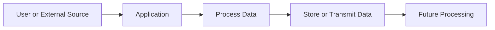

Each OWASP category targets a different stage of this lifecycle.

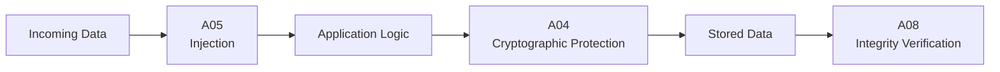

- **A05** attacks how applications **process** data.
- **A04** attacks how applications **protect** data.
- **A08** attacks how applications **trust** data.

Understanding where a vulnerability occurs helps security professionals identify appropriate defensive controls.

---

# Common Misconceptions

## "Encryption Automatically Makes Data Secure"

False.

Encryption is only as secure as its implementation.

Weak keys, reused keys, outdated algorithms, and poor key management can completely undermine otherwise strong cryptographic algorithms.

---

## "Base64 is Encryption"

False.

Base64 is only an encoding format.

Anyone can decode Base64 without needing a secret key.

---

## "Injection Only Means SQL Injection"

False.

Injection is a broad class of vulnerabilities.

Examples include:

- SQL Injection
- Command Injection
- LDAP Injection
- XPath Injection
- Server-Side Template Injection
- NoSQL Injection
- Prompt Injection

The underlying problem is always the same:

> User-controlled data is interpreted as executable instructions.

---

## "Serialization is Safe"

Not always.

Formats such as JSON simply represent data.

However, technologies like Python Pickle may execute code while reconstructing objects.

Security depends not only on the format itself, but also on whether the application trusts unverified serialized data.

---

# Red Team Perspective

From an offensive security standpoint, these vulnerabilities often provide excellent attack paths.

## Cryptographic Failures

Attackers search for:

- Weak password hashing
- Hardcoded secrets
- Weak encryption algorithms
- Poor key management
- Reused encryption keys

Rather than breaking cryptographic algorithms, attackers typically exploit implementation mistakes.

---

## Injection

Injection vulnerabilities are frequently used for initial compromise.

Successful exploitation may allow attackers to:

- Read sensitive files
- Dump databases
- Execute operating system commands
- Bypass authentication
- Achieve Remote Code Execution (RCE)

Because Injection frequently provides direct access to application internals, it remains one of the most valuable attack techniques.

---

## Software or Data Integrity Failures

Attackers actively look for:

- Insecure deserialization
- Unsigned software updates
- Weak CI/CD pipelines
- Compromised dependencies
- Malicious software packages

These weaknesses often enable code execution before an application realizes the data has been tampered with.

---

# Blue Team Perspective

Defenders should focus on secure software design rather than relying solely on reactive security controls.

Important defensive principles include:

## Protect Data Properly

- Use modern cryptographic algorithms.
- Store secrets securely.
- Rotate encryption keys.
- Hash passwords using Argon2, bcrypt, or scrypt.

---

## Treat User Input as Untrusted

- Validate input.
- Use parameterized queries.
- Avoid rendering user-controlled templates.
- Eliminate unnecessary shell execution.

---

## Verify Software and Data Integrity

- Verify digital signatures.
- Validate software updates.
- Protect CI/CD pipelines.
- Reject untrusted serialized objects.
- Replace unsafe serialization mechanisms where possible.

---

# Detection Opportunities

Security monitoring should focus on abnormal application behavior rather than specific payloads.

Potential indicators include:

## Cryptographic Failures

- Plaintext credentials
- Deprecated cryptographic algorithms
- Hardcoded secrets
- Weak TLS configurations

---

## Injection

- Template syntax appearing in requests
- SQL syntax inside user input
- Unexpected command execution
- File access attempts
- Server-side rendering errors

---

## Software Integrity

- Unexpected serialized objects
- Binary payloads submitted through web forms
- Integrity verification failures
- Modified software artifacts
- Unexpected deserialization activity

Early detection can significantly reduce the impact of successful exploitation.

---

# Industry Relevance

These vulnerabilities remain highly relevant in modern software development.

Organizations increasingly rely on:

- Cloud-native applications
- Microservices
- CI/CD pipelines
- Third-party packages
- Infrastructure as Code (IaC)
- AI-assisted applications

Every one of these technologies introduces additional trust boundaries.

As software ecosystems continue to grow, maintaining strong cryptographic practices, secure input handling, and robust integrity verification becomes increasingly important.

---

# Interview Questions

Some common cybersecurity interview questions related to this room include:

### Why is MD5 unsuitable for password hashing?

Because it is extremely fast and vulnerable to brute-force and collision attacks. Modern password hashing algorithms such as Argon2 and bcrypt are intentionally slow and include protections against these attacks.

---

### Why is Base64 not considered encryption?

Because Base64 only changes the representation of data. It does not require a secret key and provides no confidentiality.

---

### What is the root cause of Injection vulnerabilities?

Applications treat user-controlled input as executable instructions instead of ordinary data.

---

### Why is Python Pickle dangerous?

Because deserialization may execute Python functions during object reconstruction, allowing arbitrary code execution if attackers control the serialized object.

---

### What is a trust boundary?

A trust boundary is any point where data enters a system from another source. Applications should verify the authenticity and integrity of data before trusting it beyond that boundary.

---

# Skills Gained

Completing this room strengthened my understanding of several important cybersecurity concepts.

## Technical Skills

- Weak cryptographic implementations
- XOR encryption
- Key recovery concepts
- Server-Side Template Injection
- Jinja2 object traversal
- Python serialization
- Python Pickle
- Insecure deserialization
- Trust boundary analysis

---

## Security Skills

- Vulnerability identification
- Root cause analysis
- Secure coding principles
- Cryptographic best practices
- Secure software supply chain awareness
- Application security fundamentals

---

# Future Learning Path

This room provides an excellent introduction to application security, but each topic can be explored much further.

Recommended next topics include:

### Cryptography

- AES
- RSA
- Elliptic Curve Cryptography (ECC)
- Digital Signatures
- Public Key Infrastructure (PKI)

---

### Injection

- SQL Injection
- Blind SQL Injection
- Command Injection
- XXE
- NoSQL Injection
- Template Engine Internals

---

### Software Integrity

- Supply Chain Attacks
- Dependency Confusion
- CI/CD Security
- Software Bill of Materials (SBOM)
- Secure Build Pipelines
- Secure Artifact Signing

---

# Final Lessons Learned

This room reinforces an important principle that applies far beyond web applications.

Secure software is not built by adding security features after development—it is built by making correct trust decisions throughout the application's lifecycle.

Every piece of data should answer three questions before being processed:

1. **Is this data authentic?**
2. **Has this data been modified?**
3. **Should this application trust it?**

If the answer to any of these questions is uncertain, the application should verify the data before using it.

Ultimately, the three vulnerabilities explored in this room demonstrate different manifestations of the same underlying problem:

> **When applications trust data without proper protection, validation, or verification, attackers gain opportunities to manipulate system behavior, disclose sensitive information, or execute arbitrary code.**

# Conclusion

The **OWASP Top 10: Insecure Data Handling** room demonstrates that many serious web application vulnerabilities are not caused by complex exploits, but by incorrect assumptions about how data should be protected, processed, and trusted.

Across the three categories covered in this room, the attacks were technically different, yet they all shared the same underlying weakness:

- **A04 – Cryptographic Failures** showed what happens when sensitive data is protected using weak or improperly implemented cryptography.
- **A05 – Injection** demonstrated the dangers of allowing user-controlled input to become executable instructions.
- **A08 – Software or Data Integrity Failures** highlighted the risks of trusting software or serialized data without verifying its integrity.

Rather than attacking authentication or authorization directly, these vulnerabilities target the application's handling of data throughout its lifecycle. This reinforces a fundamental principle of secure software engineering:

> **Security is not only about controlling who can access data—it is equally about ensuring that data is protected, validated, and trusted appropriately before it is used.**

---

# Room Summary

During this room, I learned how to:

- Identify common cryptographic implementation mistakes.
- Understand why modern cryptographic libraries should always be preferred over custom implementations.
- Differentiate between encoding, hashing, and encryption.
- Recognize the root cause of Injection vulnerabilities.
- Exploit a Server-Side Template Injection (SSTI) vulnerability by traversing Python objects to access built-in functions.
- Understand how Python Pickle serialization works internally.
- Explain why insecure deserialization can result in arbitrary code execution.
- Recognize the importance of establishing and enforcing trust boundaries within applications.

These concepts extend beyond the individual labs and apply to secure application development in general.

---

# Practical Skills Acquired

By completing the practical exercises, I gained hands-on experience with:

## Cryptographic Analysis

- Recovering data protected by weak XOR encryption.
- Identifying implementation flaws in custom cryptographic schemes.
- Understanding the importance of key management.

---

## Injection Testing

- Detecting Server-Side Template Injection.
- Understanding template engine execution.
- Traversing Python objects.
- Reading server-side files through SSTI.

---

## Insecure Deserialization

- Creating malicious Pickle objects.
- Using the `__reduce__()` method.
- Understanding how arbitrary code execution occurs during deserialization.
- Identifying unsafe trust relationships within applications.

---

# Defensive Lessons

From a defensive perspective, the room emphasizes several secure development principles.

Developers should:

- Use well-established cryptographic algorithms.
- Manage secrets securely.
- Treat all user input as untrusted.
- Separate application code from user-controlled data.
- Verify software integrity before execution.
- Avoid unsafe deserialization mechanisms.
- Establish clear trust boundaries throughout the application.

These principles reduce risk regardless of the programming language or technology stack being used.

---

# Pentester Notes

From an offensive security perspective, this room reinforces an important mindset:

> Successful penetration testing is rarely about discovering entirely new attacks—it is about identifying where developers have violated fundamental security principles.

Each vulnerability demonstrated a different aspect of application security:

| Category | Offensive Relevance |
|----------|---------------------|
| **A04 – Cryptographic Failures** | Recover secrets, credentials, or sensitive information by exploiting weak cryptographic implementations rather than breaking strong algorithms. |
| **A05 – Injection** | Transform user input into executable instructions, potentially leading to file disclosure, authentication bypass, or Remote Code Execution (RCE). |
| **A08 – Software or Data Integrity Failures** | Abuse misplaced trust in software, serialized objects, or supply-chain components to execute arbitrary code or compromise application integrity. |

For penetration testers, these weaknesses often represent opportunities to escalate an attack beyond its initial entry point.

---

# Real-World Relevance

The vulnerabilities explored in this room are frequently encountered during security assessments and bug bounty engagements.

Examples include:

- Web applications exposing sensitive information through weak cryptographic implementations.
- Frameworks vulnerable to Server-Side Template Injection due to unsafe template rendering.
- Python applications using Pickle to deserialize user-controlled session data.
- Organizations affected by software supply-chain attacks through compromised dependencies or malicious update mechanisms.

Understanding these vulnerabilities provides a strong foundation for analyzing real-world application security issues.

---

# References

## OWASP

- https://owasp.org/www-project-top-ten/

## TryHackMe

- https://tryhackme.com/

## Python Documentation

- https://docs.python.org/3/library/pickle.html

## Jinja2 Documentation

- https://jinja.palletsprojects.com/

## CWE

- CWE-327 – Use of a Broken or Risky Cryptographic Algorithm
- CWE-1336 – Improper Neutralization of Special Elements Used in a Template Engine
- CWE-502 – Deserialization of Untrusted Data

---

# Skills Gained

After completing this room, I strengthened my understanding of:

### Web Application Security

- OWASP Top 10 (2025)
- Secure software development
- Trust boundaries
- Data lifecycle security

### Cryptography

- XOR encryption
- Key management
- Modern cryptographic practices
- Secure secret handling

### Injection

- Server-Side Template Injection (SSTI)
- Template engines
- Object traversal
- Python runtime behavior

### Software Integrity

- Serialization
- Deserialization
- Python Pickle
- Software supply-chain security

### Penetration Testing

- Vulnerability identification
- Root cause analysis
- Secure coding review
- Practical exploitation methodology

---

# Future Learning Path

To deepen the concepts introduced in this room, the following topics are recommended:

### Cryptography

- AES
- RSA
- Elliptic Curve Cryptography (ECC)
- TLS
- Public Key Infrastructure (PKI)

### Injection

- SQL Injection
- Blind SQL Injection
- Command Injection
- XXE
- NoSQL Injection
- Prompt Injection in AI systems

### Application Security

- Secure Software Development Lifecycle (SSDLC)
- Threat Modeling
- Secure Code Review
- Static Application Security Testing (SAST)
- Dynamic Application Security Testing (DAST)

### Software Integrity

- Software Bill of Materials (SBOM)
- Supply Chain Security
- Dependency Management
- CI/CD Security
- Code Signing
- Artifact Verification

---

# Final Thoughts

This room demonstrates that effective application security is built on a simple but powerful principle:

> **Never assume data is safe simply because it exists inside your application.**

Whether protecting confidential information with cryptography, processing user input through template engines, or reconstructing serialized objects, every interaction with data requires thoughtful security decisions.

Modern attackers rarely need to defeat sophisticated cryptographic algorithms or bypass complex security mechanisms. More often, they succeed because an application **trusted something it should not have trusted**, or **handled data in a way it was never intended to be handled**.

By understanding the root causes behind **Cryptographic Failures**, **Injection**, and **Software or Data Integrity Failures**, developers can build more resilient applications, defenders can better identify insecure design patterns, and penetration testers can more effectively assess real-world systems.

Ultimately, secure software is not defined by the number of security controls it contains—it is defined by the quality of the trust decisions made at every stage of the data lifecycle.

---

# Tags

`OWASP Top 10` `OWASP Top 10 2025` `Application Security` `Web Security` `Cryptographic Failures` `Injection` `Server-Side Template Injection` `SSTI` `Software Integrity` `Data Integrity` `Python Pickle` `Insecure Deserialization` `Serialization` `Jinja2` `Python` `TryHackMe` `Cybersecurity` `Blue Team` `Red Team` `Secure Coding` `Trust Boundaries`