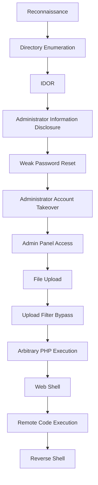
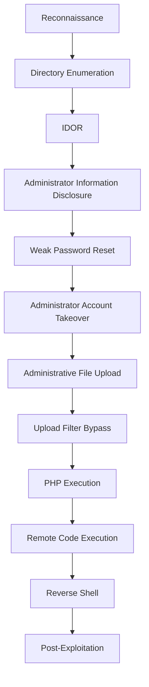
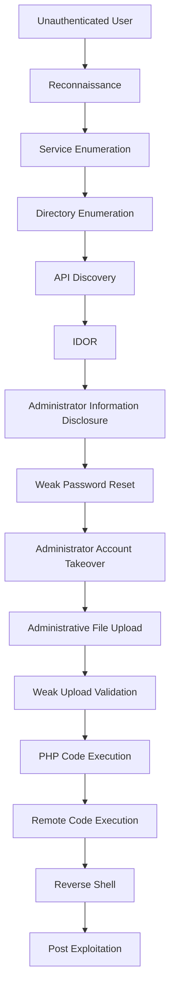

# Guided Pentest: Web

> A complete walkthrough of the **TryHackMe Guided Pentest: Web** room, covering the entire penetration testing lifecycle—from reconnaissance to remote code execution (RCE). This write-up focuses on methodology, attack chaining, and the underlying security concepts rather than simply reproducing exploitation steps.

---

# Executive Summary

Modern web application compromises rarely happen because of a single critical vulnerability. Instead, attackers often combine several seemingly minor weaknesses until they achieve full system compromise.

In this room, we performed a realistic penetration test against **RecruitX**, an internal recruitment platform. Starting with no credentials or knowledge of the application, we progressively enumerated the target, identified authorization flaws, abused an insecure password recovery mechanism, compromised an administrator account, bypassed insecure upload restrictions, and ultimately achieved **Remote Code Execution (RCE)** on the underlying Linux server.

Rather than focusing on individual exploits, this room demonstrates one of the most important concepts in offensive security:

> **Vulnerability chaining.**

Each vulnerability discovered became the stepping stone for the next stage of the attack.

---

# Scenario

The target organization operates an internal recruitment portal named **RecruitX**.

The application allows:

- Candidates to apply for jobs
- Hiring managers to manage recruitment
- Administrators to control the entire platform

The client suspects that the application contains security weaknesses but does not know where they exist or how severe they might be.

Our objective is to perform a complete web application penetration test and determine whether an external attacker can compromise the application and eventually gain access to the underlying server.

---

# Learning Objectives

Throughout this engagement, we will learn how to:

- Perform reconnaissance against a web application
- Enumerate hidden resources and attack surfaces
- Identify and exploit an **Insecure Direct Object Reference (IDOR)**
- Understand the difference between authentication and authorization
- Abuse an insecure password reset implementation
- Perform administrator account takeover
- Assess insecure file upload functionality
- Bypass weak upload restrictions
- Achieve arbitrary PHP execution
- Obtain Remote Code Execution (RCE)
- Establish an interactive reverse shell
- Understand how multiple vulnerabilities combine into a complete compromise

---

# Prerequisites

To fully understand this room, you should already be familiar with:

- Linux Command Line Basics
- HTTP Protocol Fundamentals
- Web Application Basics
- Basic PHP concepts
- Basic Linux file system structure
- Fundamental networking concepts

---

# Target Overview

RecruitX is a PHP-based recruitment management application running on a traditional **LAMP** stack.

The platform provides multiple roles with different privileges:

| Role | Responsibilities |
|-------|------------------|
| Candidate | Browse jobs and submit applications |
| Hiring Manager | Manage job postings and applicants |
| Administrator | Manage the entire application |

From a penetration testing perspective, this immediately suggests several potential attack surfaces:

- Authentication
- Authorization
- User Profiles
- Password Recovery
- Administrative Functions
- File Uploads
- APIs

---

# Engagement Methodology

Instead of randomly searching for vulnerabilities, this room follows a structured penetration testing methodology similar to a real-world engagement.

```text
Reconnaissance
        │
        ▼
Enumeration
        │
        ▼
Attack Surface Mapping
        │
        ▼
Vulnerability Discovery
        │
        ▼
Exploitation
        │
        ▼
Privilege Gain
        │
        ▼
Post-Exploitation
```

One of the biggest lessons from this room is that **enumeration never truly ends**.

Every time new privileges are obtained, new functionality becomes accessible, requiring another round of enumeration.

```
Unauthenticated
        │
        ▼
Enumerate
        │
        ▼
Candidate Access
        │
        ▼
Enumerate Again
        │
        ▼
Administrator Access
        │
        ▼
Enumerate Again
        │
        ▼
Operating System Access
```

This recursive workflow closely mirrors professional penetration testing engagements.

---

# Attack Chain Overview

The vulnerabilities discovered throughout this room are individually important, but their real impact comes from how they are combined.



Notice that no single vulnerability immediately resulted in server compromise.

Instead, every successful step unlocked new opportunities that eventually led to complete control over the target system.

This is a textbook example of **vulnerability chaining**, where multiple low or medium severity issues combine into a critical compromise.

---

# Technologies Observed

During reconnaissance we identify the following technology stack:

| Component | Technology |
|-----------|------------|
| Operating System | Ubuntu Linux |
| Web Server | Apache HTTP Server 2.4.58 |
| Backend Language | PHP |
| Database | MySQL |
| Session Management | PHP Sessions (PHPSESSID) |

This stack is commonly referred to as a **LAMP Stack**:

- **L** — Linux
- **A** — Apache
- **M** — MySQL
- **P** — PHP

Understanding the technology stack allows penetration testers to make informed decisions about where vulnerabilities are most likely to exist and how different components interact behind the scenes.

---

# Skills Demonstrated

By completing this room, we practiced skills commonly used during real web application penetration tests.

## Reconnaissance

- Service discovery
- Technology fingerprinting
- HTTP analysis

## Enumeration

- Directory enumeration
- API discovery
- Attack surface mapping
- User enumeration

## Web Application Testing

- Authentication testing
- Authorization testing
- IDOR exploitation
- Password reset assessment
- File upload testing

## Exploitation

- Administrator account takeover
- Upload filter bypass
- Arbitrary PHP execution
- Web shell deployment
- Remote Code Execution (RCE)

## Linux Enumeration

- User identification
- Host identification
- System information gathering
- File system enumeration

---

# Key Security Concepts Covered

This room introduces several important web security concepts that frequently appear during real penetration tests.

- Authentication
- Authorization
- Broken Object Level Authorization (BOLA / IDOR)
- Information Disclosure
- Password Recovery Security
- Session Management
- Client-side vs Server-side Validation
- Allowlist vs Blocklist Validation
- File Upload Security
- Remote Code Execution (RCE)
- Reverse Shells
- Least Privilege
- Defense in Depth
- Vulnerability Chaining

Understanding these concepts is significantly more valuable than memorizing specific payloads, as the same principles apply across many different applications and technologies.

---

# Why This Room Matters

Many beginner labs present a single vulnerability that immediately leads to compromise.

Real-world engagements rarely work that way.

Instead, penetration testers collect information, test assumptions, identify weaknesses, and combine multiple findings until a complete attack path emerges.

RecruitX demonstrates this process exceptionally well by showing how:

- Information disclosure enables account targeting.
- Weak account recovery enables account takeover.
- Administrative privileges expose dangerous functionality.
- Weak upload validation enables arbitrary code execution.
- Code execution ultimately leads to operating system access.

This methodology-focused approach closely reflects how professional web application penetration tests are performed and serves as an excellent introduction to vulnerability chaining in modern offensive security.

# Part 2 — Reconnaissance & Enumeration

Before attempting to exploit any vulnerabilities, a penetration tester must first understand the target environment. Reconnaissance and enumeration are the foundation of every successful penetration test because they reveal the technologies, services, and attack surfaces exposed by the application.

Rather than blindly searching for exploits, this phase focuses on answering fundamental questions:

- What services are running?
- What technologies power the application?
- Which endpoints are exposed?
- Which pages require authentication?
- Are there hidden directories?
- Does the application expose an API?
- Which functionality appears security-sensitive?

The information gathered here will directly influence every attack performed in the following phases.

---

# Phase Objectives

During reconnaissance we aim to:

- Identify open network services
- Fingerprint the web server
- Identify the application's technology stack
- Discover hidden directories and files
- Map the application's attack surface
- Identify authentication boundaries
- Discover APIs exposed by the application

---

# Service Enumeration with Nmap

The first step is identifying which services are available on the target.

```bash
nmap -sV -sC -p- MACHINE_IP
```

## Command Breakdown

### `nmap`

Network Mapper used for host discovery and service enumeration.

### `-sV`

Performs service version detection.

Instead of only identifying an open HTTP port, Nmap attempts to determine exactly which software and version are running.

### `-sC`

Executes the default NSE (Nmap Scripting Engine) scripts.

These scripts collect additional information such as:

- HTTP titles
- Cookies
- Server headers
- Default configurations
- SSL information

### `-p-`

Scans every TCP port from **1–65535**.

Without this option, Nmap scans only the most common 1,000 ports.

Scanning all ports reduces the chance of missing services running on uncommon ports.

---

# Scan Results

The scan identifies four open services:

| Port | Service | Version |
|------|----------|----------|
| 22 | SSH | OpenSSH 9.6p1 |
| 80 | HTTP | Apache 2.4.58 |
| 3306 | MySQL | MySQL |
| 8080 | HTTP | Apache Default Page |

Immediately, several observations can be made.

---

## Port 22 — SSH

SSH provides secure remote administration.

Although no credentials are available at this stage, this service becomes valuable later if credentials are obtained through another vulnerability.

Possible attack paths include:

- Credential reuse
- Password disclosure
- SSH key theft

At this point, SSH is simply recorded as a potential post-exploitation target.

---

## Port 80 — RecruitX Web Application

Port 80 hosts the primary target:

- RecruitX
- Apache HTTP Server
- PHP session management

This becomes the primary attack surface throughout the engagement.

---

## Port 3306 — MySQL

The presence of MySQL strongly suggests that the application stores its data inside a relational database.

Typical data stored includes:

- User accounts
- Password hashes
- Job postings
- Applications
- Administrator information

Although MySQL is exposed as a service, this **does not automatically indicate SQL Injection**.

Instead, it tells us the backend likely communicates with a database, making database-related attack vectors worth investigating later.

---

## Port 8080 — Secondary HTTP Service

Another Apache instance is running on port 8080.

It currently displays the default Apache page.

While it appears harmless, secondary web services should never be ignored during reconnaissance because they may expose:

- Development environments
- Staging applications
- Forgotten administrative interfaces
- Misconfigured virtual hosts

Every exposed HTTP service represents another attack surface.

---

# Initial Technology Fingerprinting

Nmap also provides valuable HTTP information.

```
Server: Apache/2.4.58 (Ubuntu)

Set-Cookie:
PHPSESSID

HTTP Title:
RecruitX — Home
```

From only a few response headers we already know:

- Web Server → Apache
- Operating System → Ubuntu
- Backend Session Management → PHP Sessions

This process is known as **technology fingerprinting**.

Understanding the technology stack helps narrow future testing efforts and provides context for interpreting application behavior.

---

# Inspecting HTTP Response Headers

Next, we manually inspect the HTTP response.

```bash
curl -I http://MACHINE_IP
```

## Command Breakdown

### `curl`

Transfers data using HTTP.

Frequently used for interacting directly with web applications without a browser.

### `-I`

Requests only the HTTP response headers.

The response contains information such as:

- Server software
- Cookies
- Cache behavior
- Content type

without downloading the page body.

---

# Response Analysis

Example response:

```
HTTP/1.1 200 OK

Server: Apache/2.4.58 (Ubuntu)

Set-Cookie:
PHPSESSID=...

Content-Type:
text/html
```

Several important observations can be made.

## HTTP Status Code

```
200 OK
```

The resource exists and is publicly accessible.

---

## Apache Version

```
Apache/2.4.58
```

Confirms the web server identified during the Nmap scan.

Version identification is useful during vulnerability research but should never be confused with proof of a vulnerability.

Software versions provide context—not exploitation.

---

## PHP Session Cookie

```
PHPSESSID
```

This immediately tells us the application uses PHP session management.

A typical login flow looks like this:

```text
User Login
      │
      ▼
Credentials Verified
      │
      ▼
Server Creates Session
      │
      ▼
PHPSESSID Issued
      │
      ▼
Browser Stores Cookie
      │
      ▼
Future Requests Include Cookie
```

Rather than sending credentials with every request, the browser authenticates using the session cookie.

---

# Understanding the Technology Stack

By combining the Nmap results and HTTP headers, we identify the application architecture.

```text
Browser
    │
HTTP Requests
    │
    ▼
Apache Web Server
    │
    ▼
PHP Application
    │
SQL Queries
    │
    ▼
MySQL Database
```

This architecture is commonly known as a **LAMP Stack**:

- Linux
- Apache
- MySQL
- PHP

Understanding where each component fits helps explain how user input ultimately reaches the backend database and operating system.

---

# Directory Enumeration with Gobuster

Applications often contain resources that are not linked from the navigation menu.

To discover these hidden resources, we perform directory enumeration.

```bash
gobuster dir \
-u http://MACHINE_IP \
-w /usr/share/wordlists/dirbuster/directory-list-2.3-small.txt \
-x php
```

---

## Command Breakdown

### `dir`

Runs Gobuster in directory enumeration mode.

### `-u`

Specifies the target URL.

### `-w`

Specifies the wordlist used during enumeration.

Gobuster constructs requests using every word contained in the wordlist.

### `-x php`

Also tests each word with the `.php` extension.

For example:

```
login
```

becomes:

```
/login
/login.php
```

This significantly increases coverage for PHP applications.

---

# Enumeration Results

Gobuster discovers multiple interesting endpoints.

| Endpoint | Observation |
|-----------|-------------|
| `/admin` | Administrative interface |
| `/api` | REST-style API |
| `/profile.php` | User profile page |
| `/dashboard.php` | Authenticated dashboard |
| `/reset.php` | Password reset functionality |
| `/uploads` | Upload directory |
| `/config` | Protected directory |
| `/data` | Protected directory |
| `/test` | Public test page |

These endpoints become the primary attack surface for the remainder of the engagement.

---

# Understanding HTTP Status Codes

Gobuster returns several different response codes.

Understanding them is important during reconnaissance.

## 200 OK

The resource exists and is directly accessible.

Example:

```
/login.php
```

---

## 301 Moved Permanently

The resource exists but redirects.

Often indicates directory normalization.

Example:

```
/admin
```

redirecting to:

```
/admin/
```

---

## 302 Found

Temporary redirect.

In authenticated applications, this often indicates authentication enforcement.

Example:

```
/dashboard.php
```

redirecting unauthenticated users to:

```
/login.php
```

This tells us the page exists but requires authentication.

---

## 403 Forbidden

The server acknowledges the resource exists but refuses access.

Example:

```
/config
/data
```

Unlike a **404 Not Found**, a **403** confirms that something exists behind the endpoint.

Protected resources are often valuable reconnaissance targets because they reveal hidden application components.

---

# Mapping the Attack Surface

After enumeration, the application's exposed functionality becomes much clearer.

```text
RecruitX
│
├── Login
├── Register
├── Dashboard
├── Profile
├── Password Reset
├── Admin Panel
├── Upload Directory
└── API
     ├── User
     ├── Jobs
     └── Applications
```

Rather than searching randomly, we now have a structured list of features to assess.

---

# Authenticated Enumeration

Several endpoints redirect unauthenticated users.

To continue testing, we authenticate using the provided candidate account.

```
Email:
testuser@fake.thm

Password:
Password123
```

After authentication, additional functionality becomes available, including:

- Dashboard
- Profile
- Job Applications

This demonstrates an important principle in penetration testing:

> **Every privilege level exposes a different attack surface.**

Enumeration is therefore performed repeatedly as new privileges are obtained.

---

# API Discovery

Earlier, Gobuster identified an `/api` directory.

Querying it reveals the available endpoints.

```bash
curl http://MACHINE_IP/api/
```

Response:

```json
{
  "endpoints":[
    "/api/user",
    "/api/jobs",
    "/api/applications"
  ]
}
```

This information is valuable because APIs frequently expose functionality that is not accessible through the web interface.

Among the discovered endpoints, `/api/user` appears particularly interesting because user-related APIs commonly become targets for authorization testing.

---

# Why Reconnaissance Matters

No vulnerabilities have been exploited yet.

However, this phase has already revealed:

- The operating system
- The web server
- The backend language
- The database
- Authentication boundaries
- Administrative functionality
- Password recovery functionality
- File upload functionality
- Multiple API endpoints

These discoveries provide the roadmap for the remainder of the penetration test.

Rather than guessing where vulnerabilities might exist, reconnaissance allows us to prioritize the application's most promising attack surfaces using evidence gathered directly from the target.

# Part 3 — Exploiting Insecure Direct Object Reference (IDOR)

After successfully authenticating as a normal candidate, the next step is to begin testing the application's authorization controls.

One of the most common authorization flaws in modern web applications is **Insecure Direct Object Reference (IDOR)**, also known as **Broken Object Level Authorization (BOLA)** in the OWASP API Security Top 10.

Unlike authentication vulnerabilities, IDOR does not allow attackers to become another user directly. Instead, it allows attackers to access objects they should never be authorized to view simply by manipulating user-controlled identifiers.

This phase demonstrates how a seemingly harmless information disclosure can become the first step toward complete application compromise.

---

# Understanding Authentication vs Authorization

Before exploiting the vulnerability, it is important to distinguish two security concepts that are often confused.

## Authentication

Authentication answers the question:

> **Who are you?**

When a user logs in, the application verifies their identity.

```
Username
      │
Password
      │
      ▼
Authentication
      │
      ▼
Authenticated User
```

After successful authentication, RecruitX issues a PHP session cookie (`PHPSESSID`) that identifies the user during future requests.

---

## Authorization

Authorization answers a different question:

> **What are you allowed to access?**

Even after authentication succeeds, every request must still be checked to determine whether the authenticated user has permission to access the requested resource.

```
Authenticated User
        │
        ▼
Requests Resource
        │
        ▼
Authorization Check
        │
 ┌──────┴──────┐
 │             │
 ▼             ▼
Allow        Deny
```

IDOR vulnerabilities occur when this authorization step is missing or implemented incorrectly.

---

# Discovering the User Identifier

While exploring the authenticated dashboard, navigating to the profile page reveals an interesting URL:

```
http://MACHINE_IP/profile.php?id=6
```

The application references the current user's profile using the `id` parameter.

Our account happens to be user ID **6**.

From a penetration tester's perspective, this immediately raises an important question:

> What happens if the identifier belongs to another user?

---

# Testing the Object Reference

Instead of requesting our own profile:

```
profile.php?id=6
```

we modify the identifier:

```
profile.php?id=1
```

The application immediately returns another user's profile instead of rejecting the request.

This confirms that the server accepts client-controlled object identifiers without verifying ownership.

---

# Understanding Why the Vulnerability Exists

Conceptually, the application behaves like this:

```text
Client Request

/profile.php?id=1
        │
        ▼
Load User #1
        │
        ▼
Return Profile
```

Notice what is missing.

The server never verifies whether the authenticated session actually belongs to User ID 1.

A secure implementation should instead perform an authorization check:

```text
Authenticated User
(User ID 6)
        │
        ▼
Requests Profile
(User ID 1)
        │
        ▼
Does User 6 own Profile 1?
        │
 ┌──────┴──────┐
 │             │
 ▼             ▼
Yes           No
 │             │
 ▼             ▼
Return      HTTP 403
Profile     Forbidden
```

RecruitX skips this verification entirely.

---

# Understanding Direct Object References

The vulnerability exists because users directly control the identifier used to retrieve objects.

Examples include:

```
profile.php?id=1

invoice.php?id=25

document.php?id=102

application.php?id=73
```

The identifier itself is not the vulnerability.

The vulnerability exists because the server trusts that identifier without validating access permissions.

Changing predictable numeric IDs to UUIDs may make enumeration more difficult, but it does **not** eliminate IDOR if authorization checks are still missing.

---

# Verifying the Vulnerability with cURL

Instead of relying only on the browser, we can reproduce the request directly using `curl`.

```bash
curl -s \
-b "PHPSESSID=<SESSION_COOKIE>" \
"http://MACHINE_IP/profile.php?id=1"
```

## Command Breakdown

### `-s`

Runs curl in silent mode.

### `-b`

Sends cookies with the request.

Here we manually include our authenticated PHP session.

```
Cookie:
PHPSESSID=<SESSION_COOKIE>
```

This allows curl to behave as an authenticated browser session.

---

# Information Disclosure

The response reveals another user's information:

- Name
- Email address
- Account creation date

Most importantly, the profile belongs to:

```
Sarah Mitchell
```

Further inspection reveals that Sarah is an **administrator**.

At this point we have not compromised the administrator account.

We have only learned that it exists.

---

# Investigating the API

Earlier reconnaissance revealed the following endpoint:

```
/api/user
```

Testing it produces an even more interesting result.

```bash
curl \
"http://MACHINE_IP/api/user?id=1"
```

Response:

```json
{
    "id":1,
    "name":"Sarah Mitchell",
    "email":"s.mitchell@recruitx.thm",
    "role":"administrator",
    "created":"2026-03-24"
}
```

Unlike the profile page, this endpoint does not even require authentication.

By simply changing the identifier:

```
id=1

id=2

id=3

...
```

the application returns user information for every account.

---

# User Enumeration

The API exposes structured JSON, making automated enumeration straightforward.

Instead of HTML pages, we receive machine-readable responses containing:

- User ID
- Name
- Email
- Role
- Account creation date

This allows an attacker to quickly build a complete map of privileged users within the application.

Example:

| User ID | Name | Role |
|----------|------|------|
| 1 | Sarah Mitchell | Administrator |
| 2 | James Crawford | Hiring Manager |
| ... | ... | ... |

This information becomes extremely valuable in later attack phases.

---

# Why This Worked

The vulnerability exists because the server trusts client-controlled object identifiers.

Instead of validating ownership, the application simply performs the database lookup requested by the client.

Conceptually, the vulnerable logic resembles:

```text
Receive id Parameter
        │
        ▼
SELECT user WHERE id = ?
        │
        ▼
Return User Information
```

The authorization check comparing the authenticated user against the requested object is completely absent.

---

# Security Impact

Many developers underestimate IDOR because it often "only" exposes data.

However, information disclosure frequently becomes the first stage of a much larger attack.

In this engagement, the IDOR vulnerability reveals:

- Administrator identity
- Administrator email address
- User roles

This information directly enables the next attack phase.

```
IDOR
    │
    ▼
Administrator Information
    │
    ▼
Password Reset Abuse
```

Without the administrator's email address, targeting the password reset functionality would have been significantly more difficult.

---

# Red Team Notes

When testing for IDOR, never stop after confirming access to a single object.

Instead, ask:

- Can I enumerate every object?
- Can I access other users?
- Can I modify objects?
- Can I delete objects?
- Does the API expose the same vulnerability?
- Are identifiers sequential?
- Are privileged users distinguishable?

Authorization testing is rarely limited to one endpoint.

Every resource that accepts user-controlled identifiers should be considered a potential IDOR target.

---

# Blue Team Notes

Preventing IDOR does **not** require hiding identifiers.

Instead, every request must perform server-side authorization.

For example:

```text
Authenticated User
        │
        ▼
Requested Object
        │
        ▼
Does this user own or have permission
to access this object?
        │
 ┌──────┴──────┐
 │             │
 ▼             ▼
Allow       Deny
```

Additional security improvements include:

- Enforcing object-level authorization on every request
- Applying the same authorization rules to APIs and web pages
- Using indirect object references where appropriate
- Logging abnormal sequential object access

---

# Detection Opportunities

IDOR attacks often generate recognizable access patterns.

Examples include:

```
GET /api/user?id=1

GET /api/user?id=2

GET /api/user?id=3

GET /api/user?id=4
```

Sequential requests for multiple object identifiers from the same client can indicate user enumeration attempts.

Security monitoring solutions can correlate these requests and alert defenders before additional attack stages occur.

---

# Key Takeaways

This phase demonstrates that authorization failures can be just as dangerous as authentication failures.

Although no passwords were stolen and no accounts were compromised, the application exposed sensitive administrative information simply because it trusted user-controlled identifiers.

More importantly, this information disclosure became the foundation for the next stage of the attack chain.

```
Reconnaissance
        │
        ▼
Enumeration
        │
        ▼
IDOR
        │
        ▼
Administrator Information Disclosure
        │
        ▼
Next Phase:
Weak Password Reset
```

# Part 4 — Weak Password Reset & Administrator Account Takeover

After identifying the administrator through the IDOR vulnerability, the next logical step is determining whether we can compromise that account.

Attempting to guess or brute-force an administrator's password is rarely practical. Modern applications typically implement account lockouts, rate limiting, password complexity requirements, and monitoring to defend against password guessing attacks.

Instead, penetration testers evaluate the **account recovery mechanism**, because password reset functionality is part of the application's authentication system and is frequently implemented incorrectly.

This phase demonstrates how a poorly designed password recovery process can completely undermine an otherwise secure login system.

---

# Understanding Password Recovery

Authentication is much more than a login page.

Most applications provide multiple ways to access an account.

```text
                    User Account
                         │
         ┌───────────────┼───────────────┐
         ▼               ▼               ▼
     Username &      Multi-Factor    Password
      Password      Authentication     Reset
```

An attacker does not necessarily attack the strongest authentication path.

Instead, they look for the weakest one.

This principle is fundamental to offensive security.

---

# Investigating the Password Reset Functionality

Earlier reconnaissance identified the following endpoint:

```
/reset.php
```

Visiting the page reveals a simple password reset form requesting only an email address.

Rather than immediately targeting the administrator account, we first test the functionality using our own account to understand how the reset workflow behaves.

This is a common penetration testing methodology:

> **Understand the workflow before attempting to exploit it.**

---

# Expected Secure Password Reset Flow

A properly implemented password reset process typically follows this sequence.

```text
User Requests Password Reset
            │
            ▼
Enter Email Address
            │
            ▼
Server Generates
Cryptographically Secure Token
            │
            ▼
Token Sent ONLY
to Registered Email
            │
            ▼
User Opens Reset Link
            │
            ▼
Token Validation
            │
            ▼
Password Reset Allowed
```

The most important security property is that **only the legitimate account owner** should receive the reset token.

Possessing the email account proves ownership.

---

# RecruitX Password Reset Flow

RecruitX behaves very differently.

After submitting an email address, the application immediately displays the reset token directly in the browser.

Instead of:

```text
Generate Token
        │
        ▼
Send Email
```

the application performs:

```text
Generate Token
        │
        ▼
Display Token
to Requester
```

This completely defeats the purpose of password recovery.

The application generates a secret, then immediately reveals that secret to anyone requesting it.

---

# Analyzing the Reset Token

Generating multiple reset requests produces values similar to:

```
784512

291037

503648
```

Several observations can be made.

- Numeric only
- Six digits
- Appears randomly generated
- Small keyspace

Since each position has ten possible values (0–9), the total number of possible tokens is:

```
10⁶ = 1,000,000
```

Although one million combinations may initially seem large, it is considered relatively small for authentication tokens if proper defensive controls are absent.

---

# Weak Token Space

A six-digit token is not automatically insecure.

Many legitimate authentication systems use six-digit One-Time Passwords (OTPs).

The difference lies in how the token is protected.

A secure implementation typically includes:

- Cryptographically secure random generation
- Short expiration time
- Single-use tokens
- Rate limiting
- Maximum retry limits
- Account binding

RecruitX implements none of these protections.

---

# Targeting the Administrator

Thanks to the previous IDOR vulnerability, we already know the administrator's email address.

```
s.mitchell@recruitx.thm
```

Submitting this email to the reset form produces a reset token directly in the response.

No email verification occurs.

No ownership verification occurs.

The attacker immediately receives everything required to reset the administrator's password.

This demonstrates why information disclosure vulnerabilities should never be underestimated.

---

# Understanding the Attack Chain

At first glance, the IDOR vulnerability appeared to expose only profile information.

However, that information becomes significantly more valuable when combined with the weak password reset implementation.

```text
IDOR
    │
    ▼
Administrator Email Address
    │
    ▼
Weak Password Reset
    │
    ▼
Reset Token Disclosure
    │
    ▼
Password Reset
    │
    ▼
Administrator Account Takeover
```

Neither vulnerability alone results in administrator compromise.

Together, they completely compromise the application's authentication model.

---

# Resetting the Password

Using the disclosed reset token, the application allows us to choose an entirely new password for the administrator account.

Importantly, the original password is never required.

Conceptually, the process looks like this.

```text
Attacker
     │
     ▼
Valid Reset Token
     │
     ▼
Choose New Password
     │
     ▼
Server Updates
Administrator Password Hash
     │
     ▼
Login as Administrator
```

The attacker does **not** recover the administrator's existing password.

Instead, the attacker replaces it with one they control.

---

# Verifying Account Takeover

Logging into RecruitX with:

```
Email:
s.mitchell@recruitx.thm

Password:
<attacker-controlled password>
```

successfully authenticates as the administrator.

The dashboard confirms:

```
Role:
Administrator
```

At this stage, we have achieved a full **Administrator Account Takeover (ATO).**

This is significantly more impactful than merely viewing administrator data.

We now possess the same privileges as the application's highest-privileged user.

---

# Why This Worked

The password reset implementation contains multiple security flaws.

## 1. Reset Token Disclosure

The reset token is displayed directly to whoever submits the request.

Instead of protecting the secret, the application immediately exposes it.

This is the primary reason the attack succeeds.

---

## 2. Weak Token Space

The reset token consists of only six numeric digits.

Although acceptable in some OTP implementations, it becomes significantly weaker when combined with poor security controls.

---

## 3. Missing Rate Limiting

The application imposes no restrictions on:

- Password reset requests
- Token validation attempts

This increases the feasibility of automated attacks.

---

## 4. No Ownership Verification

The application assumes that anyone requesting a reset for an email address should receive the reset token.

Ownership of the email account is never verified.

---

# Authentication Bypass Through Recovery

One important lesson from this room is that attackers do not always bypass authentication directly.

Instead, they frequently abuse **account recovery**.

```text
Strong Login Security
        │
        ▼
Weak Password Reset
        │
        ▼
Authentication Bypass
```

Even a strong password becomes irrelevant if anyone can simply replace it.

---

# Red Team Notes

When assessing password reset functionality, penetration testers should evaluate:

- How is the user identified?
- Where is the reset token delivered?
- Is the token predictable?
- Is the token cryptographically random?
- Does the token expire?
- Is it single-use?
- Are requests rate limited?
- Can tokens be brute-forced?
- Does the application reveal whether an account exists?

Password recovery should always be considered part of the authentication attack surface.

---

# Blue Team Notes

A secure password reset implementation should:

- Generate cryptographically secure random tokens
- Deliver tokens only through trusted recovery channels
- Expire tokens after a short period
- Invalidate tokens after successful use
- Require single-use tokens
- Apply rate limiting
- Log password reset events
- Return generic responses regardless of whether the email exists

For example:

```
If an account exists for this email address,
password reset instructions have been sent.
```

This prevents attackers from performing account enumeration.

---

# Detection Opportunities

Password reset abuse often produces detectable events.

Security teams should monitor for:

- Excessive password reset requests
- Multiple reset requests targeting privileged accounts
- Password resets immediately followed by successful logins
- Administrator password changes from unusual IP addresses
- High-frequency reset token validation attempts

Correlating these events significantly improves the chances of detecting account takeover attempts.

---

# Key Takeaways

This phase illustrates why password recovery mechanisms must be protected with the same level of security as the login process itself.

The administrator account was not compromised because of a weak password.

Instead, it was compromised because the application fundamentally trusted anyone requesting a password reset.

Combined with the administrator information obtained during the previous IDOR attack, the result was a complete administrator account takeover.

```text
Reconnaissance
        │
        ▼
Enumeration
        │
        ▼
IDOR
        │
        ▼
Administrator Email
        │
        ▼
Weak Password Reset
        │
        ▼
Administrator Account Takeover
        │
        ▼
Next Phase:
Administrative Functionality Assessment
```

# Part 5 — Administrative Functionality Assessment & Insecure File Upload

After compromising the administrator account, the engagement enters a completely new phase.

Many penetration tests stop after achieving administrative access because it is already considered a high-impact finding.

However, from an attacker's perspective, administrator privileges are often **not the final objective**.

The next goal is to determine whether administrative functionality can be leveraged to gain control of the underlying operating system.

This requires another round of enumeration.

> **Every privilege escalation creates new attack surfaces.**

---

# Enumeration Never Stops

One of the most important penetration testing principles is that enumeration is an iterative process.

After becoming an administrator, entirely new functionality becomes available.

```text
Unauthenticated User
        │
        ▼
Enumerate
        │
        ▼
Candidate Access
        │
        ▼
Enumerate Again
        │
        ▼
Administrator Access
        │
        ▼
Enumerate Again
```

Instead of immediately searching for exploits, we carefully inspect every feature exposed by the administrator dashboard.

This includes:

- User management
- Application settings
- Administrative APIs
- Backup functionality
- File upload features

Among these, one feature immediately stands out.

---

# Discovering the File Upload Functionality

The administrator dashboard includes a document upload feature.

Its intended purpose is to allow administrators to upload files such as:

- PDF documents
- Microsoft Word files
- Images

At first glance, this appears to be a perfectly legitimate feature.

However, file upload functionality has historically been one of the most dangerous attack surfaces in web applications because improperly validated uploads can allow attackers to execute arbitrary code on the server.

---

# Understanding File Upload Security

Uploading files is far more complicated than it initially appears.

A secure upload system must answer several questions:

- What types of files are allowed?
- How are file types verified?
- Where are uploaded files stored?
- Can uploaded files be executed?
- Can filenames be manipulated?
- Are uploaded files accessible from the web?

If any of these questions are answered incorrectly, the upload feature can become an entry point for Remote Code Execution.

---

# Inspecting the Upload Form

Viewing the page source reveals an HTML form similar to the following:

```html
<form action="/admin/upload.php"
      method="POST"
      enctype="multipart/form-data">
```

Several components are worth understanding.

## `action`

Specifies the server-side endpoint responsible for processing the upload.

```
/admin/upload.php
```

---

## `method="POST"`

Files are transmitted using an HTTP POST request because binary data cannot be safely included in a standard URL.

---

## `enctype="multipart/form-data"`

This encoding allows browsers to transmit both normal form fields and binary files in a single request.

Without this attribute, file uploads would not function correctly.

---

# Client-Side File Restrictions

The upload input also contains an `accept` attribute.

```html
<input
type="file"
accept=".pdf,.doc,.docx,.jpg,.png">
```

At first glance, this appears to restrict uploads to approved file types.

Many beginners assume this is a security control.

It is not.

---

# Understanding the `accept` Attribute

The `accept` attribute is simply a browser hint.

Its purpose is to improve user experience by filtering the file selection dialog.

```text
User Opens File Picker
        │
        ▼
Browser Shows
Preferred File Types
        │
        ▼
User Selects File
```

Nothing prevents an attacker from:

- Editing the HTML
- Using browser developer tools
- Intercepting the request with Burp Suite
- Sending a custom HTTP request using another tool

The browser may enforce the restriction, but the server has no guarantee that the request originated from an unmodified browser.

---

# Client-Side Validation vs Server-Side Validation

This distinction is one of the most important security concepts in web application security.

## Client-Side Validation

Runs inside the browser.

Purpose:

- User convenience
- Better user experience
- Immediate feedback

The client is fully controlled by the user.

Therefore, client-side validation **cannot** be trusted.

---

## Server-Side Validation

Runs on the web server after receiving the request.

Purpose:

- Security enforcement
- Business logic
- Data validation

Only server-side validation can enforce security because the attacker cannot bypass code executing on the server.

---

# Testing the Upload Restrictions

Rather than immediately attempting to upload executable code, we follow a structured testing methodology.

The first step is determining how the application validates uploaded files.

The testing process looks like this:

```text
Upload Benign File
        │
        ▼
Observe Server Behavior
        │
        ▼
Modify File Type
        │
        ▼
Observe Again
        │
        ▼
Identify Validation Logic
```

This incremental approach minimizes assumptions and helps reveal how the application actually behaves.

---

# Discovering Weak Validation

Testing multiple file extensions reveals an interesting pattern.

| File Type | Result |
|-----------|--------|
| `.pdf` | Accepted |
| `.docx` | Accepted |
| `.jpg` | Accepted |
| `.php` | Rejected |
| `.phtml` | Accepted |

The application blocks `.php` files but accepts `.phtml`.

This immediately suggests that the upload validation relies primarily on the filename extension.

---

# Understanding PHP File Extensions

Many developers assume PHP scripts always end with:

```
.php
```

In reality, Apache can execute several PHP-related extensions depending on its configuration.

Examples include:

- `.php`
- `.php3`
- `.php4`
- `.php5`
- `.phtml`
- `.phar`

If only `.php` is blocked, alternative executable extensions may still be interpreted as PHP code.

---

# Blocklists vs Allowlists

RecruitX attempts to secure uploads using a **blocklist**.

```text
Reject:

.php
```

Everything else is implicitly accepted.

This strategy is dangerous because developers must anticipate every potentially dangerous extension.

Missing just one executable extension can completely bypass the protection.

---

## Better Approach: Allowlists

A much safer strategy is an allowlist.

```text
Allow Only

.pdf

.docx

.jpg

.png
```

Every other extension is rejected by default.

Instead of trying to identify every dangerous file type, the server accepts only explicitly approved formats.

---

# Uploaded File Location

After a successful upload, the application stores the file inside a publicly accessible directory.

```
/uploads/documents/
```

This is significant because files placed inside the web root can usually be accessed directly through a browser.

If the uploaded file is executable, simply visiting its URL may cause the server to execute it.

---

# Why This Worked

The upload feature relies on **insufficient server-side validation**.

The application's logic resembles the following:

```text
Receive Uploaded File
        │
        ▼
Extension == ".php" ?
        │
 ┌──────┴──────┐
 │             │
 ▼             ▼
Reject      Accept
```

The application never verifies:

- Actual file contents
- MIME type
- Server execution behavior
- Alternative executable extensions

As a result, an executable PHP script using the `.phtml` extension bypasses the upload restrictions.

---

# Security Impact

At this stage, we have **not yet achieved Remote Code Execution**.

However, we now possess something equally important:

> The ability to upload a server-executable file into a web-accessible directory.

This transforms the upload functionality into a potential code execution vector.

The attack chain has now evolved into:

```text
IDOR
      │
      ▼
Administrator Information
      │
      ▼
Weak Password Reset
      │
      ▼
Administrator Account Takeover
      │
      ▼
Administrative File Upload
      │
      ▼
Upload Filter Bypass
      │
      ▼
Potential Code Execution
```

The final step is determining whether the uploaded file is actually executed by the server.

---

# Red Team Notes

When assessing file upload functionality, always evaluate:

- Is validation performed on the client or server?
- Which extensions are allowed?
- Which extensions are blocked?
- Can the filename be modified?
- Is the upload directory web-accessible?
- Are uploaded files executed?
- Are MIME types validated?
- Is file content inspected?
- Are uploaded files renamed?

Even if code execution is impossible, insecure uploads may still enable:

- Stored XSS
- Sensitive file disclosure
- Malware distribution
- Phishing
- Denial of Service

File upload vulnerabilities should never be underestimated.

---

# Blue Team Notes

Secure upload implementations should:

- Validate file types on the server
- Use strict allowlists
- Verify MIME types
- Inspect file signatures (magic bytes)
- Rename uploaded files
- Store uploads outside the web root
- Disable script execution in upload directories
- Scan uploaded files for malware
- Apply strict file size limits
- Log upload activity

Defense in depth ensures that bypassing one validation layer does not automatically lead to code execution.

---

# Detection Opportunities

Security teams should monitor:

- Upload attempts using unusual extensions
- Repeated upload failures
- Uploads immediately followed by HTTP requests to the uploaded file
- Uploads containing executable content
- Administrative uploads from unusual locations

These behaviors often indicate attempts to weaponize file upload functionality.

---

# Key Takeaways

This phase demonstrates that administrative privileges alone are not necessarily the end of an attack.

Instead, administrators often gain access to powerful functionality that, if implemented insecurely, can become a bridge between the web application and the underlying operating system.

By carefully analyzing the upload feature, we discovered that weak server-side validation allows executable files to bypass the intended restrictions.

The next phase will determine whether those uploaded files are executed by the server, ultimately leading to **Remote Code Execution (RCE)**.

# Part 6 — Achieving Remote Code Execution (RCE)

By this stage of the engagement, we have successfully compromised the application's administrator account and identified an insecure file upload mechanism.

However, uploading an executable file does **not automatically** mean the server will execute it.

The final question is:

> **Can uploaded PHP code actually run on the target server?**

Answering this question determines whether the vulnerability is merely an insecure upload or a full **Remote Code Execution (RCE)** vulnerability.

---

# Understanding Remote Code Execution

Remote Code Execution (RCE) is one of the most severe vulnerability classes in web application security.

An RCE vulnerability allows an attacker to execute arbitrary commands or code on a remote system.

Instead of interacting only with the web application, the attacker gains the ability to interact with the underlying operating system.

```text
Attacker
      │
HTTP Request
      │
      ▼
Web Application
      │
      ▼
Operating System
      │
      ▼
Execute Command
      │
      ▼
Return Output
```

At this point, the attack is no longer limited to web application functionality.

---

# From File Upload to Code Execution

Earlier, we successfully uploaded a `.phtml` file.

The next step is simply accessing that uploaded file through the browser.

```
http://MACHINE_IP/uploads/documents/shell.phtml
```

Instead of downloading the file, Apache processes it using the PHP interpreter.

This confirms an extremely important observation:

> **The upload directory allows server-side script execution.**

---

# Understanding PHP Execution

When a browser requests an HTML document, Apache simply returns the file contents.

```
Browser
      │
GET /index.html
      │
      ▼
Apache
      │
      ▼
Return HTML
```

PHP files behave differently.

```
Browser
      │
GET /shell.phtml
      │
      ▼
Apache
      │
      ▼
PHP Interpreter
      │
Execute PHP Code
      │
      ▼
Generated Output
      │
      ▼
Browser
```

The browser never receives the PHP source code.

Instead, it receives the output produced after the server executes the PHP script.

---

# The Web Shell

The uploaded file contains a minimal PHP web shell.

Conceptually, it behaves like this:

```php
<?php
echo shell_exec($_GET['cmd']);
?>
```

Although only a few lines long, this script fundamentally changes the attack.

Instead of serving static content, it allows the server to execute operating system commands supplied by the attacker.

---

# Understanding the Code

## `$_GET`

PHP stores URL query parameters inside the `$_GET` array.

Example:

```
shell.phtml?cmd=whoami
```

Results in:

```
$_GET['cmd']

↓

whoami
```

---

## `shell_exec()`

`shell_exec()` is a PHP function that executes operating system commands.

Conceptually:

```
PHP

↓

shell_exec()

↓

Linux Shell

↓

Execute Command

↓

Return Output
```

This function bridges the gap between the web application and the operating system.

---

## `echo`

The output produced by `shell_exec()` is returned to the browser using:

```php
echo
```

The attacker immediately sees the command output in their browser.

---

# Verifying Code Execution

To confirm that commands execute successfully, we begin with a harmless command.

```
whoami
```

Response:

```
www-data
```

This confirms two important facts.

1. The uploaded PHP code is executed.
2. The commands execute under the Apache web server's account.

---

# Understanding `www-data`

Linux services rarely execute as the root user.

Apache typically runs under a dedicated service account.

```
www-data
```

This follows the **Principle of Least Privilege**, which states that services should operate with only the permissions necessary to perform their tasks.

Although `www-data` is not highly privileged, it still provides an attacker with an initial foothold on the target system.

---

# Gathering Basic System Information

Once command execution is confirmed, attackers typically begin with basic enumeration.

A common command is:

```
hostname
```

Output:

```
recruitx-prod
```

The hostname often reveals useful information about:

- Server purpose
- Environment
- Naming conventions
- Internal infrastructure

---

# Identifying the Current User

Another useful command is:

```
id
```

Example output:

```
uid=33(www-data)
gid=33(www-data)
groups=33(www-data)
```

This provides information about:

- User ID (UID)
- Group ID (GID)
- Group memberships

These details become important during privilege escalation.

---

# Identifying the Operating System

Next, we inspect the operating system.

```
uname -a
```

Example output:

```
Linux recruitx-prod
6.x.x
Ubuntu
```

This reveals:

- Operating system
- Kernel version
- CPU architecture
- Hostname

Kernel information may later help identify potential privilege escalation opportunities.

However, **kernel version alone does not imply vulnerability**.

Additional research and validation are always required.

---

# Enumerating Local Users

One of the most valuable sources of information on Linux systems is:

```
/etc/passwd
```

Viewing its contents reveals local user accounts.

Typical entries resemble:

```
root:x:0:0:root:/root:/bin/bash

www-data:x:33:33:www-data:/var/www:/usr/sbin/nologin

developer:x:1000:1000::/home/developer:/bin/bash
```

Each line contains:

- Username
- Password placeholder
- UID
- GID
- Description
- Home directory
- Login shell

---

# Understanding the Password Field

Many beginners mistakenly believe:

```
x
```

represents the user's password.

It does not.

Modern Linux systems store password hashes inside:

```
/etc/shadow
```

The `x` simply indicates that shadow passwords are being used.

---

# Why Enumeration Matters

Achieving RCE is **not** the end of the attack.

It is the beginning of post-exploitation.

Attackers now ask questions such as:

- Which users exist?
- Which services are running?
- Which files contain credentials?
- Are SSH keys present?
- Are databases accessible?
- Can privileges be escalated?

The workflow becomes:

```text
Remote Code Execution
        │
        ▼
System Enumeration
        │
        ▼
Credential Discovery
        │
        ▼
Privilege Escalation
        │
        ▼
Persistence
```

Enumeration remains the most important activity after initial compromise.

---

# Why This Worked

The attack succeeds because two independent weaknesses combine into a critical vulnerability.

1. The application allows executable files to bypass upload restrictions.
2. Apache executes uploaded PHP files inside a web-accessible directory.

Conceptually:

```text
Upload PHP File
        │
        ▼
Stored Inside Web Root
        │
        ▼
Attacker Requests File
        │
        ▼
Apache Invokes PHP
        │
        ▼
PHP Executes System Command
        │
        ▼
Command Output Returned
```

Either weakness alone would have been less severe.

Together, they result in full Remote Code Execution.

---

# Red Team Notes

Once RCE is achieved, attackers typically begin systematic host enumeration rather than immediately searching for privilege escalation.

Common objectives include:

- Identifying users
- Discovering configuration files
- Locating SSH keys
- Finding application secrets
- Enumerating scheduled tasks
- Inspecting running services
- Searching for writable directories
- Identifying privilege escalation opportunities

Careful enumeration often produces better results than rushing into exploitation.

---

# Blue Team Notes

Preventing RCE requires multiple defensive layers.

Recommended controls include:

- Store uploaded files outside the web root
- Disable PHP execution within upload directories
- Implement strict server-side allowlists
- Validate MIME types and file signatures
- Remove unnecessary PHP execution permissions
- Restrict web server privileges using least privilege
- Monitor file creation in upload directories
- Audit administrative upload activity

No single defense should be relied upon in isolation.

---

# Detection Opportunities

Remote Code Execution frequently leaves observable indicators.

Defenders should monitor for:

- Requests to newly uploaded files
- Execution of unexpected PHP scripts
- Web server processes spawning shell commands
- Unusual outbound network connections
- Suspicious access to `/etc/passwd`
- Repeated command execution through web requests

Endpoint Detection and Response (EDR), web server logs, and process monitoring can often identify these behaviors before attackers achieve further objectives.

---

# Key Takeaways

This phase marks the transition from **web application compromise** to **operating system compromise**.

The insecure upload functionality alone did not directly compromise the server.

Instead, it became dangerous because Apache executed uploaded PHP files, allowing arbitrary operating system commands to run under the `www-data` account.

This foothold provides everything needed to begin post-exploitation activities, including system enumeration, credential discovery, privilege escalation, and persistence.

```text
Administrator Account
        │
        ▼
File Upload
        │
        ▼
Upload Filter Bypass
        │
        ▼
PHP Execution
        │
        ▼
Remote Code Execution
        │
        ▼
Operating System Access
```

# Part 7 — Establishing a Reverse Shell & Post-Exploitation

Achieving Remote Code Execution (RCE) is a significant milestone during a penetration test, but interacting with the target through a web shell quickly becomes inefficient.

Every command requires:

1. Sending a new HTTP request.
2. Waiting for the server to execute the command.
3. Receiving the output through the browser.

This process is slow, cumbersome, and unsuitable for extended post-exploitation activities.

For this reason, attackers often upgrade a basic web shell into a **reverse shell**, providing an interactive terminal directly connected to the compromised system.

---

# Why Upgrade the Shell?

A web shell allows individual command execution.

```
Attacker

↓

HTTP Request

↓

Run One Command

↓

HTTP Response
```

A reverse shell establishes a persistent interactive session.

```
Attacker Terminal

⇄

Compromised Server
```

Instead of repeatedly sending HTTP requests, both systems communicate through a dedicated TCP connection.

This dramatically improves usability during post-exploitation.

---

# Web Shell vs Reverse Shell

Although both provide command execution, they serve different purposes.

| Web Shell | Reverse Shell |
|------------|---------------|
| HTTP-based | TCP-based |
| Executes one command per request | Fully interactive terminal |
| Slow | Fast |
| Limited interactivity | Supports continuous command execution |
| Browser required | Terminal access |

A web shell is typically used to obtain the initial foothold.

A reverse shell is used to continue the attack more efficiently.

---

# Establishing a Listener

Before the target can connect back, the attacker's machine must wait for incoming connections.

In the room, this is accomplished using Netcat.

```bash
nc -lvnp 4444
```

---

# Command Breakdown

## `nc`

Netcat is a networking utility capable of reading from and writing to TCP or UDP connections.

It is commonly referred to as the **Swiss Army Knife of Networking** because it supports:

- Client connections
- Listening sockets
- File transfers
- Port testing
- Reverse shells
- Bind shells

---

## `-l`

Listen mode.

Instead of connecting to another system, Netcat waits for an incoming connection.

---

## `-v`

Verbose mode.

Displays additional connection information, making it easier to verify when the target connects.

---

## `-n`

Disables DNS resolution.

Netcat displays IP addresses directly instead of attempting hostname lookups.

This improves speed and avoids unnecessary DNS queries.

---

## `-p`

Specifies the listening port.

```
4444
```

In this room, port **4444** is chosen simply because it is commonly used for demonstrations.

Any available TCP port could be used.

---

# Reverse Shell Workflow

Once the listener is waiting, the compromised server initiates the outbound connection.

The communication flow looks like this:

```text
Attacker
(Netcat Listener)
        ▲
        │
TCP Connection
        │
        ▼
Compromised Server
(PHP Process)
```

Notice that the connection originates from the victim.

This is why it is called a **reverse** shell.

---

# Why Reverse Shells Often Succeed

Many organizations restrict unsolicited inbound connections through firewalls.

```
Internet

↓

Firewall

↓

Internal Network
```

However, outbound connections are frequently permitted because servers need Internet access for:

- Software updates
- Package repositories
- External APIs
- Monitoring services

A reverse shell leverages this outbound communication to establish the interactive session.

---

# Successful Connection

After triggering the payload, the Netcat listener receives a connection.

```
connect to [Attacker_IP] from [Target_IP]
```

At this point, commands entered into the attacker's terminal execute directly on the compromised host.

This represents the transition from browser-based interaction to an interactive Linux shell.

---

# Initial Post-Exploitation

Obtaining a shell is not the final objective.

Professional penetration testers immediately begin collecting information about the compromised host.

Typical questions include:

- Which user am I?
- Which machine is this?
- Which users exist?
- What services are running?
- Are sensitive files present?
- Can privileges be escalated?

Post-exploitation is largely an information-gathering exercise.

---

# Basic Enumeration

The room introduces several simple but important enumeration commands.

## Current User

```
whoami
```

Purpose:

Identify the security context of the current shell.

Example:

```
www-data
```

---

## User Information

```
id
```

Purpose:

Display:

- UID
- GID
- Group memberships

Understanding group memberships is often useful during privilege escalation.

---

## Hostname

```
hostname
```

Purpose:

Identify the compromised system.

Example:

```
recruitx-prod
```

Hostnames often reveal naming conventions and organizational structure.

---

## Kernel Information

```
uname -a
```

Purpose:

Display:

- Operating system
- Kernel version
- CPU architecture
- Hostname

Kernel versions become relevant when researching local privilege escalation vulnerabilities.

---

## Local Users

```
cat /etc/passwd
```

Purpose:

Enumerate local user accounts.

This information helps identify:

- Human users
- Service accounts
- Potential lateral movement targets

---

# Thinking Beyond the Lab

In this room, post-exploitation stops after basic system enumeration.

In a real penetration test, the workflow would continue.

```
Operating System Access
          │
          ▼
System Enumeration
          │
          ▼
Credential Discovery
          │
          ▼
Privilege Escalation
          │
          ▼
Persistence
          │
          ▼
Lateral Movement
```

Every stage builds upon the previous one.

The objective is no longer exploiting the web application—it is understanding and assessing the security of the underlying infrastructure.

---

# Attack Chain Recap

By this point, every vulnerability encountered has contributed to the final compromise.



None of these vulnerabilities alone guaranteed complete compromise.

Instead, each weakness expanded the attacker's capabilities until full operating system access was achieved.

This is a classic example of **vulnerability chaining**.

---

# Red Team Notes

After obtaining an interactive shell, experienced penetration testers typically focus on:

- Enumerating users and groups
- Searching for configuration files
- Identifying stored credentials
- Inspecting scheduled tasks
- Reviewing installed software
- Locating SSH keys
- Examining writable directories
- Researching privilege escalation opportunities

Enumeration remains the most valuable activity during post-exploitation.

A thorough understanding of the environment often leads to more reliable privilege escalation than immediately attempting public exploits.

---

# Blue Team Notes

Organizations should assume that attackers may eventually obtain Remote Code Execution.

Defensive controls should therefore focus on limiting the impact of a successful compromise.

Recommended controls include:

- Principle of Least Privilege
- Network segmentation
- Egress traffic filtering
- Application allowlisting
- Endpoint Detection and Response (EDR)
- Centralized logging
- File integrity monitoring
- Continuous security monitoring

Even if the initial compromise cannot be prevented, these controls can significantly reduce an attacker's ability to expand access.

---

# Detection Opportunities

A reverse shell typically produces observable indicators across multiple systems.

Potential detection sources include:

- Outbound network connections from web servers
- Unexpected child processes spawned by Apache or PHP
- Web server processes launching shell utilities
- Connections to uncommon external ports
- Suspicious command execution following file uploads

Correlating web logs, process creation events, and outbound network traffic provides defenders with multiple opportunities to detect post-exploitation activity.

---

# Key Takeaways

This phase demonstrates that successful penetration testing does not end with Remote Code Execution.

RCE provides only the initial foothold.

The real objective is understanding the compromised environment, evaluating the attacker's potential impact, and determining how far the compromise could realistically extend.

More importantly, this room illustrates that complete system compromise was not caused by a single catastrophic vulnerability.

Instead, it resulted from a sequence of individually exploitable weaknesses that, when chained together, allowed an attacker to progress from an anonymous user to operating system access.

This methodology mirrors real-world web application penetration testing, where careful reconnaissance, systematic enumeration, and disciplined exploitation are often more valuable than sophisticated exploits.

# Part 8 — Security Analysis, Lessons Learned & Conclusion

Throughout this engagement, we successfully compromised the RecruitX application, progressing from an unauthenticated external user to interactive operating system access.

However, the most important takeaway from this room is **not** the individual vulnerabilities.

Every weakness encountered was relatively common and, in many cases, preventable.

What made the compromise possible was the way those weaknesses interacted with one another.

This is the essence of **vulnerability chaining**.

---

# Complete Attack Chain

The entire penetration test followed a logical progression.



Notice that each phase depended on information collected during the previous stage.

Professional penetration tests rarely involve "jumping straight to the exploit."

Instead, attackers continuously gather information, validate assumptions, and expand their access one step at a time.

---

# Mapping Vulnerabilities to the OWASP Top 10

The vulnerabilities identified during this engagement closely align with several categories from the **OWASP Top 10**.

| Vulnerability | OWASP Category |
|---------------|----------------|
| Insecure Direct Object Reference (IDOR) | A01 – Broken Access Control |
| Weak Password Reset | A07 – Identification and Authentication Failures |
| Administrator Information Disclosure | A01 – Broken Access Control |
| Insecure File Upload | A05 – Security Misconfiguration *(depending on implementation)* |
| Remote Code Execution | Impact resulting from multiple weaknesses |

This demonstrates an important principle:

> **OWASP categories rarely exist in isolation.**

A single application may contain weaknesses spanning multiple categories, allowing attackers to combine them into a much larger compromise.

---

# Root Cause Analysis

Although multiple vulnerabilities were exploited, many of them originate from a small number of underlying security failures.

## Missing Authorization

Responsible for:

- IDOR
- Administrator information disclosure

The application authenticated users correctly but failed to verify whether they were authorized to access specific resources.

---

## Insecure Authentication Design

Responsible for:

- Weak password reset
- Administrator account takeover

The password recovery mechanism undermined the security of the entire authentication system.

---

## Weak Server-Side Validation

Responsible for:

- File upload bypass
- PHP execution

The server trusted client-controlled input instead of enforcing strict validation.

---

## Lack of Defense in Depth

Each vulnerability should have been prevented by multiple independent controls.

Instead, bypassing one security mechanism immediately exposed the next attack stage.

---

# Defense in Depth

Modern applications should never rely on a single security control.

Instead, multiple protective layers should work together.

```text
User Input
      │
      ▼
Authentication
      │
      ▼
Authorization
      │
      ▼
Input Validation
      │
      ▼
File Validation
      │
      ▼
Execution Restrictions
      │
      ▼
Operating System
```

If one layer fails, the remaining layers should continue protecting the application.

RecruitX demonstrates what happens when those layers are missing or incomplete.

---

# Red Team Perspective

From an offensive security standpoint, this room reinforces several important habits.

## Enumeration Never Ends

Every new privilege level reveals additional attack surfaces.

After obtaining:

- Candidate access → Enumerate again.
- Administrator access → Enumerate again.
- Remote Code Execution → Enumerate again.

Good enumeration consistently produces better results than guessing.

---

## Think in Attack Chains

Attackers rarely depend on a single critical vulnerability.

Instead, they ask:

> "What does this vulnerability allow me to do next?"

That mindset transforms seemingly low-impact findings into complete compromises.

---

## Validate Assumptions

Rather than assuming a vulnerability exists, every step should be verified.

Examples include:

- Does the endpoint actually expose unauthorized data?
- Is the password reset truly insecure?
- Does the upload filter validate server-side?
- Are uploaded files actually executed?

Evidence-based testing is more reliable than speculation.

---

# Blue Team Perspective

From a defensive standpoint, RecruitX demonstrates several security practices that should become standard.

## Enforce Authorization Everywhere

Every request involving user-controlled identifiers should perform server-side authorization checks.

Authentication alone is insufficient.

---

## Secure Password Recovery

Password reset functionality should:

- Use cryptographically secure tokens.
- Send tokens only through trusted recovery channels.
- Expire tokens quickly.
- Allow single use.
- Implement rate limiting.
- Log recovery events.

---

## Secure File Uploads

A secure upload system should:

- Use allowlists.
- Validate MIME types.
- Inspect file signatures.
- Rename uploaded files.
- Store uploads outside the web root.
- Disable script execution inside upload directories.

---

## Monitor High-Risk Events

Security monitoring should prioritize:

- Sequential object enumeration.
- Password reset abuse.
- Administrator logins.
- Suspicious file uploads.
- Execution of uploaded files.
- Unusual outbound network connections.

Detection is most effective when multiple events are correlated rather than analyzed independently.

---

# Skills Gained

Completing this room strengthens several practical penetration testing skills.

## Technical Skills

- Network reconnaissance
- HTTP analysis
- Directory enumeration
- Session handling
- Authorization testing
- API testing
- IDOR identification
- Password reset assessment
- File upload testing
- Remote Code Execution analysis
- Linux enumeration
- Reverse shell fundamentals

---

## Security Concepts

- Authentication vs Authorization
- Object-Level Authorization
- Session Management
- Password Recovery Security
- Client-side vs Server-side Validation
- Allowlists vs Blocklists
- Principle of Least Privilege
- Defense in Depth
- Vulnerability Chaining

These concepts extend far beyond this room and are directly applicable to real-world web application security assessments.

---

# Common Beginner Mistakes

While completing this room, beginners often make several assumptions.

### "Finding an administrator account means I've won."

Not necessarily.

You still need a legitimate path to compromise that account.

---

### "Changing the URL parameter is the vulnerability."

Changing the parameter is only the test.

The vulnerability is the server's failure to enforce authorization.

---

### "Blocking `.php` files makes uploads secure."

Alternative executable extensions may still exist.

Security must be based on strict allowlists and server-side validation.

---

### "Remote Code Execution means I'm root."

RCE simply means arbitrary code execution.

The privileges available depend on the account executing the application.

In this room, commands execute as:

```
www-data
```

Privilege escalation is a separate stage of an attack.

---

# Real-World Relevance

Every vulnerability explored in this room has appeared in real production environments.

Examples include:

- IDOR vulnerabilities exposing sensitive customer records.
- Password reset flaws leading to account takeover.
- Insecure upload mechanisms enabling web shells.
- Executable upload directories resulting in Remote Code Execution.

Although simplified for educational purposes, the attack methodology closely resembles real penetration testing engagements.

The ability to identify and chain multiple weaknesses together is one of the defining skills of experienced penetration testers.

---

# Final Thoughts

**Guided Pentest: Web** is an excellent introductory room for understanding how professional web application penetration tests are conducted.

Rather than presenting isolated vulnerabilities, it emphasizes a structured methodology built around:

- Reconnaissance
- Enumeration
- Validation
- Exploitation
- Post-exploitation

Most importantly, it teaches that successful compromises are often the result of **careful observation and systematic thinking**, not advanced exploits.

The greatest lesson from this room is that every vulnerability should be evaluated not only for its immediate impact, but also for how it can contribute to a larger attack chain.

That mindset—thinking in terms of **progression rather than individual exploits**—is what separates simply running tools from performing meaningful security assessments.

---

# References

- OWASP Foundation. *OWASP Top 10 – Web Application Security Risks*
- OWASP Foundation. *OWASP API Security Top 10*
- PortSwigger Web Security Academy
- MITRE ATT&CK Framework
- NIST SP 800-61 Rev. 2 – Computer Security Incident Handling Guide

---

# Tags

`tryhackme`
`guided-pentest`
`web-security`
`penetration-testing`
`idor`
`broken-access-control`
`password-reset`
`authentication`
`authorization`
`file-upload`
`php`
`apache`
`linux`
`reverse-shell`
`rce`
`owasp-top-10`
`cybersecurity`
`red-team`
`blue-team`
`web-application-security`