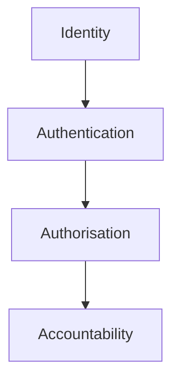
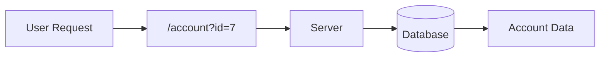
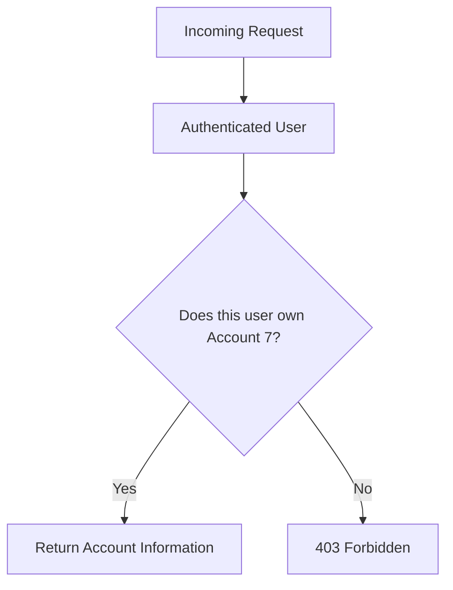
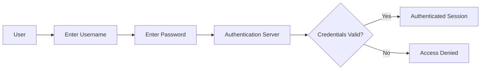
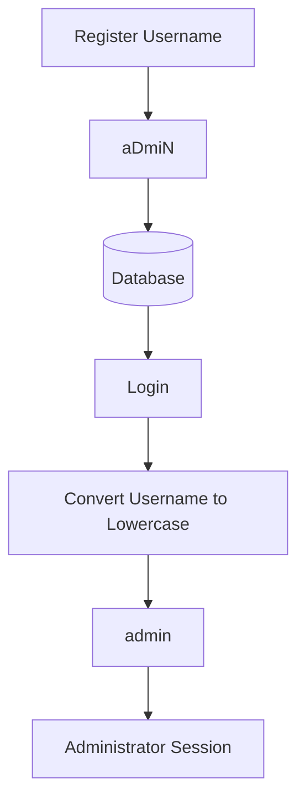
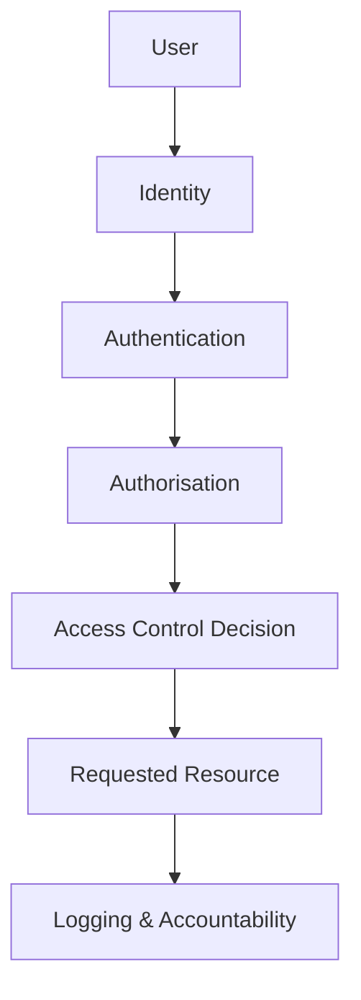
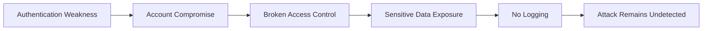

# OWASP Top 10 2025: IAAA Failures

> Learn how weaknesses in **Identity, Authentication, Authorisation, and Accountability (IAAA)** lead to some of the most common and impactful web application vulnerabilities. This room covers **Broken Access Control**, **Authentication Failures**, and **Logging & Alerting Failures** through practical, beginner-friendly labs.

---

# Executive Summary

Modern web applications must do more than simply authenticate users. They must correctly identify users, verify their identity, enforce authorization decisions, and maintain reliable audit logs for accountability. A failure in any of these areas can result in unauthorized access, privilege escalation, account compromise, or attacks that remain undetected.

In this TryHackMe room, we explore three categories from the **OWASP Top 10:2025** that are directly related to failures in **Identity, Authentication, Authorisation, and Accountability (IAAA)**:

- **A01: Broken Access Control**
- **A07: Authentication Failures**
- **A09: Logging & Alerting Failures**

Each topic is reinforced through an interactive lab that demonstrates how seemingly small implementation mistakes can create serious security risks. Instead of focusing solely on exploitation, this room also emphasizes why these vulnerabilities occur, how they affect real-world applications, and how developers and defenders can prevent them.

---

# Room Information

| Information | Value |
|------------|-------|
| Platform | TryHackMe |
| Room | OWASP Top 10 2025: IAAA Failures |
| Difficulty | Beginner |
| Category | Web Security |
| Focus | Identity, Authentication, Authorization, Accountability |
| OWASP Categories | A01, A07, A09 |

---

# Learning Objectives

After completing this room, I was able to:

- Understand the **IAAA (Identity, Authentication, Authorisation, Accountability)** security model.
- Differentiate between **authentication**, **authorization**, and **access control**.
- Understand how **Broken Access Control** leads to vulnerabilities such as **IDOR**.
- Recognize authentication logic flaws beyond weak passwords.
- Investigate authentication-related vulnerabilities caused by inconsistent identity handling.
- Understand the importance of **security logging**, **monitoring**, and **alerting**.
- Analyze security events from an incident responder's perspective.
- Connect OWASP Top 10 concepts to real-world penetration testing and defensive security.

---

# Prerequisites

Before working through this room, it is helpful to understand:

- Basic HTTP requests and responses
- URLs and query parameters
- User accounts and login systems
- Basic web application architecture
- Client vs Server communication

No previous penetration testing experience is required.

---

# Technologies & Security Concepts Covered

- Web Applications
- HTTP Requests
- Authentication
- Authorization
- Access Control
- IDOR (Insecure Direct Object Reference)
- Identity Management
- Logging
- Security Monitoring
- Incident Response
- OWASP Top 10:2025

---

# What is IAAA?

IAAA is a security model that describes how an application should manage user identity and user actions throughout their interaction with the system.

The four components are:

- **Identity** — Determines who the user claims to be.
- **Authentication** — Verifies that the user is truly who they claim to be.
- **Authorisation** — Determines what actions the authenticated user is allowed to perform.
- **Accountability** — Records security-relevant activities for auditing and investigation.

Each stage depends on the previous one. An application cannot correctly authorize a user without first authenticating them, and it cannot provide accountability without accurately identifying user actions.



---

# Understanding the Security Flow

A user interacting with a secure application typically follows this sequence:

```text
User
 │
 ▼
Identity
 │
 ▼
Authentication
 │
 ▼
Authorization
 │
 ▼
Application Resources
 │
 ▼
Logging & Accountability
```

Each layer introduces an additional security control.

For example:

- The user provides a username (**Identity**).
- The application verifies the password or MFA (**Authentication**).
- The server checks whether the user may access the requested resource (**Authorization**).
- Every important action is recorded (**Accountability**).

If any one of these layers fails, attackers may gain unauthorized access or perform actions without detection.

---

# OWASP Top 10:2025 Categories Covered

This room focuses on three OWASP categories that directly map to failures within the IAAA model.

## A01 — Broken Access Control

Broken Access Control occurs when the server fails to verify whether an authenticated user is permitted to access a specific resource.

A common example is **Insecure Direct Object Reference (IDOR)**, where modifying an object identifier (such as a user ID) allows access to another user's data.

Example:

```text
/account?id=5
```

Changing it to:

```text
/account?id=6
```

should never expose another user's information unless the requester is authorized.

---

## A07 — Authentication Failures

Authentication Failures occur when an application cannot reliably verify a user's identity.

Examples include:

- Weak password policies
- Username enumeration
- Missing rate limiting
- Session management flaws
- Authentication logic bugs
- Account confusion

These weaknesses often lead to account compromise or unauthorized access.

---

## A09 — Logging & Alerting Failures

Even if an application is attacked, defenders must be able to detect and investigate the incident.

Logging and alerting failures occur when applications fail to:

- Record authentication events
- Log privilege changes
- Detect brute-force attacks
- Alert administrators
- Preserve logs for investigations

Without proper logging, organizations may never realize they have been compromised.

---

# Why This Room Matters

Many beginners assume web security is primarily about SQL Injection or Cross-Site Scripting.

In reality, modern penetration tests frequently uncover issues related to:

- Improper authorization
- Broken authentication logic
- Poor session management
- Missing audit trails

These vulnerabilities are often easier to exploit than traditional injection attacks because they result from flawed business logic rather than coding mistakes.

Understanding these concepts is essential not only for penetration testers but also for developers, security engineers, SOC analysts, and incident responders.

---

# Real-World Relevance

The concepts covered in this room are encountered daily in modern security operations.

From a **Red Team** perspective:

- Testing IDOR vulnerabilities
- Bypassing authentication
- Enumerating user accounts
- Escalating privileges
- Testing session security

From a **Blue Team** perspective:

- Implementing least privilege
- Monitoring authentication events
- Detecting brute-force attacks
- Investigating compromised accounts
- Building reliable audit trails

Regardless of specialization, understanding **Identity, Authentication, Authorisation, and Accountability** forms a critical foundation for securing modern web applications.

---

> **Figure 1:** High-level relationship between Identity, Authentication, Authorisation, and Accountability (IAAA), illustrating the sequential security model used throughout this room.

# Part 2 — A01: Broken Access Control

## Overview

The first vulnerability explored in this room is **A01: Broken Access Control**, which has consistently remained one of the most critical security risks in modern web applications.

Access control determines **what an authenticated user is allowed to access or modify**. When these controls are not properly enforced by the server, attackers can access resources that should only be available to other users or privileged administrators.

One of the most common examples of Broken Access Control is **Insecure Direct Object Reference (IDOR)**.

---

# Understanding Access Control

Many beginners confuse **Authentication**, **Authorization**, and **Access Control**.

Although they are closely related, they answer different security questions.

| Security Layer | Question |
|---------------|----------|
| Identity | Who are you? |
| Authentication | Can you prove it? |
| Authorization | What are you allowed to do? |
| Access Control | Is this specific request allowed? |

Think of a bank.

Authentication is checking your identity when you enter the bank.

Authorization determines that you are a customer instead of an employee.

Access Control decides whether you are allowed to open **this specific account**, transfer **this specific amount**, or access **this particular document**.

---

# What is IDOR?

IDOR stands for **Insecure Direct Object Reference**.

Instead of verifying ownership of a resource, the application directly trusts identifiers supplied by the client.

For example:

```text
https://bank.thm/account?id=7
```

The application simply loads Account **7**.

An attacker then changes the request to:

```text
https://bank.thm/account?id=6
```

If the server immediately displays another customer's account information without verifying ownership, an IDOR vulnerability exists.

The issue is **not** that the ID is predictable.

The real problem is that the server never checks whether the authenticated user actually owns the requested resource.

---

# How IDOR Works

The vulnerable application's workflow can be represented as follows.



Notice what is missing.

There is **no authorization check** between the incoming request and the database lookup.

A secure application should instead follow this workflow.



Authorization must always happen **before** sensitive data is returned.

---

# Lab Objective

The lab simulates a banking application where account information is retrieved through an **ID parameter** in the URL.

The objective was simple:

> Find the user whose account balance exceeds **$1,000,000**.

Rather than exploiting software or bypassing authentication, the exercise demonstrates how changing a single parameter can expose data belonging to completely different users.

---

# Walkthrough

After opening the application, the browser displayed the following URL.

```text
https://bank.thm/accounts?id=7
```

The account belonged to another customer.

Changing only the numeric identifier allowed viewing different accounts.

Examples included:

```text
?id=1
?id=2
?id=3
?id=4
...
```

Eventually, Account ID **7** contained a balance greater than one million dollars.

The account description revealed the flag.

```
THM{Found.the.Millionare!}
```

> **Figure 2:** Successful discovery of the millionaire account by modifying the `id` parameter, demonstrating an Insecure Direct Object Reference (IDOR) vulnerability.

---

# Why This Worked

The application trusted user-controlled input.

Instead of verifying whether the authenticated user owned the requested account, the backend simply performed a lookup similar to:

```sql
SELECT *
FROM accounts
WHERE id = 7;
```

Because no ownership validation occurred, changing the identifier exposed other users' sensitive information.

The vulnerability exists because **authorization checks are completely absent**, not because the account IDs are sequential.

---

# Horizontal vs Vertical Privilege Escalation

The room asks an important conceptual question.

> If you can only access another user's information, what type of privilege escalation is this?

The answer is:

> **Horizontal Privilege Escalation**

Why?

Because both users possess the same privilege level.

```text
Customer A
        │
        ▼
Customer B Data
```

No additional privileges were gained.

The attacker simply moved sideways between accounts.

By comparison, **Vertical Privilege Escalation** occurs when a normal user gains administrator privileges.

```text
Regular User
      │
      ▼
Administrator
```

Understanding this distinction is extremely important during penetration testing because both issues have different impacts and remediation strategies.

---

# Security Impact

A successful IDOR vulnerability may expose:

- Customer profiles
- Financial records
- Medical records
- Uploaded documents
- Internal reports
- Purchase history
- Personal information

If write operations are also vulnerable, attackers may additionally:

- Modify another user's profile
- Reset passwords
- Delete resources
- Transfer funds
- Change permissions

This is why Broken Access Control remains the **#1 OWASP Top 10 vulnerability**.

---

# How Developers Should Prevent IDOR

Developers should never trust identifiers supplied by the client.

Instead, every request should verify ownership.

Example:

```python
account = get_account(request.id)

if account.owner != current_user:
    return 403
```

Additional security measures include:

- Implement server-side authorization checks on every request.
- Follow the **Least Privilege Principle**.
- Never rely solely on hidden buttons or frontend restrictions.
- Use unpredictable identifiers (UUIDs) as an additional defense—not as the primary security mechanism.
- Log unauthorized access attempts for incident investigation.

---

# Pentester Notes

During web application assessments, IDOR testing is one of the highest-value activities.

Common testing techniques include:

- Modifying numeric IDs.
- Testing UUIDs and encoded identifiers.
- Manipulating API parameters.
- Accessing predictable URLs directly.
- Checking whether authorization is enforced consistently across both web pages and REST APIs.

Many real-world bug bounty reports involve simple IDOR vulnerabilities that expose thousands of customer records because backend authorization was overlooked.

> **💡 Pentester Tip:** Always remember that **authentication alone is not enough**. A user may be successfully logged in yet still be unauthorized to access a particular resource. Every sensitive request should be evaluated independently by the server.

---

# Key Takeaways

- Broken Access Control occurs when the server fails to enforce authorization.
- IDOR is one of the most common forms of Broken Access Control.
- The vulnerability exists because the server trusts client-controlled object identifiers.
- Horizontal Privilege Escalation allows access to resources owned by users with the same privilege level.
- Proper server-side authorization checks are the only reliable defense against IDOR attacks.
- Predictable IDs are not the root cause—the absence of authorization is.

---
```**Personal Reflection**

This lab demonstrates how a seemingly harmless URL parameter can expose highly sensitive information when authorization checks are missing. Although the exploitation process is extremely simple, the underlying lesson is significant: authentication identifies *who* the user is, but authorization determines *what* that user is allowed to access. Understanding this distinction is fundamental for both penetration testers and secure application developers.
```

# Part 3 — A07: Authentication Failures

## Overview

The second category covered in this room is **A07: Authentication Failures**.

Authentication is responsible for verifying that a user is genuinely who they claim to be. While many people associate authentication vulnerabilities with weak passwords or brute-force attacks, authentication failures can also result from flawed business logic, inconsistent identity handling, or poor session management.

In this lab, no passwords were cracked, no brute-force attacks were performed, and no software vulnerabilities were exploited.

Instead, the application contained a **logic flaw** that confused two different user identities, ultimately allowing access to the administrator's account.

---

# Understanding Authentication

Authentication answers one simple question:

> **"Can you prove that you are who you claim to be?"**

A typical authentication process looks like this:



If authentication succeeds, the application creates a session and allows the user to access resources based on their permissions.

If authentication fails, access should be denied immediately.

---

# Identity vs Authentication

One of the most important concepts introduced earlier in this room is the distinction between **Identity** and **Authentication**.

Identity answers:

> **Who are you?**

Authentication answers:

> **Can you prove it?**

For example:

```
Username:
admin
```

is only an identity claim.

Only after the application successfully verifies the password, passkey, or another authentication factor can the user actually become authenticated.

Without authentication, identity alone has no meaning.

---

# The Vulnerability: Account Confusion

The lab demonstrates a logic flaw known as **Account Confusion**.

The application already contains an administrator account named:

```
admin
```

Instead of attacking the password, the objective is to register a new account using:

```
aDmiN
```

Although the username appears different because of its capitalization, the application later treats both usernames as the same identity during authentication.

As a result, logging into the newly created account unexpectedly grants access to the administrator dashboard.

The administrator dashboard reveals the flag:

```
THM{Account.confusion.FTW!}
```

> **Figure 3:** Successfully accessing the administrator dashboard after registering the username `aDmiN`, demonstrating an authentication logic flaw caused by inconsistent identity handling.

---

# Understanding the Logic Flaw

The vulnerability occurs because the application handles usernames inconsistently.

A simplified version of the workflow may look like this.



During registration, the username is stored exactly as entered.

During login, however, the application converts usernames into lowercase before searching the database.

Consequently:

```
aDmiN
```

becomes

```
admin
```

The application authenticates the wrong account, resulting in a complete authentication failure.

---

# Walkthrough

The exercise consisted of four simple steps.

### Step 1

Open the registration page.

### Step 2

Create a new account using the username:

```
aDmiN
```

### Step 3

Log into the application using the newly created credentials.

### Step 4

Instead of entering a normal user dashboard, the application redirects the session to the administrator dashboard.

The flag displayed is:

```
THM{Account.confusion.FTW!}
```

Although the attack requires almost no technical effort, it demonstrates how dangerous authentication logic bugs can become.

---

# Why This Worked

The application failed to maintain a consistent identity model.

Instead of treating usernames identically throughout the entire authentication lifecycle, different parts of the application applied different rules.

For example:

Registration:

```
Store:
aDmiN
```

Authentication:

```
Normalize:
admin
```

Since the canonical form matched the administrator account, the application incorrectly authenticated the user as **admin**.

The vulnerability was **not caused by weak passwords**, but by inconsistent identity processing.

---

# Canonicalization

A key concept introduced by this lab is **canonicalization**.

Canonicalization is the process of converting multiple representations of the same value into a single standardized format.

For usernames, an application may decide that:

```
Admin
ADMIN
admin
aDmIn
```

should all become:

```
admin
```

This approach is perfectly acceptable—but **only if the same rule is applied everywhere**.

The mistake occurs when:

- Registration is case-sensitive.
- Login is case-insensitive.

This inconsistency creates opportunities for account confusion.

---

# Other Common Authentication Failures

Although this lab focuses on account confusion, OWASP A07 covers many additional authentication weaknesses.

Examples include:

- Weak password policies
- Username enumeration
- Missing account lockout
- Missing rate limiting
- Session fixation
- Session hijacking
- Weak session identifiers
- Improper logout handling
- Password reset vulnerabilities
- Missing Multi-Factor Authentication (MFA)

Authentication security extends far beyond passwords.

---

# Security Impact

Authentication failures may lead to:

- Account takeover
- Administrator compromise
- Identity impersonation
- Privilege escalation
- Unauthorized access to sensitive information
- Complete application compromise

Because authentication is the gateway to every protected resource, failures at this stage often have severe consequences.

---

# Secure Authentication Practices

Developers should implement several defensive measures.

### Normalize identity consistently

Apply the same canonicalization rules during:

- Registration
- Login
- Password reset
- Session creation
- API authentication

---

### Enforce unique constraints

Databases should prevent duplicate identities after normalization.

For example:

```sql
UNIQUE(username)
```

or, preferably, on the normalized version of the username.

---

### Protect against brute force

Implement:

- Rate limiting
- Account lockout
- Progressive delays
- CAPTCHA where appropriate

---

### Secure session management

After successful authentication:

- Rotate session identifiers.
- Regenerate sessions after privilege changes.
- Invalidate sessions after logout.
- Expire inactive sessions automatically.

---

# Pentester Notes

Authentication testing involves much more than guessing passwords.

During security assessments, common authentication tests include:

- Testing username normalization.
- Trying different capitalization patterns.
- Checking whitespace handling.
- Testing Unicode look-alike characters.
- Looking for duplicate account registration.
- Evaluating password reset workflows.
- Reviewing session handling.
- Testing MFA implementation.

Authentication logic flaws are particularly valuable findings because they often bypass traditional security controls without requiring sophisticated exploitation.

> **💡 Pentester Tip:** Always test how applications process usernames—not just passwords. Small inconsistencies in identity normalization can completely undermine an otherwise secure authentication system.

---

# Key Takeaways

- Authentication verifies a user's claimed identity.
- Authentication failures include business logic flaws—not only weak passwords.
- Inconsistent username normalization can cause **Account Confusion**.
- Registration and login must apply identical identity handling rules.
- Canonicalization is safe only when implemented consistently across the entire authentication lifecycle.
- Secure authentication also requires rate limiting, account lockout, strong session management, and proper identity validation.

---

```text
Personal Reflection

This lab was an excellent reminder that authentication security is not solely about password strength. Even with strong credentials, inconsistent identity processing can completely undermine an application's security model. It highlights why secure authentication depends just as much on correct business logic as it does on cryptographic protections.
```

# Part 4 — A09: Logging & Alerting Failures

## Overview

The final category explored in this room is **A09: Logging & Alerting Failures**.

Even the most secure applications cannot prevent every attack. Eventually, organizations must assume that security incidents will occur. When they do, defenders rely on **logging**, **monitoring**, and **alerting** to detect malicious activity, investigate incidents, and understand exactly what happened.

Without reliable logging, attackers may remain undetected for weeks or even months.

Unlike the previous labs, this exercise places us in the role of a **Security Operations Center (SOC) Analyst** investigating an application that has already been attacked.

---

# What is Accountability?

The final component of the **IAAA** model is **Accountability**.

Accountability ensures that every security-relevant action can be traced back to the responsible user.

A good logging system should answer four essential questions:

- **Who** performed the action?
- **What** action was performed?
- **When** did it happen?
- **Where** did it originate?

For example:

| Question | Example |
|----------|---------|
| Who? | admin |
| What? | Login |
| When? | 2025-01-15 08:42:29 |
| Where? | 203.0.113.45 |

Without this information, incident investigations become significantly more difficult.

---

# Logging vs Alerting

Although often mentioned together, **logging** and **alerting** serve different purposes.

### Logging

Logging records events for future investigation.

Examples include:

- Successful logins
- Failed login attempts
- Password changes
- Role modifications
- Administrative actions
- API requests

---

### Alerting

Alerting actively notifies defenders when suspicious activity occurs.

Examples include:

- Multiple failed login attempts
- Privilege escalation
- Account lockouts
- Access from unusual locations
- Administrative actions outside business hours

Logging provides evidence.

Alerting enables rapid response.

Both are necessary components of an effective security monitoring strategy.

---

# Lab Objective

The objective of this exercise is to investigate an application's logs and answer three questions:

1. Which IP address performed the brute-force attack?
2. Which account was successfully compromised?
3. Which sensitive endpoint did the attacker access after authentication?

Rather than exploiting a vulnerability, this lab focuses on reconstructing an attack timeline using application logs.

---

# Investigating the Logs

The application presents a sequence of security events.

By analyzing them chronologically, we can reconstruct the attack.

```mermaid
timeline
    title Attack Timeline

    08:42:09 : Multiple Failed Login Attempts
    08:42:29 : Successful Login (admin)
    08:42:31 : Access to Administrative Endpoint
```

This timeline demonstrates how seemingly unrelated log entries combine to reveal the complete attack.

---

# Step 1 — Detecting the Brute-Force Attack

The first log entry records multiple failed login attempts.

Important observations include:

- HTTP Status: **401 Unauthorized**
- Endpoint: **/login**
- Username: **admin**
- Source IP: **203.0.113.45**

The application also raises a warning indicating suspicious authentication activity.

The attacker repeatedly attempted to authenticate using different password guesses.

Eventually, the answer to the first challenge question is:

```
203.0.113.45
```

> **Figure 4:** Security log showing repeated failed login attempts from the attacker's IP address, indicating a brute-force attack.

---

# Step 2 — Successful Authentication

A few seconds later, another log entry appears.

Unlike the previous requests, this login succeeds.

Important details include:

- HTTP Status: **200 OK**
- Username: **admin**
- Source IP: **203.0.113.45**

The successful authentication immediately follows multiple failed attempts, strongly suggesting that the attacker successfully guessed the administrator's credentials.

The answer to the second challenge question is:

```
admin
```

> **Figure 5:** Successful administrator login immediately following multiple failed authentication attempts.

---

# Step 3 — Investigating Post-Compromise Activity

After gaining access, the attacker immediately performs another request.

The logs show:

- HTTP Method: **GET**
- Endpoint:

```
/supersecretadminstuff
```

- Response:

```
200 OK
```

This indicates that the attacker successfully reached a privileged administrative endpoint.

The answer to the final challenge question is:

```
/supersecretadminstuff
```

> **Figure 6:** Administrative endpoint accessed immediately after the successful compromise.

---

# Why This Investigation Worked

The investigation succeeded because the application recorded sufficient security information.

Each log entry contained valuable forensic evidence, including:

- Timestamp
- Source IP Address
- Username
- HTTP Method
- Requested Endpoint
- HTTP Response Code

Together, these fields allow investigators to reconstruct the complete sequence of events.

Without them, determining how the compromise occurred would be nearly impossible.

---

# What Should Security Logs Contain?

A secure application should record events such as:

### Authentication

- Successful logins
- Failed logins
- Account lockouts
- MFA failures
- Password resets

---

### Authorization

- Privilege changes
- Role assignments
- Access denied events
- Administrative actions

---

### System Activity

- File downloads
- Sensitive data access
- Configuration changes
- API requests
- Database modifications

Collecting these events provides valuable visibility during incident response and digital forensic investigations.

---

# Common Logging Failures

Many organizations implement logging incorrectly.

Examples include:

- Authentication events are not recorded.
- Logs contain insufficient information.
- Logs are stored only on the compromised server.
- Attackers can modify or delete logs.
- Log retention periods are too short.
- No alerting rules exist for suspicious activity.

Any of these weaknesses can significantly delay incident detection.

---

# Secure Logging Best Practices

Developers and security engineers should:

- Log both successful and failed authentication attempts.
- Record privilege changes and administrative actions.
- Store logs in centralized logging infrastructure (such as a SIEM).
- Protect logs against unauthorized modification.
- Synchronize timestamps using reliable time sources.
- Define alerting rules for suspicious behavior.
- Retain logs according to organizational policy.

Logging should support both operational monitoring and forensic investigations.

---

# Pentester Notes

Although penetration testers primarily focus on identifying vulnerabilities, reviewing logging behavior can provide valuable security insights.

During an assessment, testers commonly evaluate whether:

- Failed logins generate alerts.
- Successful administrator logins are recorded.
- Privilege escalation events appear in logs.
- Sensitive API endpoints are monitored.
- Logs can be tampered with after compromise.
- Security teams would realistically detect the attack.

Weak logging often transforms a successful attack into a long-term compromise because defenders never realize the system has been breached.

> **💡 Pentester Tip:** Logging is a defensive security control. During penetration tests, don't only ask *"Can I compromise the application?"* Also ask *"Would the defenders notice if I did?"*

---

# Key Takeaways

- Logging provides the evidence required for incident response.
- Alerting enables defenders to react quickly to suspicious activity.
- Accountability depends on accurate, complete, and trustworthy logs.
- A complete attack timeline can often be reconstructed using authentication and access logs.
- Centralized logging and anomaly detection are essential components of modern defensive security.
- Even a successful attack can be rapidly contained when high-quality logging and alerting are in place.

---

```text
Personal Reflection

This lab shifted the focus from exploitation to detection, highlighting an equally important aspect of cybersecurity. Rather than asking how an attacker gains access, it demonstrated how defenders investigate and understand an incident after it occurs. It reinforced that effective logging is not merely about collecting data—it is about creating reliable evidence that enables rapid detection, incident response, and accountability.
```

# Part 5 — Key Concepts & Security Lessons

Throughout this room, three seemingly different OWASP categories were explored. However, they all share a common foundation: **Identity, Authentication, Authorisation, and Accountability (IAAA).**

Rather than viewing these vulnerabilities as isolated issues, it is more useful to understand how they fit together within the security architecture of a modern web application.

---

# Bringing Everything Together

Every request sent to a web application follows a security decision-making process.



Each stage answers a different security question.

| Stage | Security Question |
|--------|-------------------|
| Identity | Who is making the request? |
| Authentication | Can they prove their identity? |
| Authorisation | What are they allowed to do? |
| Access Control | Should this specific request be permitted? |
| Accountability | Can this action be traced later? |

Skipping any of these stages weakens the overall security model.

---

# How the Three OWASP Categories Relate

Each vulnerability demonstrated in this room targets a different stage of the security lifecycle.

| OWASP Category | Primary Security Failure | Real-World Impact |
|---------------|--------------------------|------------------|
| **A01 – Broken Access Control** | Authorization enforcement | Unauthorized access to sensitive resources |
| **A07 – Authentication Failures** | Identity verification | Account takeover and impersonation |
| **A09 – Logging & Alerting Failures** | Accountability | Delayed detection and difficult investigations |

Together, they illustrate how attackers can progress from initial access to long-term persistence if multiple security controls fail.

---

# Attack Chain

The vulnerabilities covered in this room can easily appear together during a real attack.



A single weakness rarely causes a major breach.

Instead, attackers often exploit several small weaknesses that combine into a much larger compromise.

This is one of the most important lessons taught by the OWASP Top 10.

---

# Red Team Perspective

From a penetration tester's perspective, these three categories are among the highest priorities during a web application assessment.

Typical objectives include:

### Broken Access Control

- Test IDOR vulnerabilities
- Manipulate object identifiers
- Access another user's resources
- Attempt horizontal privilege escalation
- Attempt vertical privilege escalation

---

### Authentication

- Test username normalization
- Perform credential stuffing
- Evaluate brute-force protections
- Review password reset workflows
- Assess session management
- Test Multi-Factor Authentication (MFA)

---

### Logging

- Determine whether attacks generate logs
- Identify missing audit events
- Test whether privilege changes are recorded
- Check whether logs can be modified or deleted
- Evaluate whether defenders would detect the attack

For Red Team operators, successful exploitation is only part of the assessment. Understanding whether security teams can detect that activity is equally valuable.

---

# Blue Team Perspective

Blue Teams focus on preventing, detecting, and responding to attacks.

For the three OWASP categories covered, defensive priorities include:

### Identity & Authentication

- Strong password policies
- Multi-Factor Authentication
- Rate limiting
- Account lockout
- Secure session management

---

### Authorization

- Least Privilege Principle
- Role-Based Access Control (RBAC)
- Server-side authorization checks
- Deny-by-default access policies

---

### Accountability

- Centralized logging
- SIEM integration
- Security monitoring
- Automated alerting
- Long-term log retention
- Incident response procedures

Unlike attackers, defenders must secure every stage of the application's lifecycle.

---

# Detection Opportunities

Many attacks demonstrated in this room generate observable indicators.

Security teams should monitor for events such as:

| Activity | Detection Opportunity |
|----------|-----------------------|
| Multiple failed logins | Brute-force detection |
| Successful login after repeated failures | Possible account compromise |
| Access to unusual resources | Access control anomaly |
| Privilege changes | Administrative alert |
| Login from unfamiliar IP addresses | Impossible travel or suspicious login |
| Excessive requests for sequential IDs | Possible IDOR enumeration |
| Repeated HTTP 401/403 responses | Authentication or authorization abuse |

Modern Security Information and Event Management (SIEM) platforms continuously analyze these events to identify suspicious behavior before attackers can achieve their objectives.

---

# Common Misconfigurations

Many of these vulnerabilities originate from simple implementation mistakes rather than advanced exploitation.

Common examples include:

### Broken Access Control

- Authorization checks only implemented in the frontend.
- Missing ownership validation.
- Predictable object identifiers without authorization.
- Hidden administrator pages instead of protected administrator pages.

---

### Authentication

- Weak password policies.
- Missing account lockout.
- Inconsistent username normalization.
- Weak session identifiers.
- Sessions not rotated after authentication.

---

### Logging

- Failed logins not recorded.
- Privilege changes missing from audit logs.
- Logs stored on the same compromised server.
- No monitoring or alerting.
- Log retention periods that are too short.

These mistakes are surprisingly common, even in production applications.

---

# Industry Relevance

The concepts covered throughout this room are encountered across many cybersecurity roles.

| Role | Application |
|------|-------------|
| Penetration Tester | Identifying IDOR, authentication flaws, privilege escalation |
| Security Engineer | Designing secure authentication and authorization systems |
| SOC Analyst | Detecting brute-force attacks and account compromise |
| Incident Responder | Reconstructing attack timelines from logs |
| Application Security Engineer | Reviewing business logic and access control implementations |
| Software Developer | Building secure authentication workflows and authorization checks |

Understanding these concepts provides a strong foundation for securing both traditional web applications and modern APIs.

---

# Beyond This Room

The knowledge gained here naturally leads into more advanced topics.

Recommended next areas of study include:

- API Security
- JWT (JSON Web Tokens)
- OAuth 2.0
- OpenID Connect
- Session Management
- Multi-Factor Authentication (MFA)
- Identity and Access Management (IAM)
- Role-Based Access Control (RBAC)
- Attribute-Based Access Control (ABAC)
- Zero Trust Architecture
- Secure Software Development Lifecycle (SSDLC)

These technologies expand upon the same principles introduced by the IAAA model.

---

# Key Lessons Learned

This room reinforces several important security principles:

- Authentication identifies **who** the user is.
- Authorization determines **what** the user can do.
- Access control must always be enforced on the server.
- Accountability requires complete, accurate, and protected audit logs.
- Security controls should complement one another rather than operate independently.
- Small implementation flaws often become serious vulnerabilities when combined.
- Detection capabilities are just as important as prevention mechanisms.

---

```text
Personal Reflection

Although the individual labs in this room were relatively straightforward, the underlying concepts are fundamental to modern application security. Rather than teaching complex exploitation techniques, the room emphasized understanding the security decisions that every web application must make for each request. Learning how Identity, Authentication, Authorisation, and Accountability interact provides a strong foundation for studying more advanced topics such as API security, OAuth, JWT, and Zero Trust architectures.
```

# Part 6 — Conclusion

## Room Summary

This room introduced three critical categories from the **OWASP Top 10:2025** that are closely tied to the **Identity, Authentication, Authorisation, and Accountability (IAAA)** security model.

Rather than focusing on complex exploitation techniques, the room demonstrated how small implementation mistakes in authentication, authorization, and security monitoring can have significant real-world consequences.

Through three practical labs, we explored vulnerabilities that are commonly encountered during penetration tests, bug bounty assessments, and security audits.

---

# Skills Gained

By completing this room, I gained practical experience in:

- Understanding the **IAAA** security model.
- Differentiating Identity, Authentication, Authorization, and Accountability.
- Identifying **Broken Access Control** vulnerabilities.
- Understanding **Insecure Direct Object Reference (IDOR)** attacks.
- Distinguishing between **Horizontal** and **Vertical Privilege Escalation**.
- Recognizing authentication logic flaws such as **Account Confusion**.
- Understanding username normalization and canonicalization.
- Investigating authentication events through application logs.
- Reconstructing attack timelines using security logs.
- Understanding the importance of security monitoring and alerting.

Although the individual labs were beginner-friendly, the concepts introduced are directly applicable to professional web application security assessments.

---

# Concepts Reinforced

This room strengthened several important cybersecurity concepts.

### Identity

Applications must uniquely identify every user.

Without a reliable identity model, authentication cannot function correctly.

---

### Authentication

Authentication is more than verifying passwords.

Applications must consistently process user identities while protecting against brute-force attacks, session abuse, and authentication logic flaws.

---

### Authorization

Authorization determines whether an authenticated user is permitted to perform a particular action.

Every request must be validated on the server, regardless of what the client interface displays.

---

### Accountability

Organizations must maintain reliable audit trails that allow investigators to determine:

- Who performed an action
- What action occurred
- When it happened
- Where it originated

Without accountability, incident response becomes significantly more difficult.

---

# Security Takeaways

The biggest lesson from this room is that **security is built in layers**.

Strong passwords alone cannot protect an application if authorization is missing.

Likewise, correct authorization provides limited value if successful attacks remain invisible because logging is inadequate.

A secure application should therefore implement:

- Strong identity management
- Secure authentication
- Server-side authorization
- Comprehensive logging
- Effective monitoring
- Automated alerting

These controls work together to reduce both the likelihood and impact of security incidents.

---

# Common Real-World Scenarios

The vulnerabilities demonstrated in this room frequently appear in production systems.

Examples include:

- Users viewing another customer's invoices by changing a URL parameter.
- Applications allowing duplicate usernames because of inconsistent case handling.
- Administrator accounts compromised through brute-force attacks.
- Security teams discovering breaches weeks later because failed login attempts were never monitored.

Although these examples may appear simple in a lab environment, similar implementation mistakes have contributed to numerous real-world security incidents.

---

# Future Learning Path

This room provides an excellent foundation for more advanced web application security topics.

Recommended next topics include:

- Application Design Flaws
- API Security
- Session Management
- JWT Security
- OAuth 2.0
- OpenID Connect
- Multi-Factor Authentication
- Identity and Access Management (IAM)
- Secure Software Development Lifecycle (SSDLC)
- OWASP API Security Top 10

These topics build directly upon the principles introduced in this room.

---

# References

- OWASP Foundation — *OWASP Top 10*
- OWASP Foundation — *Broken Access Control*
- OWASP Foundation — *Authentication Cheat Sheet*
- OWASP Foundation — *Logging Cheat Sheet*
- TryHackMe — *OWASP Top 10 2025: IAAA Failures*

---

# Tags

`TryHackMe`

`OWASP Top 10`

`OWASP Top 10 2025`

`Web Security`

`Application Security`

`Broken Access Control`

`Authentication`

`Authorization`

`Accountability`

`Identity`

`IDOR`

`Authentication Failures`

`Logging`

`Security Monitoring`

`Incident Response`

`SOC`

`Blue Team`

`Red Team`

`Beginner`

---

# Final Thoughts

At first glance, this room appears much simpler than exploitation-focused rooms involving SQL Injection, Remote Code Execution, or Privilege Escalation. However, its value lies in teaching the **security principles** that every modern web application depends on.

One of the most important takeaways is understanding that **authentication alone is not security**. Successfully identifying a user is only the beginning. Every subsequent request must be authorized, every sensitive action should be recorded, and abnormal behavior must trigger alerts that enable defenders to respond before attackers can cause significant damage.

Another key lesson is that many of these vulnerabilities are **business logic flaws** rather than programming bugs. The IDOR challenge was caused by missing authorization checks, the authentication challenge resulted from inconsistent username handling, and the logging challenge highlighted how difficult investigations become when security events are not properly recorded. None of these issues required advanced exploitation techniques, yet each had the potential to severely compromise an application.

As I continue my cybersecurity journey, this room serves as a reminder that effective security requires balancing both offensive and defensive thinking. Knowing how attackers exploit weak authentication or access control is valuable, but understanding how developers should prevent these issues and how defenders should detect them is equally important. This holistic perspective is what transforms isolated technical knowledge into practical security expertise.

---

> **Overall Assessment:** ⭐⭐⭐⭐⭐ (5/5)

This room is an excellent introduction to three of the most important categories in the **OWASP Top 10:2025**. It combines concise theory with practical exercises that clearly demonstrate why **Identity, Authentication, Authorisation, and Accountability (IAAA)** are fundamental pillars of secure web application design. I highly recommend it to beginners who want to build a strong foundation before progressing to more advanced topics such as API Security, OAuth, JWT, and Application Design Flaws.